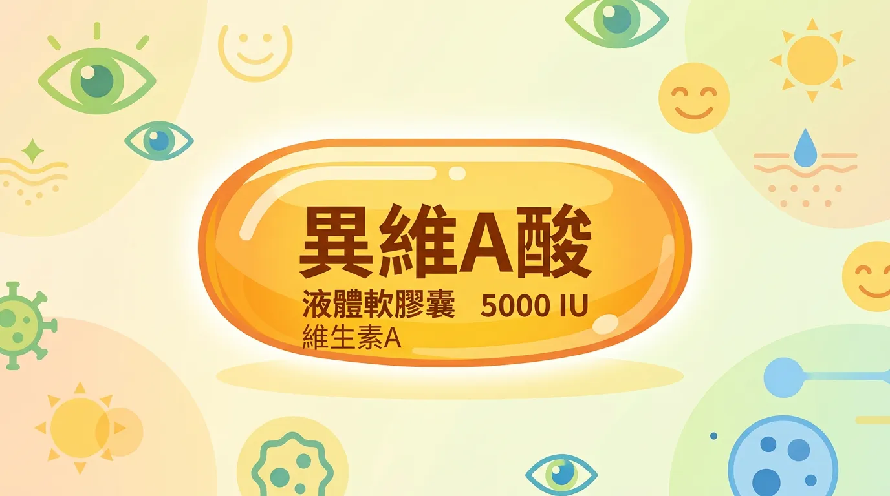
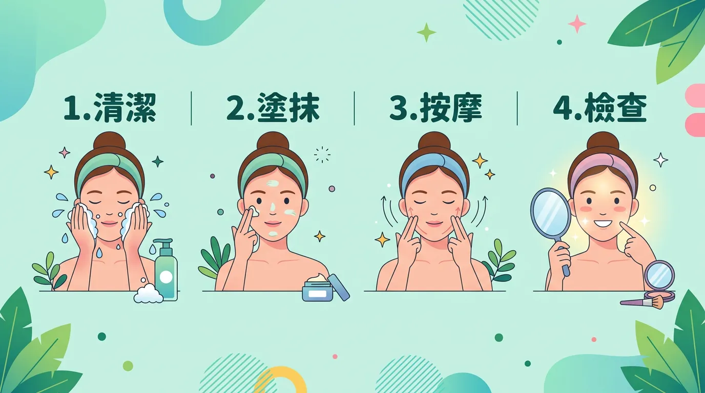
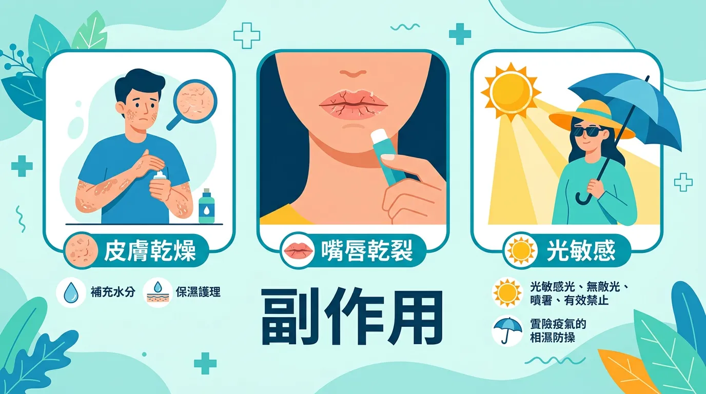
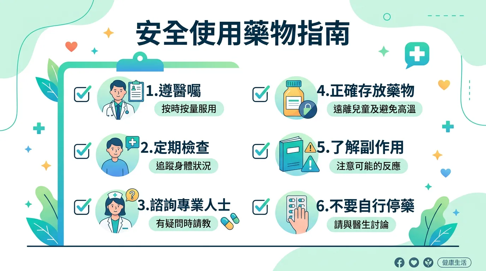
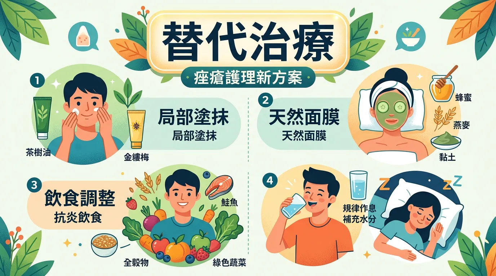
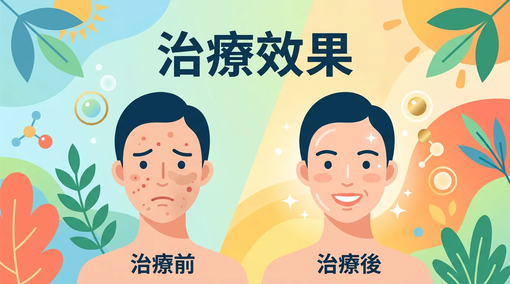

# 吃口服 A 酸能根治痘痘嗎？皮膚科醫生告訴你吃之前必須知道的事

本文你會學到：異維A酸是什麼、誰適合使用、治療過程與劑量、常見與嚴重副作用、安全監測與日常注意事項，以及替代治療選項。說穿了，這是嚴重痘瘡的處方藥，必須醫師監控、嚴格避孕與驗血，懷孕絕對禁用，療程中勿捐血。

## 3分鐘速讀：本篇精華重點

<DataTable theme="blue" caption="異維A酸快速摘要">
  <Fragment slot="header">
    <tr><th>項目</th><th>說明</th></tr>
  </Fragment>
  <tr><td><strong>用途</strong></td><td>嚴重囊腫性痤瘡的處方藥物</td></tr>
  <tr><td><strong>風險等級</strong></td><td>⚠️ 高風險 — 需醫師嚴格監控</td></tr>
  <tr><td><strong>適用對象</strong></td><td>其他治療無效的嚴重痤瘡患者</td></tr>
  <tr><td><strong>作用機理</strong></td><td>減少皮脂分泌、抑制細菌、降低發炎、促進角質更新</td></tr>
  <tr><td><strong>療程</strong></td><td>4–6 個月，依體重和嚴重程度調整</td></tr>
  <tr><td><strong>主要副作用</strong></td><td>皮膚乾燥、血脂異常、視力變化、致畸性</td></tr>
</DataTable>

<Callout icon="⚠️" title="實用提醒：使用前必讀">
異維A酸具有強烈致畸性（胎兒畸形風險），懷孕期間絕對禁用。有生育能力的女性須使用雙重避孕，治療期間及治療後一個月內禁止捐血。
</Callout>

---

## 一分鐘看懂：什麼是異維A酸？

異維A酸是一種維生素 A 衍生物，也是目前治療嚴重痤瘡最有效的藥物；美國皮膚科醫學會（AAD，American Academy of Dermatology）2024 年指引仍建議作為嚴重痤瘡的標準治療[^1]。當外用藥、口服抗生素等常規手段都無法控制痤瘡時，皮膚科醫師才會考慮開立。

它透過四種機制同時攻擊痤瘡的成因[^2][^3]：

- **大幅減少皮脂分泌** — 抑制皮脂腺活動，從根源減少油脂
- **抑制痤瘡桿菌**（Cutibacterium acnes，皮脂腺內常見菌）— 降低致病菌的生存環境
- **降低發炎反應** — 減輕紅腫和疼痛
- **促進角質正常代謝** — 防止毛孔堵塞

### 必看指南！誰需要使用？

- 嚴重囊腫性痤瘡，外用藥和口服抗生素無效者
- 痤瘡已經留下明顯疤痕
- 頻繁復發、嚴重影響生活品質或心理健康的患者[^4]

---

## 真實療程揭秘：治療時會發生什麼事？

### 實用拆解：劑量與服用方式

劑量依體重計算，通常為每天 0.5–1.0 mg/kg[^5]。一個重要的小技巧：**務必與食物一起服用**，因為脂溶性的異維A酸搭配食物可以讓吸收率提高達 60%[^6]。

### 專業視角：療程長度

標準療程為 4–6 個月，醫師會根據效果和副作用動態調整劑量。累積劑量通常需達到 120–150 mg/kg 才能達到最佳效果[^7]。

### 關鍵看點：治療初期會暫時惡化？

研究顯示約三成患者在用藥後 2～4 週內會暫時惡化（「爆痘期」），屬常見治療反應，多數撐過後會逐漸好轉[^16]。

<Simulation title="情境模擬" icon="🩹">
  你開始吃療程兩週後臉反而更紅、更多痘，以為是藥物無效或過敏。其實這是「爆痘期」——深層粉刺被加速代謝排出，多數人再撐 2～4 週會明顯好轉。若非常擔憂可回診與醫師確認。
</Simulation>

---

## 深度解析：副作用與風險

### 核心觀念：常見副作用

<DataTable theme="purple" caption="異維A酸常見副作用與處理">
  <Fragment slot="header">
    <tr><th>副作用</th><th>發生率</th><th>處理方式</th></tr>
  </Fragment>
  <tr><td>皮膚、嘴唇乾燥</td><td>&gt;90%</td><td>勤用保濕乳液和護唇膏[^8]</td></tr>
  <tr><td>血脂異常</td><td>中等</td><td>定期抽血監測</td></tr>
  <tr><td>夜間視力下降、乾眼症</td><td>中等</td><td>使用人工淚液</td></tr>
  <tr><td>關節、肌肉痠痛</td><td>中等</td><td>適度休息</td></tr>
  <tr><td>情緒變化</td><td>少見</td><td>留意並告知醫師</td></tr>
</DataTable>

### 重點解析：嚴重副作用（罕見但須警覺）

- **致畸性**：懷孕期間使用會導致胎兒嚴重畸形，這是異維A酸最嚴重的風險[^9]
- **肝功能異常**：需每月監測肝功能指數[^11]
- **顱內壓升高**：極罕見，若出現嚴重頭痛須立即就醫

### 進階討論：長期影響

長期使用可能影響骨骼代謝，增加骨質疏鬆風險[^10]。因此療程結束後，醫師通常不會建議再做第二次療程，除非確實有必要。

了解副作用後，用藥期間可以這樣配合監測與日常照護：

---

## 全面盤點：安全使用須知

### 深度解析：定期監測

治療期間需要每月回診，項目包括[^11]：
- 血脂（膽固醇、三酸甘油脂）
- 肝功能（AST、ALT，即肝指數）
- 有生育能力的女性需每月驗孕[^12]

### 進階討論：日常注意事項

- **不要服用維生素 A 補充劑**，避免維生素 A 過量中毒
- **避免脫毛、打蠟**等侵入性皮膚處理，治療期間皮膚極其脆弱
- **加強防曬**，藥物會增加光敏感性
- **多喝水**，幫助緩解乾燥副作用
- **避免需要清晰夜間視力的活動**，如夜間開車

---

## 重點解析：替代治療選項

若還不需要用到異維A酸，可先考慮以下方式：

<CardGroup>
  <Card title="外用治療" icon="🧴" type="info">
    維生素 A 酸、過氧化苯甲醯、水楊酸、外用抗生素。適合輕中度痤瘡，先從局部與低濃度開始。
  </Card>
  <Card title="口服治療" icon="💊" type="warning">
    四環素類抗生素、抗雄激素藥物（女性）。需醫師評估，不可長期自行使用。
  </Card>
  <Card title="物理／光療" icon="🔬" type="success">
    藍光治療、化學換膚、雷射治療。可與藥物搭配，由皮膚科規劃療程。
  </Card>
</CardGroup>

---

## 核心觀念：治療效果

異維A酸療效明確：多項研究顯示約八至九成患者可獲顯著改善[^13]。治療完成後，近年大型研究顯示約二至三成患者可能復發，但多數程度較治療前輕微；累積劑量達 120 mg/kg 以上有助降低復發率[^14][^15]。

---

## 常見問題（FAQ）

### 專業視角：異維A酸會永久影響生育能力嗎？

目前沒有證據顯示異維A酸會永久損害生育能力。但治療期間和停藥後一個月內，女性**絕對不能懷孕**[^9]。

### 實用拆解：可以同時使用其他痤瘡藥物嗎？

治療期間應避免使用其他維生素 A 衍生物。搭配使用其他藥物前，務必告知皮膚科醫師[^17]。

### 關鍵看點：治療後痘痘還會復發嗎？

約 20–30% 的患者會復發，但多數情況較治療前輕微。如需第二次療程，通常需間隔至少兩個月[^14]。

---

## 給你的最後建議

<Takeaway title="異維A酸使用總結" icon="💊">
  <TakeawayItem title="療效" type="success">嚴重痤瘡的有效治療選項，約八至九成患者可獲顯著改善。</TakeawayItem>
  <TakeawayItem title="必須配合" type="warning">醫師監控、按時回診與驗血，並嚴格避孕與防曬。</TakeawayItem>
  <TakeawayItem title="用藥前" type="info">充分了解副作用與替代方案，有助做出適合自己的決定。</TakeawayItem>
</Takeaway>

---

## 常見問題（FAQ）

### 口服A酸療程結束後痘痘會不會復發？

約 85–90% 的患者在完成一個完整療程（累積劑量達 120–150 mg/kg）後可長期緩解，甚至永久不再復發。復發風險較高的族群包括：療程劑量不足者、年輕青少年（因荷爾蒙仍在變化）、以及囊腫位置偏下頜和頸部者（通常與荷爾蒙相關）。若復發，醫師可能建議第二療程。

### 服用異維A酸期間可以用一般護膚品嗎？

可以，但需要大幅調整護膚程序。因為A酸會顯著降低皮脂分泌，皮膚會變得非常乾燥，應避免含酒精、去角質、水楊酸或果酸的產品。建議改為：**溫和無皂鹼潔面乳**（不過度清潔）、**高效保濕乳液**（如含神經醯胺、玻尿酸）、以及**SPF 30+ 防曬**（因A酸會讓皮膚對紫外線更敏感）。

### 口服A酸期間必須絕對禁止懷孕嗎？

是，而且是最嚴格的醫療禁忌之一。異維A酸具有強烈的致畸毒性，可導致嚴重的胎兒先天缺陷（包括心臟、顏面、腦部異常）。有生育能力的女性必須在開始前 30 天至整個療程期間，以及**停藥後至少 1 個月**使用兩種以上避孕方法，且每次複診需確認驗孕陰性。

### A酸療程期間需要做哪些血液檢測？

通常在開始前先做**基礎血脂（三酸甘油脂、膽固醇）**和**肝功能（AST、ALT）**，治療期間每 4–8 週重複一次。異維A酸可能升高三酸甘油脂和肝酶，大多數情況是輕微可逆的，但若數值明顯異常，醫師可能需要調整劑量或暫停治療。

### 口服A酸會造成憂鬱或情緒問題嗎？

這一點仍存在爭議。雖然有個案報告和部分研究提出關聯，但大型系統性回顧尚未確立直接因果關係。另一個角度是：嚴重痤瘡本身就與高度焦慮和憂鬱有關，治療後情緒改善者其實比惡化者更多。儘管如此，治療期間若出現情緒低落、社交退縮等變化，應立即告知醫師。

---

## 推薦閱讀：你可能也會喜歡

- [痤瘡保養與治療](/how-to-deal-with-acne/)
- [防曬產品選擇指南](/how-to-choose-sunscreen/)
- [皺紋預防與改善](/how-to-prevent-or-soothe-wrinkles/)
- [毛孔粗大怎麼辦](/pores-enlarge/)

---

## 這裡有科學根據：參考文獻

以下文獻最後檢索：2026-02。

1. Zaenglein, A. L., et al. (2016). Guidelines of care for the management of acne vulgaris. *Journal of the American Academy of Dermatology*, 74(5), 945-973.

2. Layton, A. M., & Dreno, B. (2016). Oral isotretinoin: patient selection and management. *American Journal of Clinical Dermatology*, 17(3), 293-305.

3. Melnik, B. C. (2017). Isotretinoin and FoxO1: a scientific hypothesis. *Dermato-endocrinology*, 9(1), e1356518.

4. Strauss, J. S., et al. (2007). Guidelines of care for acne vulgaris management. *Journal of the American Academy of Dermatology*, 56(4), 651-663.

5. Rademaker, M. (2013). Isotretinoin: dose, duration and relapse. *Australasian Journal of Dermatology*, 54(3), 157-162.

6. Colburn, W. A., et al. (1983). Food increases the bioavailability of isotretinoin. *Journal of Clinical Pharmacology*, 23(11-12), 534-539.

7. Blasiak, R. C., et al. (2013). High-dose isotretinoin treatment and the rate of retrial, relapse, and adverse effects. *JAMA Dermatology*, 149(12), 1392-1398.

8. Zane, L. T., et al. (2006). A population-based analysis of laboratory abnormalities during isotretinoin therapy. *Archives of Dermatology*, 142(8), 1016-1022.

9. Lammer, E. J., et al. (1985). Retinoic acid embryopathy. *New England Journal of Medicine*, 313(14), 837-841.

10. DiGiovanna, J. J. (2001). Isotretinoin effects on bone. *Journal of the American Academy of Dermatology*, 45(5), S176-S182.

11. Lee, J. W., et al. (2011). Effectiveness of conventional, low-dose and intermittent oral isotretinoin. *British Journal of Dermatology*, 164(6), 1369-1375.

12. Honein, M. A., et al. (2001). Continued occurrence of Accutane-exposed pregnancies. *Teratology*, 64(3), 142-147.

13. Layton, A. M., et al. (1993). Isotretinoin for acne vulgaris—10 years later: a safe and successful treatment. *British Journal of Dermatology*, 129(3), 292-296.

14. Lehucher-Ceyrac, D., et al. (1993). Isotretinoin and acne in practice. *Dermatology*, 186(2), 123-128.

15. Stainforth, J. M., et al. (1993). Isotretinoin for the treatment of acne vulgaris. *British Journal of Dermatology*, 129(3), 297-301.

16. Cunliffe, W. J., et al. (1997). Roaccutane treatment guidelines. *Dermatology*, 194(4), 351-357.

17. Del Rosso, J. Q., & Kircik, L. (2014). The sequence of inflammation, relevant biomarkers, and the pathogenesis of acne. *Journal of Clinical and Aesthetic Dermatology*, 7(7), 18-24.