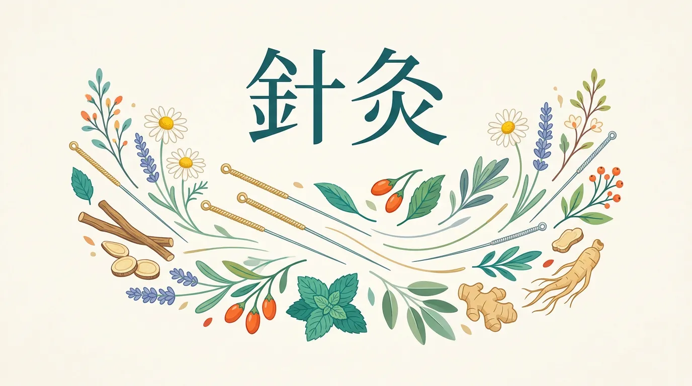
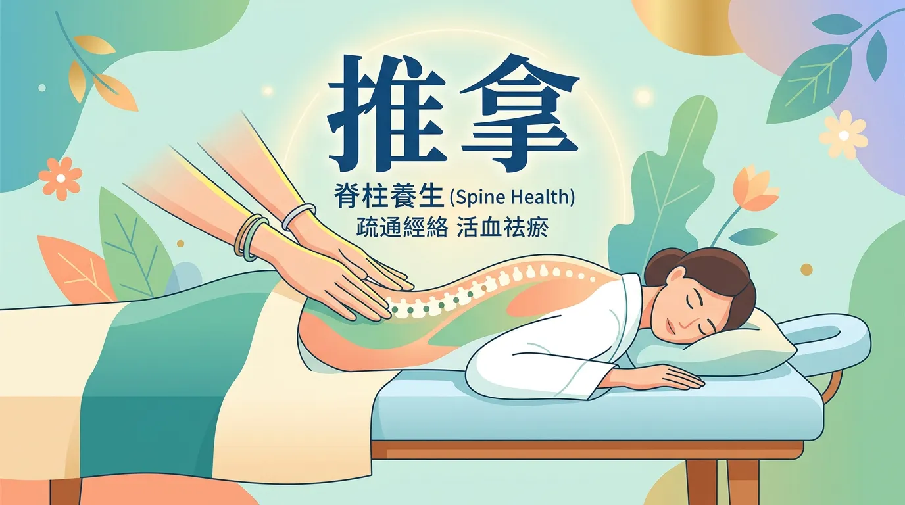
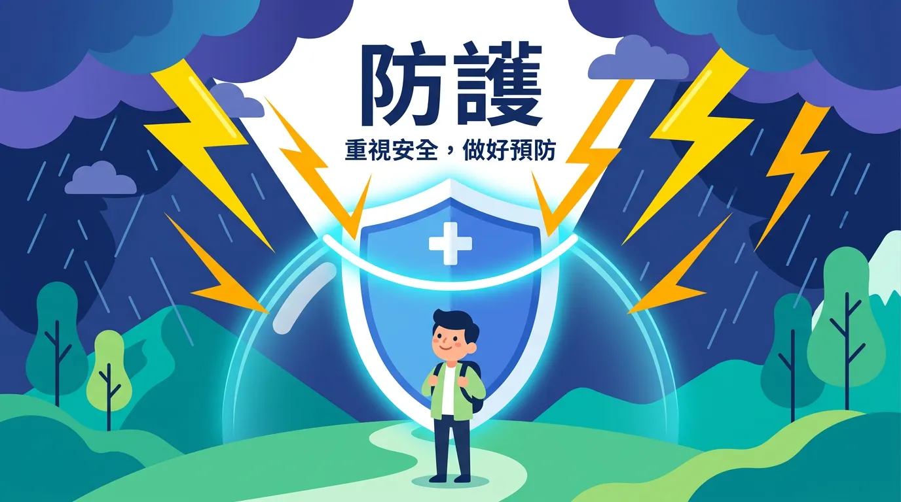

# 針灸與推拿有效嗎？中醫傳統療法全解盲

每次肩膀硬得像石頭，或是失眠到懷疑人生時，身邊總有人會勸你：「去針灸推拿看看吧！」但這兩項流傳數千年的中醫老把戲，在現代醫學眼裡真的站得住腳嗎？說實話，很多人對它是既期待又怕受傷害。

這篇文章我們就來拆解針灸與推拿的真實面貌：它不是什麼神仙法術，但對某些頑固疼痛確實有一套。我們不掉書袋，直接帶你看懂背後的原理、現代科學怎麼看，以及——更重要的——哪些人其實「千萬別碰」。

<Takeaway title="3分鐘速讀：本篇精華重點" icon="📌">
  <TakeawayItem title="不要神話它" type="info">針灸推拿無法取代急診。它最擅長的是**輔助疼痛緩解**與**慢性調理**。</TakeawayItem>
  <TakeawayItem title="安全是底線" type="warning">有出血傾向、皮膚感染、或是正在懷孕的讀者，請務必先告知醫師，部分穴位與手法屬於絕對禁忌。</TakeawayItem>
  <TakeawayItem title="專業度決戰" type="success">找有合格執照的醫師操作。千萬別找坊間來路不明的密醫拿你的身體開玩笑。</TakeawayItem>
</Takeaway>

<Callout icon="⚠️" title="安全提醒">
針灸與推拿雖然常見，但仍屬於醫療行為，應由受過專業訓練的醫師或技師操作。本文僅供健康知識參考，不構成實質醫療建議。
</Callout>

---

## 核心觀念：針灸基礎

### 背後的科學原理大解密

你一定聽過「打通任督二脈」這種武俠小說的台詞。如果在現實的中醫視角裡，針灸的理論主要建立在**經絡學說**之上：人體有十二正經與奇經八脈，氣血就像高速公路上的車流，沿著這些通道運行。

當這條路塞車了（也就是所謂的「氣滯血瘀」），就會產生疼痛或生病。透過在特定「穴位」施以極細的針刺或艾灸溫熱刺激，目的就是為了疏通車流、調節臟腑功能，讓身體重新找回平衡。

### 進階討論：常見針灸類型

這不光是拿針往身上扎而已，臨床上其實分得很細：

<DataTable theme="purple" caption="常見針灸類型一覽">
  <Fragment slot="header">
    <tr><th>類型</th><th>方法</th><th>常見用途</th></tr>
  </Fragment>
  <tr><td><strong>體針</strong></td><td>直接針刺體表穴位</td><td>應對多種內外科疾病，這是最常見的作法。</td></tr>
  <tr><td><strong>耳針</strong></td><td>針刺耳廓反應點</td><td>利用耳朵對應全身的原理，用於鎮痛、戒菸或減重輔助。</td></tr>
  <tr><td><strong>頭針</strong></td><td>針刺頭皮特定區域</td><td>多見於中風後遺症、神經系統調理。</td></tr>
  <tr><td><strong>艾灸</strong></td><td>用點燃的艾草條溫熱刺激</td><td>本身不扎針，專治虛寒體質、手腳冰冷。</td></tr>
</DataTable>

### 專業視角：常用穴位速查

中醫有幾百個穴位，但你至少可以認識這幾個超級明星：
- **足三里**：位在小腿的「長壽穴」，主力是健脾和胃、增強免疫。
- **合谷**：在虎口，專門對付頭面部的毛病，像是頭痛、牙痛。
- **內關**：手腕內側，常用來安神寧心、緩解暈車噁心感。
- **三陰交**：腳踝上方，婦科調理的必備穴位。

<CardGroup>
  <Card title="✅ 適合嘗試：適應症" icon="👍" type="success">
    針灸目前在這些領域有最強的臨床實務支持：
    - **慢性疼痛**：頸肩腰腿痛、退化性關節炎。
    - **神經系統問題**：中風後復健輔助、面癱、壓力型失眠。
    - **消化與婦科**：反覆的胃痛、[便秘](/constipate/)、或是每個月報到的經痛。
  </Card>
  <Card title="❌ 千萬別碰：絕對禁忌" icon="🚫" type="danger">
    如果你有以下狀況，請在掛號前就踩煞車：
    - **出血性疾病**：凝血功能異常或正服用抗凝血藥。
    - **局部感染**：皮膚有破損或發炎的部位。
    - **孕婦腹部/腰骶部**：特定穴位會引發強烈宮縮。
    - **不佳的身體狀態**：極度虛弱、餓肚子或剛喝完酒（容易引發暈針）。
  </Card>
</CardGroup>

---

## 實用拆解：推拿基礎

### 背後的科學原理大解密

推拿不只是「按摩師用力揉捏」那麼簡單。它同樣是依循中醫經絡，透過點、按、揉、推等手法，直接刺激肌肉組織與穴位。與西方常見的放鬆按摩最大的差異在於，推拿有強烈的**目的性和治療性**，講究「辨證論治」，而不是單純幫你把緊繃的肩膀推鬆而已。

### 深度解析：常用手法

<DataTable theme="blue" caption="推拿的核心手法">
  <Fragment slot="header">
    <tr><th>手法</th><th>操作方式</th><th>主要作用</th></tr>
  </Fragment>
  <tr><td><strong>按法</strong></td><td>指腹或手掌持續穩定按壓</td><td>深層放鬆、阻斷痛覺傳導。</td></tr>
  <tr><td><strong>揉法</strong></td><td>在穴位或部位上做環形揉動</td><td>活血化瘀、消腫止痛。</td></tr>
  <tr><td><strong>推法</strong></td><td>順著經絡方向單向推移</td><td>疏通經絡氣血。</td></tr>
  <tr><td><strong>捏法</strong></td><td>拇指和食指捏拿大塊肌肉</td><td>鬆解經常僵硬的軟組織。</td></tr>
</DataTable>

<CardGroup>
  <Card title="✅ 適合嘗試：適應症" icon="👍" type="success">
    - **骨盆/軟組織不適**：常見的頸肩僵硬、下背痛、運動傷害。
    - **慢性調理**：消化不良、[便秘](/constipate/)、淺眠焦慮。
    - **小兒推拿**：一種專門針對幼兒體質開發的手法，用於增強體力與改善挑食。
  </Card>
  <Card title="❌ 千萬別碰：絕對禁忌" icon="🚫" type="danger">
    - **傳染性疾病與外傷**：急性傳染病、皮膚病、開放性傷口。
    - **骨骼高危險群**：新鮮骨折、關節脫位，或是患有嚴重[骨質疏鬆](/how-to-prevent-osteoporosis/)的長者（絕對不能重壓）。
    - **重症患者**：惡性腫瘤部位、孕婦的敏感部位。
  </Card>
</CardGroup>

---

## 關鍵看點：現代科學怎麼看？

「這不就是民俗療法嗎？」這是許多接受西方醫學訓練的人最常提出的質疑。但事實上，近年來現代實證醫學對這塊領域已經有了不少研究突破：

1. **鎮痛機制是真實存在的**：核磁共振與生化研究發現，針灸確實能活化我們的中樞神經，誘發大腦釋放「內源性鴉片類物質」（這是一種人體天然的強效止痛劑）。
2. **促進組織修復**：推拿被證實能有效促進局部的血液循環，加速發炎物質代謝。在慢性下背痛的治療指南中，目前已經有大量系統性綜論給予支持。
3. **證據強度的現況**：對於疼痛（尤其是下背痛、偏頭痛），針灸推拿的科學證據已經相當完整。而在復健科領域，許多中大型醫院甚至已經將它列為中風後遺症的標準輔助療法之一。

結論是：**它不是玄學，它有其實體生理學基礎，只是我們以前解釋它的語言不同罷了。**

---

## 這樣用才安全！必備防雷指南

### 重點解析：就醫選擇

要享受傳統療法的好處，**選對醫療機構是最重要的一步**。
- 請務必尋找擁有**合格執照的中醫師**。在台灣或多數法治國家，這是有嚴格門檻的。
- 坐上診療台前，先確認醫師使用的是**拋棄式無菌針具**。
- 不要隱瞞病史！初次看診請誠實交待你的手術史、用藥史與懷孕狀態。

### 不求人！日常自我保健秘訣

- **按壓可以，扎針絕對不行**：你可以看著教學輕輕按壓虎口的「合谷穴」，但**千萬不要出於好奇在網路上買針自己扎**，這可能導致氣胸或嚴重神經損傷。
- 推拿過後，肌肉就像剛做完一場劇烈運動。這時候**請注意保暖，避免吹風受涼**，並且多喝溫開水。若是出現極度不適，第一時間聯絡你的施術者。

---

## 給你的最後建議

傳統療法陪伴了人類幾千年，它或許沒辦法像抗生素一樣立竿見影地殺死細菌，或是像手術刀一樣切除病灶，但它在**「修復人體生態」**與**「管理長期疼痛」**上的價值，是許多現代療法難以完全替代的。

下次當你被醫生判定「這只是老化」或是「查不出什麼大毛病，先吃止痛藥吧」的時候，或許這兩把傳承千年的老鑰匙，正是能幫你解開身體枷鎖的新解方。

---

## 常見問題（FAQ）

### 全面盤點：針灸能完全替代止痛藥嗎？

**不行。** 針灸的強項是調理和輔助鎮痛，但不能取代急症治療。如果你是盲腸炎引發的劇痛，或是車禍外傷，第一時間請直奔急診。在確認沒有危及生命的狀況後，才能將針灸作為後續的疼痛管理手段。

### 實用拆解：第一次去做針灸會不會很痛？

這也是大家最害怕的問題。其實，專業醫師使用的針**幾乎和你的頭髮一樣細**。
進針的瞬間通常像被蚊子叮一下，而當針到達特定深度時，你會感覺到一股難以形容的**痠、脹、沉重感**——中醫稱之為「得氣」。這代表刺激有效，不是你受傷了！但如果過程中有尖銳的刺痛，請立刻告訴醫生調整。

### 重點解析：推拿後為什麼會更酸痛？

這是很正常的「延遲性反應」。推拿其實是對肌肉與筋膜進行了深層梳理，這通常會在術後 24-48 小時內引發類似運動後的痠痛感。回家後好好洗個熱水澡、多休息，通常幾天內就會褪去，並換來深度的放鬆。但如果痛到受不了超過一週，請回診檢查。

### 關鍵看點：孕婦能做針灸和推拿嗎？

**可以，但需要高度謹慎。** 準媽媽在孕期經常腰痠背痛，針灸推拿是不用吃藥的好選項。但你**必須**告知醫師目前的懷孕週數，因為腹部、腰骶部以及某些會引發宮縮的特定穴位絕對不能碰。

### 針灸推拿與西醫治療能同時進行嗎？

**這不是二選一的選擇題。** 現在非常提倡「中西醫結合」。只要你確定讓兩邊的主治醫師都知道你正在接受另一種療法，他們就能幫你評估藥物是否有交互作用，並為你排出最理想的復健時程！

---

## 推薦閱讀：你可能也會喜歡

- [薑的功效與應用](/ginger/)
- [薑黃素的抗發炎特性](/curcumin/)
- [天然免疫支持方法](/natural-immune-support/)
- [骨質疏鬆預防](/how-to-prevent-osteoporosis/)