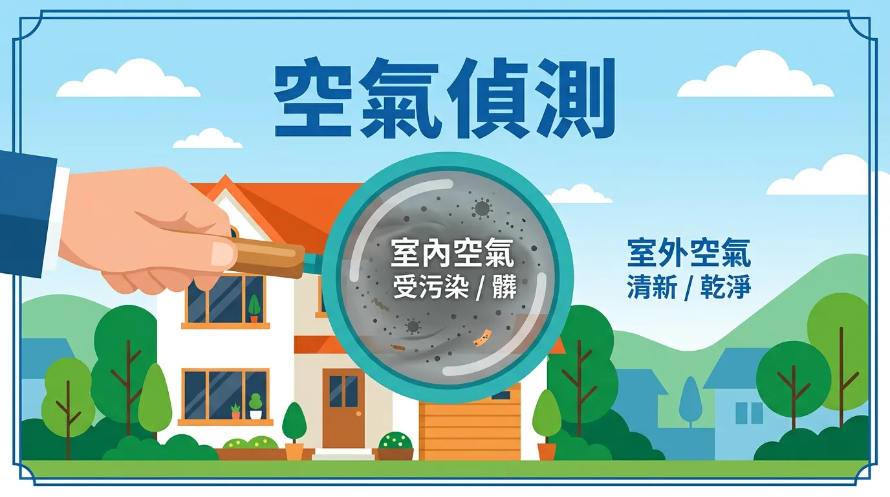
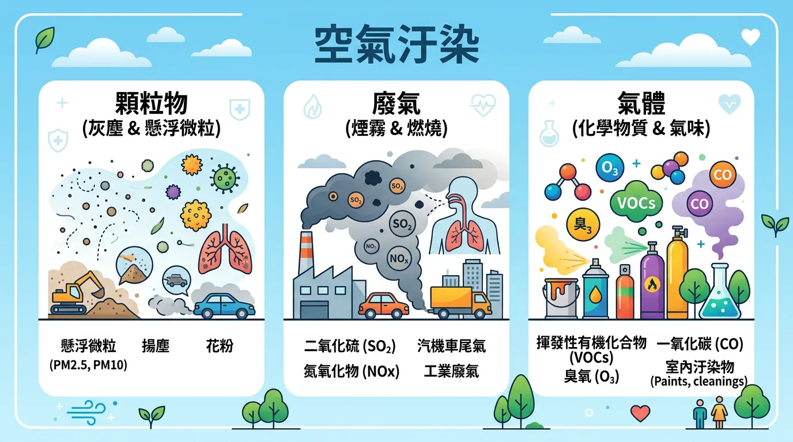
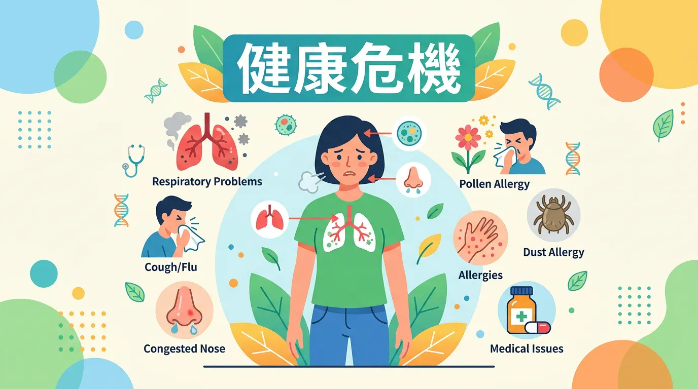
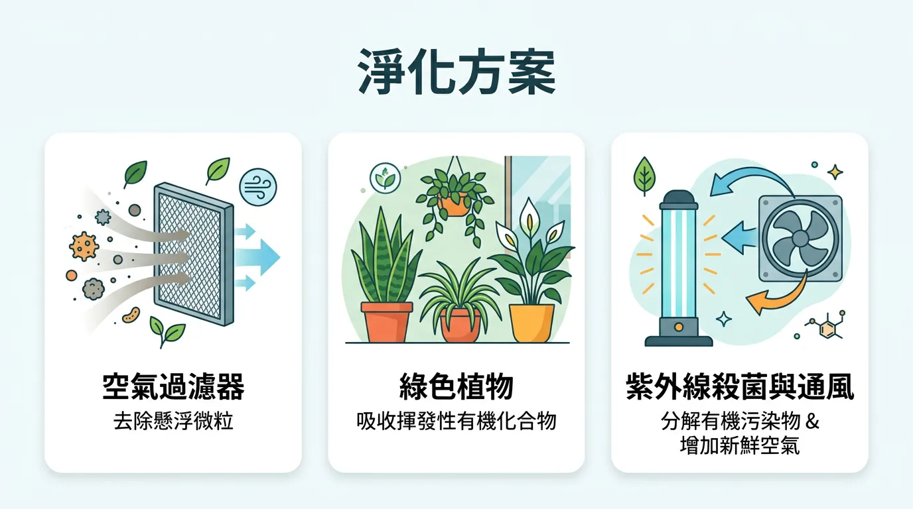
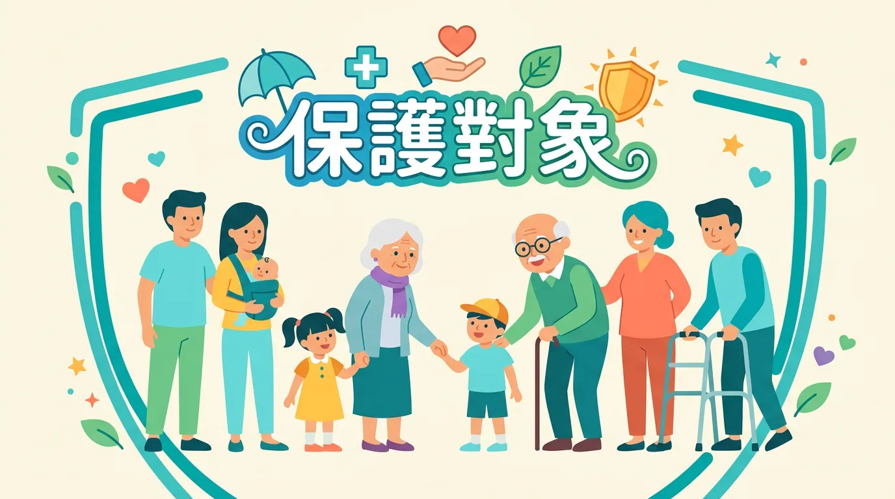

# 你家空氣比戶外還髒？打造純淨居家呼吸空間的實用指南

我們每天大概要吸進 11,000 公升的空氣——這是不管你願不願意，都得被迫吃下的「超級大餐」。但老實說，你真的有想過這頓大餐乾淨嗎？很多人覺得「外面空氣差，躲在家裡就沒事了」，這其實是個致命的誤會。很多時候，你家剛裝潢好的甲醛、沙發上的塵蟎，甚至廚房炒菜的油煙，可能比馬路上的廢氣還要毒。

從懸浮微粒 PM2.5 到你天天接觸的化學物質，這些看不見的殺手不只會讓你猛打噴嚏，它們還會悄悄鑽進血管、甚至是你的大腦。這篇指南不是要嚇你，而是要實實在在地告訴你：除了買一台幾萬塊的清淨機，你還能做什麼？

<Takeaway title="3分鐘速讀：本篇精華重點" icon="📌">
  <TakeawayItem title="看懂指標再出門" type="warning">別只看天空灰不灰！出門前習慣打開手機查 AQI，超過 100 敏感族群就該戴上密合度高的口罩或減少出門。</TakeawayItem>
  <TakeawayItem title="室內不是絕對安全" type="danger">剛裝潢的房子、新買的家具是甲醛溫床。如果外面空氣好，**開窗通風**永遠是最有效的淨化器。</TakeawayItem>
  <TakeawayItem title="清淨機要買對" type="success">不要只看牌子。認明 HEPA 等級濾網與足夠容納你客廳坪數的 CADR 值，並記得定期換濾網，才不是買心酸的。</TakeawayItem>
</Takeaway>

---

## 專業視角：空氣品質怎麼看？

### 關鍵看點：AQI 空氣品質指標

別再只靠「肉眼看天空」來決定今天適不適合跑步了！各國通用的 AQI（Air Quality Index）就是你的空氣品質紅綠燈。

<DataTable theme="blue" caption="AQI 空氣品質指標與建議">
  <Fragment slot="header">
    <tr><th>AQI 範圍</th><th>等級</th><th>你的行動指南</th></tr>
  </Fragment>
  <tr><td>0–50</td><td>🟢 良好</td><td>放心去戶外奔跑吧！</td></tr>
  <tr><td>51–100</td><td>🟡 普通</td><td>一般人沒感覺，但過敏兒可能要帶包衛生紙。</td></tr>
  <tr><td>101–150</td><td>🟠 對敏感族群不健康</td><td>氣喘、心臟病患者請乖乖待在冷氣房。</td></tr>
  <tr><td>151–200</td><td>🔴 對所有人都不健康</td><td>「紅害」等級！健康的人也別去戶外劇烈運動了。</td></tr>
  <tr><td>201+</td><td>🟣 🟤 紫爆與危害</td><td>趕緊回家關緊門窗，啟動空氣清淨機。</td></tr>
</DataTable>

### 實用拆解：台灣 vs 國際標準比較

<DataTable theme="gray" caption="標準總是滾動式更新的">
  <Fragment slot="header">
    <tr><th>污染物</th><th>WHO 極嚴苛標準</th><th>台灣現行標準</th><th>美國 EPA 標準</th></tr>
  </Fragment>
  <tr><td>PM2.5（年均）</td><td>5 μg/m³ (2021)</td><td>15 μg/m³</td><td>12 μg/m³</td></tr>
  <tr><td>PM2.5（24hr）</td><td>15 μg/m³</td><td>35 μg/m³</td><td>35 μg/m³</td></tr>
  <tr><td>臭氧（8hr）</td><td>100 μg/m³</td><td>60 ppb</td><td>70 ppb</td></tr>
</DataTable>

---

## 核心觀念：主要空氣污染物

<CardGroup>
  <Card title="💨 顆粒物：穿透肺泡的微型炸彈" icon="💨" type="danger">
    **PM2.5（細懸浮微粒）** 直徑不到你頭髮的 1/28。這代表它完全無視你鼻毛的阻擋，直接穿透肺泡進入血液。長期下來，心臟病和肺癌的風險直線飆升。**PM10** 雖然大一點，但同樣會瘋狂刺激你的上呼吸道，引發狂咳與氣喘。
  </Card>
  <Card title="🌫️ 氣態污染物：刺鼻的隱形刺客" icon="🌫️" type="warning">
    你每天通勤吸入的汽機車廢氣（二氧化氮）、瓦斯爐燃燒不完全的產物（一氧化碳），或是工廠排出的二氧化硫。這些廢氣短時間內會讓你喉嚨癢、流眼淚，長時間暴露更是慢性呼吸道疾病的元凶。
  </Card>
</CardGroup>

### 重點解析：室內特有污染物

回到家，危機解除了嗎？並沒有。

**甲醛** 是室內空氣的頭號戰犯。從你剛鋪好的木地板、新買來的系統櫃，到各種膠合板，都在持續釋放這類毒氣。台灣室內標準為 0.08 ppm，即使低濃度也會刺鼻流淚，長期暴露還會增加鼻咽癌風險。除了甲醛，那些油漆裡的**苯**、老舊冷氣吹出來的**黴菌孢子**，甚至你覺得聞起來很香的「室內擴香」，其實都充滿了揮發性有機化合物（VOCs）。

---

## 進階討論：空氣污染對健康的影響

空氣污染不是只會讓你咳嗽，這是一場牽連全身器官的慢性戰爭。

<CardGroup>
  <Card title="🫁 呼吸與心血管" icon="🫁" type="danger">
    PM2.5 會激發全身性的發炎反應與氧化壓力。數據會說話：PM2.5 濃度每增加 10 μg/m³，心血管疾病死亡率就上升 4–6%。對於氣喘或 COPD（慢性阻塞性肺病）患者來說，更是一顆隨時引爆的炸彈。
  </Card>
  <Card title="🧠 大腦與免疫力" icon="🧠" type="warning">
    越來越多研究驚恐地發現：直徑小於 0.1μm 的超細微粒居然能**直接穿過血腦屏障**，不僅導致成年人認知功能提早衰退，還會削減兒童的學習能力，同時讓你變得特別容易感冒。
  </Card>
</CardGroup>

---

## 實用拆解：改善空氣品質的實用方法

### 深度解析：室內改善，這三招最管用

1. **戰術性通風**：
   除非外面正在「紫爆」，否則**開窗**永遠是最高效的除甲醛與 VOCs 策略。最佳時機是清晨和傍晚，避開車流高峰，每次開窗 15–30 分鐘讓屋內換氣。
2. **挑選空氣清淨機的底層邏輯**：
   別管它外型多潮！核心只有兩個：**HEPA 濾網**（負責捕捉 99.97% 懸浮微粒）以及**活性碳濾網**（負責吸附甲醛等毒氣）。購買前先算好你房間大小所需的 **CADR 值**（潔淨空氣輸出率），如果你買太小台，它就只是一台昂貴的電風扇。
3. **從源頭掐斷**：
   選購建材時直接指名「F1 級低甲醛」；煮菜不管大火小火，**一定要開抽油煙機**；家裡濕度控制在 40–60%，黴菌自然活不下去。

### 全面盤點：個人與飲食防護

- **選好你的盾牌（口罩）**：
  在戶外高污染環境，只有 **N95 口罩** 才能真正過濾 95% 的顆粒物。但記住：**密合度才是王道！** 口罩戴得再好，只要兩頰漏氣，就等於白戴。日常通勤使用一般醫用口罩擋擋大顆粒灰塵即可。
- **吃出肺部抵抗力**：
  對抗空污帶來的氧化壓力，最好的方法是吃進去抗氧化物。多攝取富含 [維生素 C](/vitamin-c/)、維生素 E 與多酚的蔬果。[地中海飲食](/mediterranean-diet/) 就是你最好的幫手。

---

## 重點解析：敏感族群的額外注意

- **兒童**：他們呼吸頻率快、肺部還在長，最容易受傷。紫爆的日子，請跟學校老師確認體育課是否改為室內。進階閱讀：[兒童營養與健康](/children-nutrition-health/)。
- **長者與慢性病患**：免疫力弱的長者，或是本來就有[心臟病](/heart-disease-prevention/)、[高血壓](/hypertension_management/)的病友，空污日出門等同於在玩俄羅斯輪盤，請盡量待在開啟清淨機的室內。

---

## 給你的最後建議

守護呼吸道健康不是等到空氣變糟才要緊張的事，而是每天的生活微調：
出門前花五秒滑一下 AQI App；買家電時撥點預算給一台足夠強力的空氣清淨機；遇到新裝潢的房子，千萬別急著住進去。不要認為自己年輕健康就天下無敵，你的肺只有一個，善待它吧。

---

## 常見問題（FAQ）

### 專業視角：我家裡需要空氣清淨機嗎？

**絕對需要！** 就算你住在深山裡，除非你家裡純淨無暇，否則你的煮菜油煙、棉被塵蟎、外來粉塵都會累積。如果家裡有寵物或是氣喘兒，這更是標準配備。請挑選結合 HEPA 和活性碳濾網的機型，並記得定期換濾網。

### 外面AQI超過100時一定要戴N95口罩嗎？

這取決於你的體質。AQI 破百時，敏感族群如果在戶外待超過半小時，**強烈建議戴上密合的 N95**。一般醫用口罩只能防飛沫和大灰塵，對 PM2.5 基本上是「門戶大開」。不過，如果只是下樓買個便當，醫用口罩也夠了。

### 新裝修房間的甲醛要多久才會散掉？

事實是：**幾個月到幾年不等！** 這是個漫長的拉鋸戰。千萬別以為買幾盆鳳梨皮或點精油就能除甲醛（那只是掩蓋味道）。唯一解法是 **「24小時長時間通風」** 加上活性碳幫助吸附。如果預算允許，請專業除甲醛公司來處理是最安心的。

### 睡眠時關窗開冷氣，空氣品質會變差嗎？

**會的，二氧化碳會飆高。** 關窗開冷氣會讓室外污染物進不來，但你呼出的二氧化碳會一直堆積，導致早上起床頭昏腦脹。最佳解法是：睡前先開窗換氣 15 分鐘，然後**開著冷氣睡覺的同時，也把空氣清淨機開到睡眠模式**，這是兼顧溫度與空氣品質的最佳平衡。

### 進階討論：植物能替代空氣清淨機嗎？

**這是一個美麗的誤會。** 很多人以為放幾盆虎尾蘭就能淨化全家，但研究顯示，你可能需要把客廳塞滿幾十盆植物，才可能達到一台入門清淨機的淨化效果。植物最棒的價值是安撫你的心靈、釋放一點氧氣，但真要對付滿屋子PM2.5，還是交給專業機器吧。

---

## 推薦閱讀：你可能也會喜歡

- [水質安全與健康](/water-quality-safety/)
- [室內空氣污染防護](/indoor-air-pollute/)
- [PM2.5 空氣污染](/pm2.5-air-pollute/)
- [微塑膠污染對健康的影響](/micro-plastic/)
- [天然免疫支持方法](/natural-immune-support/)