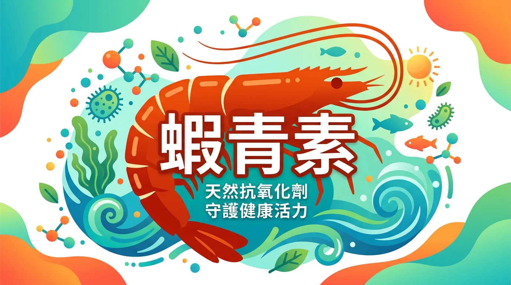
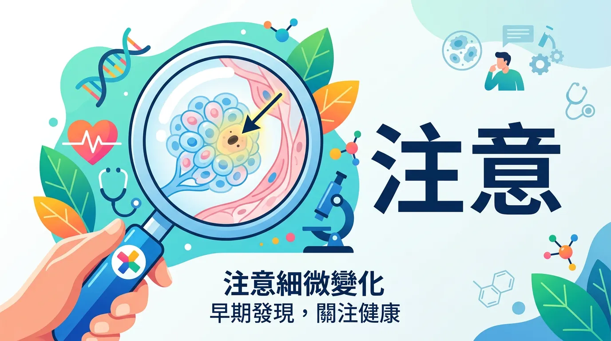
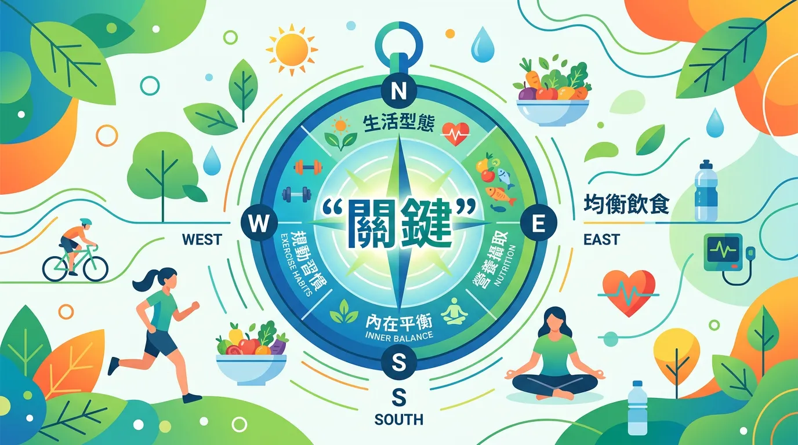
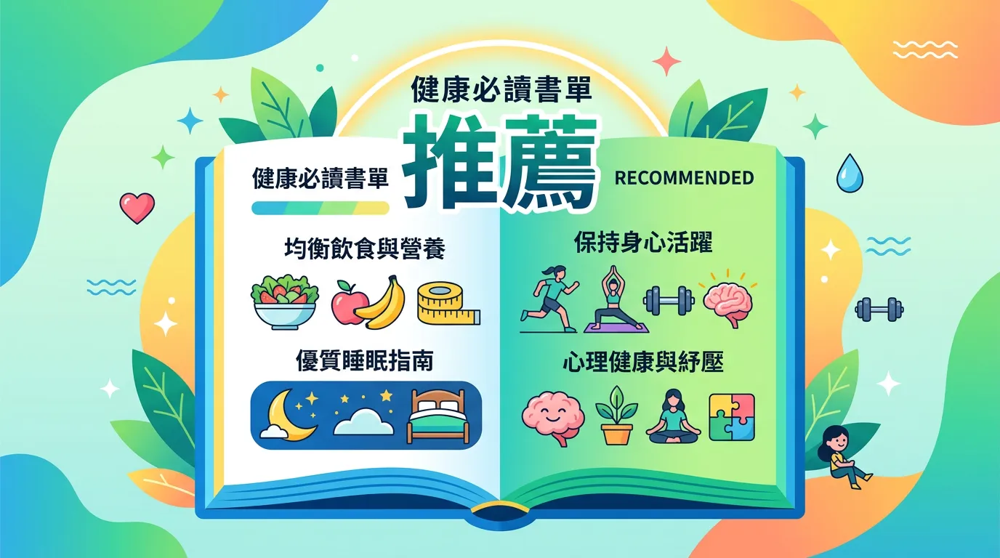

# 比維他命 C 強效千倍？揭開「抗氧化之王」蝦紅素的真實功效

本文你會學到：蝦青素是什麼、主要功效與注意事項、使用建議，以及是否值得補充的實證觀點。若用一句話概括：蝦青素從鮭魚等食物即可取得，非必需營養素；若選補充品須搭配油脂，孕婦、過敏或服藥者請先諮詢醫師。

先說結論：**如果你沒打算額外補充蝦青素，那不知道它是什麼也完全沒關係。**

蝦青素不像蛋白質或維生素 C 那樣是人體必需的營養素，正常飲食不會有「攝取不足」的問題。但如果你對它有興趣，或正在考慮購買相關保健品，那就繼續往下看吧。

---

## 3分鐘速讀：本篇精華重點

| 項目 | 說明 |
|------|------|
| **本質** | 天然類胡蘿蔔素，強效抗氧化劑 |
| **必需性** | ❌ 非必需營養素 |
| **主要來源** | 微藻（雨生紅球藻）、鮭魚、蝦蟹 |
| **建議劑量** | 2–4 mg/天（保健），最高 12 mg/天 |
| **吸收方式** | 脂溶性，需搭配油脂食用 |

---

## 白話文解釋：蝦青素是什麼？

蝦青素（Astaxanthin）是一種天然的類胡蘿蔔素色素，主要由微藻 *Haematococcus pluvialis*（雨生紅球藻）在惡劣環境下大量產生，作為自我保護機制[^6]。

鮭魚的橘紅色、蝦蟹煮熟後的紅色，都來自蝦青素。動物本身不能合成蝦青素，是透過食物鏈從藻類層層累積而來的。

常被引用的數據：蝦青素的抗氧化能力約為維生素 E 的 50 倍、β-胡蘿蔔素的 40 倍[^9]。不過要注意，這些數字來自體外實驗（試管研究），在人體內的實際效果並沒有這麼誇張。

---

## 吃對才有效！你不可不知的主要功效

### 全面盤點：抗氧化保護

蝦青素最核心的功能是清除自由基、減少氧化壓力。它具有獨特的分子結構，能同時嵌入細胞膜的內外兩層，提供全方位的保護[^10]。

### 重點解析：眼部健康

蝦青素是少數能穿越血腦屏障和血-視網膜屏障的抗氧化劑，理論上可以直接到達視網膜發揮保護作用。部分研究顯示它可能有助於緩解眼睛疲勞，但預防黃斑部病變的證據仍不充分。

如果你關心眼睛健康，也值得了解[葉黃素](/lutein-is-sufficiency/)和[維生素 A](/vitamin-a/)。

### 實用拆解：皮膚保護

小規模臨床試驗顯示，口服蝦青素 6–8 週後，皮膚的水分含量和彈性有所改善，細紋也有輕微減少[^3][^4]。這可能與它抑制紫外線引起的膠原蛋白分解有關。

### 專業視角：心血管健康

動物實驗和初步人體研究暗示，蝦青素可能有助於改善血脂指標（降低 LDL 壞膽固醇、提高 HDL 好膽固醇）[^5]。但臨床證據仍然有限。

### 核心觀念：免疫調節

一項小型人體研究發現，補充蝦青素 8 週後，免疫細胞活性有所提升，發炎指標降低[^2]。

---

## 進階討論：需要注意的地方

### 深度解析：運動員要小心

有趣的是，蝦青素的強效抗氧化特性可能**反而不利於運動訓練**。適度的氧化壓力是肌肉適應和成長的訊號之一，如果被抗氧化劑完全抑制，可能影響訓練效果[^1]。

### 專家私藏的正確使用攻略

- **劑量**：一般保健 2–4 mg/天，最高不超過 12 mg/天
- **服用時機**：餐後，搭配含有油脂的食物以提高吸收率
- **來源選擇**：優先選擇天然微藻來源，避免人工合成品[^7]
- **孕婦和哺乳婦女**：安全性資料不足，建議先諮詢醫師

---

## 關鍵看點：真正重要的事

蝦青素的研究雖然有趣，但絕大多數證據來自體外實驗或小規模臨床試驗，離「臨床推薦」還有很長的路要走。

與其花錢買蝦青素保健品，不如把預算花在以下更有實證基礎的事情上：

- **多吃蔬果** — 天然的抗氧化劑組合，效果比單一補充品更好
- **一週吃兩次鮭魚** — 既有蝦青素又有 omega-3 脂肪酸
- **做好[防曬](/how-to-choose-sunscreen/)** — 保護皮膚最有效的方法
- **確認[基礎營養素](/macronutrients-guide/)充足** — 打好地基比蓋裝飾品重要

---

## 常見問題（FAQ）

### 關鍵看點：蝦青素真的是最強抗氧化劑嗎？

在體外實驗中確實表現優異，但人體內的效果受到**吸收率、代謝速度**等因素影響，實際功效不能直接等同於體外數據。行銷上的「50倍維生素E」是基於試管研究，在人體內很難達到。

### 吃鮭魚和蝦蟹就夠了，需要買補充品嗎？

**野生鮭魚**含蝦青素較高，一週吃2-3次能攝取到天然蝦青素。蝦蟹含量遠低於補充品。若你的飲食中經常有鮭魚等富含蝦青素的食物，額外補充品的效益有限。

### 蝦青素補充品要吃多久才能看到效果？

研究中看到皮膚改善多需6-8週，眼睛疲勞改善可能需要4-8週。**脂溶性營養素需搭配油脂食用才能有效吸收**，飯後服用吸收效果最佳。若3個月後無明顯感受，可考慮停用。

### 專業視角：蝦青素對運動員有幫助嗎？

有趣的是，蝦青素的強效抗氧化可能**反而不利於運動訓練**。適度氧化壓力會刺激肌肉適應與成長，被完全抑制反而影響訓練效果。認真健身的人應慎用。

### 深度解析：孕婦和哺乳媽媽能吃蝦青素嗎？

目前安全性資料不足，**不建議在懷孕或哺乳期額外補充**。若想從食物中自然攝取（如吃鮭魚），問題不大，但補充品劑量應先諮詢醫師或營養師。

---

## 給你的最後建議

蝦青素在體外與小規模研究中表現亮眼，但尚不足以作為普遍推薦的補充品。優先做好均衡飲食、適量鮭魚、防曬與基礎營養，比單一補充蝦青素更有實證基礎。

---

## 推薦閱讀：你可能也會喜歡

- [葉黃素補充指南](/lutein-is-sufficiency/)
- [維生素 E 完整指南](/vitamin-e/)
- [營養補充品到底有沒有用？](/is-supplement-works/)
- [如何選擇優質營養補充品](/quality-supplement-selection/)

---

## 這裡有科學根據：參考文獻

1. Baralic, I., et al. (2015). Effect of astaxanthin supplementation on salivary IgA, oxidative stress, and inflammation in young soccer players. *Evidence-Based Complementary and Alternative Medicine*, 2015.

2. Park, J. S., et al. (2010). Astaxanthin decreased oxidative stress and inflammation and enhanced immune response in humans. *Nutrition & Metabolism*, 7(1), 18.

3. Tominaga, K., et al. (2012). Cosmetic benefits of astaxanthin on humans subjects. *Acta Biochimica Polonica*, 59(1), 43-47.

4. Ito, N., et al. (2018). The protective role of astaxanthin for UV-induced skin deterioration in healthy people. *Nutrients*, 10(7), 817.

5. Fassett, R. G., & Coombes, J. S. (2011). Astaxanthin: a potential therapeutic agent in cardiovascular disease. *Marine Drugs*, 9(3), 447-465.

6. Ambati, R. R., et al. (2014). Astaxanthin: sources, extraction, stability, biological activities and its commercial applications. *Marine Drugs*, 12(1), 128-152.

7. Higuera-Ciapara, I., et al. (2006). Astaxanthin: a review of its chemistry and applications. *Critical Reviews in Food Science and Nutrition*, 46(2), 185-196.

8. Yuan, J. P., et al. (2011). Potential health-promoting effects of astaxanthin. *Molecular Nutrition & Food Research*, 55(1), 150-165.

9. Nishida, Y., et al. (2007). Quenching activities of common hydrophilic and lipophilic antioxidants against singlet oxygen. *Carotenoid Science*, 11, 16-20.

10. Kidd, P. (2011). Astaxanthin, cell membrane nutrient with diverse clinical benefits and anti-aging potential. *Alternative Medicine Review*, 16(4), 355-364.