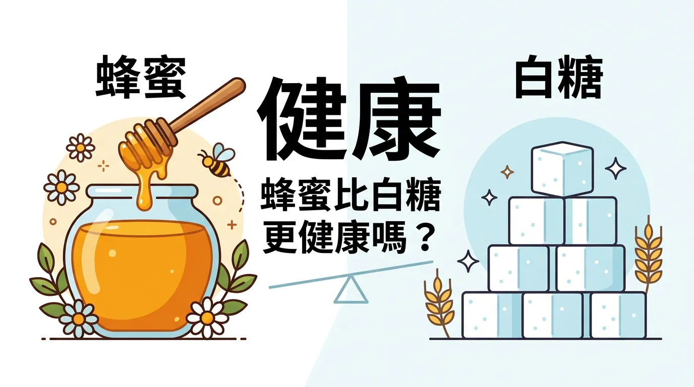
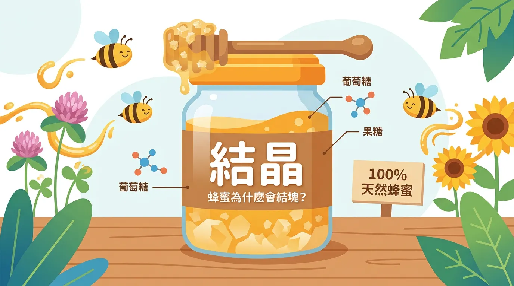
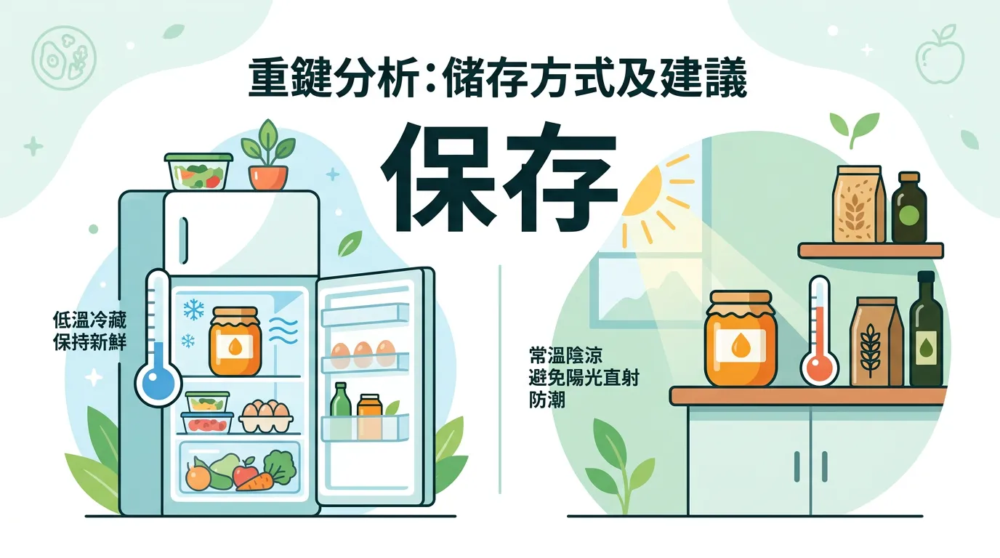
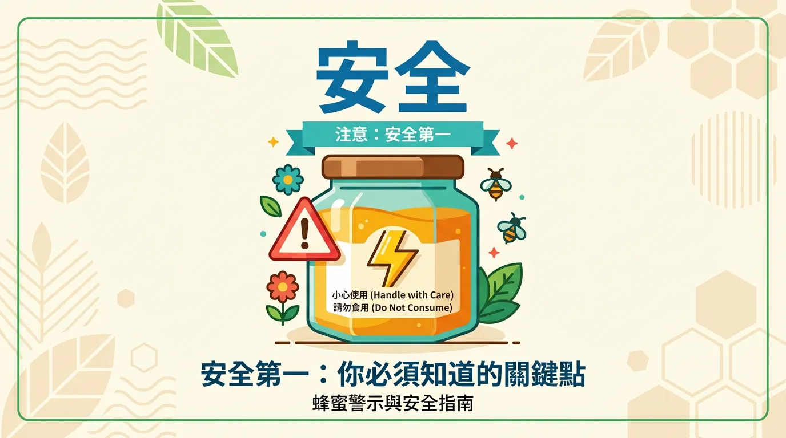
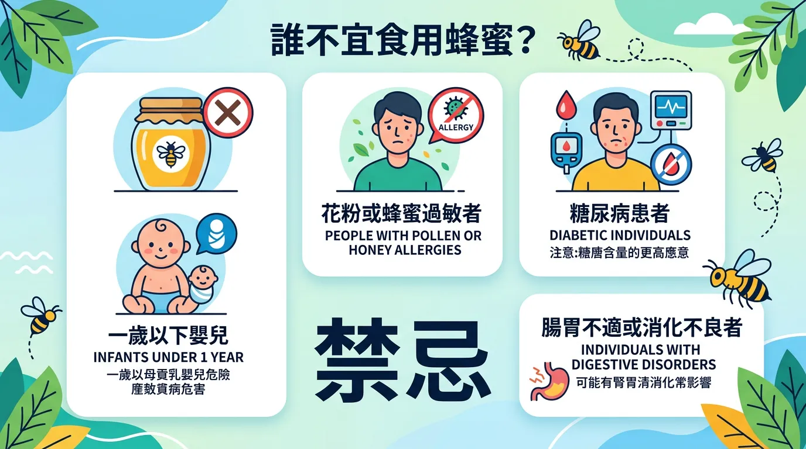
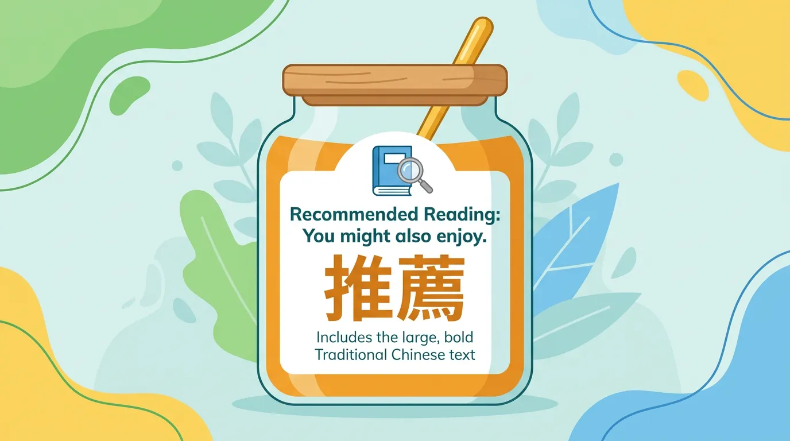

# 泡蜂蜜水千萬別用熱水！破解加熱蜂蜜產生毒素的迷思

本文你會學到：加熱蜂蜜是否產生毒素、HMF 與活性的真相、蜂蜜與糖的比較、結晶與儲存方式，以及嬰兒禁忌等安全提醒。一句話總結：加熱蜂蜜不會產生毒素，結晶是正常；1 歲以下嬰兒絕對不可吃蜂蜜，本質仍是糖不宜過量。

蜂蜜是由蜜蜂採集花蜜後經由唾液酶轉化而成的天然甜味劑。許多人認為蜂蜜是比精製糖更健康的選擇，甚至賦予它各種藥用期待。然而，關於蜂蜜的「加熱毒性」與「儲存方式」存在不少誤解。本文將從科學角度一一釐清。

---

## 3分鐘速讀：本篇精華重點

<DataTable theme="blue" caption="蜂蜜快速摘要">
  <Fragment slot="header">
    <tr><th>項目</th><th>說明</th></tr>
  </Fragment>
  <tr><td><strong>加熱安全性</strong></td><td>✅ 安全。不會產生毒素，但高溫會破壞部分活性酶。</td></tr>
  <tr><td><strong>結晶現象</strong></td><td>✅ 正常。是葡萄糖析出的自然過程，不代表變質。</td></tr>
  <tr><td><strong>儲存建議</strong></td><td>陰涼避光處即可。若要長期維持活性，4°C 最佳。</td></tr>
  <tr><td><strong>特殊限制</strong></td><td>⚠️ <strong>1 歲以下嬰兒絕對禁止食用</strong>（肉毒桿菌中毒風險）。</td></tr>
  <tr><td><strong>營養地位</strong></td><td>仍屬「游離糖」。雖有微量營養素，但不建議過量攝取。</td></tr>
</DataTable>

---

## 深度解析：加熱蜂蜜真的有毒嗎？

這是一個流傳甚廣的網路謠言，來源可能與阿育吠陀（Ayurveda）的古老觀點有關。

### 實用拆解：科學真相：HMF 的產生
人們擔心的有毒物質主要是**羥甲基糠醛（HMF）**。HMF 是糖類在酸性環境中受熱分解後的副產物。雖然過量的 HMF 可能有害，但合法生產的蜂蜜在標準加工或家庭烹飪（如泡蜂蜜水、做蜂蜜蛋糕）中所產生的 HMF 濃度，**遠低於引起健康問題的水平**[^3][^4]。

台灣食藥署也曾官方澄清：目前尚未有證據顯示 HMF 對人體具有臨床毒性，「加熱超過 40°C 會有毒」的說法缺乏科學基礎。

### 全面盤點：加熱的真正影響：失去活性
雖然沒毒，但高溫（超過 40°C）會讓蜂蜜中的**轉化酶**與**澱粉酶**失活。這些酵素被認為具有助消化和抗氧化的潛力，因此若想保留這些「活性」，建議用常溫水沖泡。

---

## 核心觀念：蜂蜜比糖更健康嗎？

蜂蜜約含 80% 的糖（主要是果糖與葡萄糖）和 17% 的水，剩餘的 3% 包含微量的維生素、礦物質、胺基酸與抗氧化物。

### 專業視角：臨床研究結果
一項針對 1,105 名參與者的研究分析發現，每天攝取約 40 克蜂蜜的人，在以下指標有輕微改善[^10]：
- **高密度脂蛋白 (HDL)**：輕微上升
- **總膽固醇與 LDL（低密度脂蛋白）**：輕微下降
- **空腹血糖**：輕微下降

**結論**：蜂蜜確實比精製砂糖「好一點點」，但它本質上仍是糖。如果你喜歡蜂蜜的風味，它是很好的替代品；但若想靠吃蜂蜜來獲得健康，效益可能比不上少吃甜食。

---

## 驚人真相：為什麼蜂蜜會「結晶」？

很多人看到蜂蜜變硬、變白，就以為是壞掉或是買到假貨，其實這剛好相反。

- **結晶原理**：蜂蜜是葡萄糖的過飽和溶液。當溫度下降或水分蒸發時，葡萄糖會自然析出形成結晶。
- **影響因素**：含水量越低、葡萄糖比例越高、含有微量花粉的天然蜂蜜，越容易結晶。
- **處理方法**：將瓶身放入 40°C 左右的溫水中隔水加熱，即可恢復流動狀態。

<Simulation title="情境模擬" icon="🍯">
  你打開冰箱發現蜂蜜整罐變硬、顏色變白，以為是壞掉或買到假貨。其實這是**結晶**——葡萄糖自然析出，代表品質不差。隔水加熱 40°C 左右即可恢復流動，不必丟棄。
</Simulation>

了解加熱與結晶真相後，儲存可以這樣做：

---

## 重點解析：儲存方法與建議

### 進階討論：哪裡是最佳儲存點？
- **短期食用**：放在室溫（18–24°C）、陰涼通風處即可。
- **長期保存**：若想長期抑制 HMF 產生並保留活性，4°C 冷藏是最佳選擇。但要注意冷藏會導致蜂蜜變極其黏稠且結晶。
- **最佳實踐**：每次購買少量，放在室溫，並在幾個月內吃完。

---

## 安全第一：你必須知道的防雷重點

<Callout icon="⚠️" title="實用提醒：食用與保存注意">
- **嬰兒禁忌**：1 歲以下嬰兒腸道屏障未成熟，蜂蜜可能含有肉毒桿菌孢子，攝取後可能導致呼吸困難甚至致死。
- **糖尿病患者**：蜂蜜仍會影響血糖，攝取量需諮詢營養師。
- **過敏反應**：對蜜蜂製品或特定花粉過敏者應謹慎食用。
</Callout>

---

## 千萬別搞錯：誰不適合食用蜂蜜？

**1 歲以下嬰兒絕對禁止**（肉毒桿菌孢子風險）。**糖尿病**者須計入糖分與醫師討論。**對蜂製品或花粉過敏**者應避免。蜂蜜仍屬游離糖，不宜取代正餐或過量攝取。

---

## 給你的最後建議

加熱蜂蜜不會產生毒素，但高溫會破壞部分活性成分；結晶是正常現象。蜂蜜比精製糖略好，本質仍屬游離糖，不宜過量。1 歲以下嬰兒絕對禁止食用，以避開肉毒桿菌風險。

---

## 常見問題（FAQ）

### 加熱蜂蜜超過40°C就會產生毒素是真的嗎？

這是**常見的網路謠言**，缺乏科學根據。雖然高溫會產生微量的羥甲基糠醛（HMF），但家庭烹飪溫度下的濃度遠低於對人體造成傷害的水平。台灣食藥署已官方澄清此說法無科學基礎。

### 蜂蜜結晶了代表變質嗎？應該丟掉嗎？

**完全相反**，結晶代表蜂蜜品質不差。當溫度下降或水分蒸發時，葡萄糖自然析出就會結晶。將瓶身放入40°C溫水隔水加熱即可恢復流動狀態，不需丟棄。結晶的蜂蜜通常是高品質的表現。

### 關鍵看點：蜂蜜比砂糖真的健康很多嗎？

蜂蜜約80%是糖、17%是水、3%才是微量營養素。研究顯示每天40克蜂蜜對血糖、膽固醇有**輕微改善**，但差異不大。本質上蜂蜜仍屬游離糖，若想靠吃蜂蜜變健康，效益可能不如**少吃甜食**來得實在。

### 實用拆解：糖尿病患者能吃蜂蜜嗎？

蜂蜜仍會**影響血糖**，不建議隨意食用。應計入日常糖分攝取，並在營養師或醫師指導下決定是否適合以及攝取量。血糖控制不佳的患者應儘量避免。

### 進階討論：蜂蜜該怎麼儲存最好？

**短期食用**：室溫陰涼處即可。**長期保存**：4°C冷藏能最好地保留活性與抑制HMF產生，但會導致結晶且黏稠度增加。建議每次購買適量、在幾個月內食用完畢，避免長期囤積。

---

## 推薦閱讀：你可能也會喜歡

- [1 歲以下嬰兒不應喝果汁？](/baby-should-not-drink-juice/)
- [生酮飲食 vs 低碳飲食](/weight-loss-ketogenic-diet/)
- [腸道健康基礎指南](/gut-health-fundamentals/)
- [薑的功效與藥用價值](/ginger/)

---

## 這裡有科學根據：參考文獻

以下文獻最後檢索：2026-02。

1. Erejuwa, O. O., et al. (2012). Honey: a novel antioxidant. *Molecules*, 17(4), 4400-4423.

2. Alvarez-Suarez, J. M., et al. (2010). Antioxidant and antimicrobial capacity of monofloral Cuban honeys. *Food and Chemical Toxicology*, 48, 2490-2499.

3. Gheldof, N., et al. (2002). Identification and quantification of antioxidant components of honeys. *Journal of Agricultural and Food Chemistry*, 50, 5870-5877.

5. Al-Waili, N. S. (2004). Natural honey lowers plasma glucose, C-reactive protein, and blood lipids. *Journal of Medicinal Food*, 7, 100-107.

10. Rasad, H., et al. (2018). The effect of honey consumption compared with sucrose on lipid profile in young healthy subjects. *Clinical Nutrition ESPEN*, 26, 8-12.