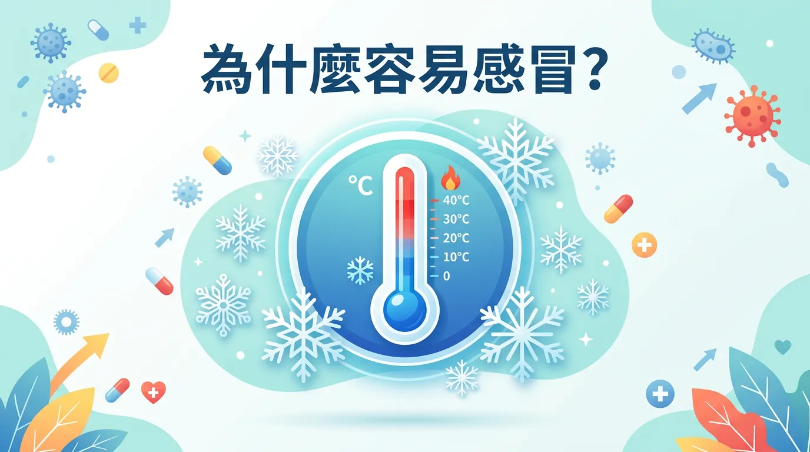
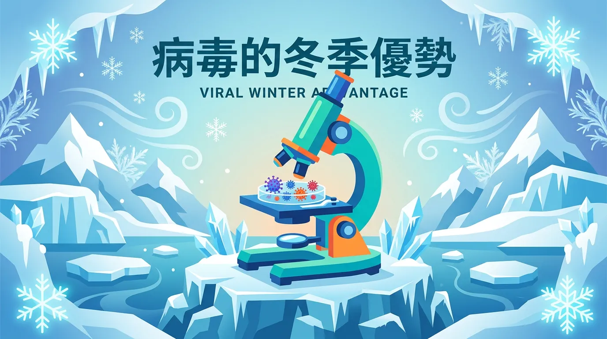
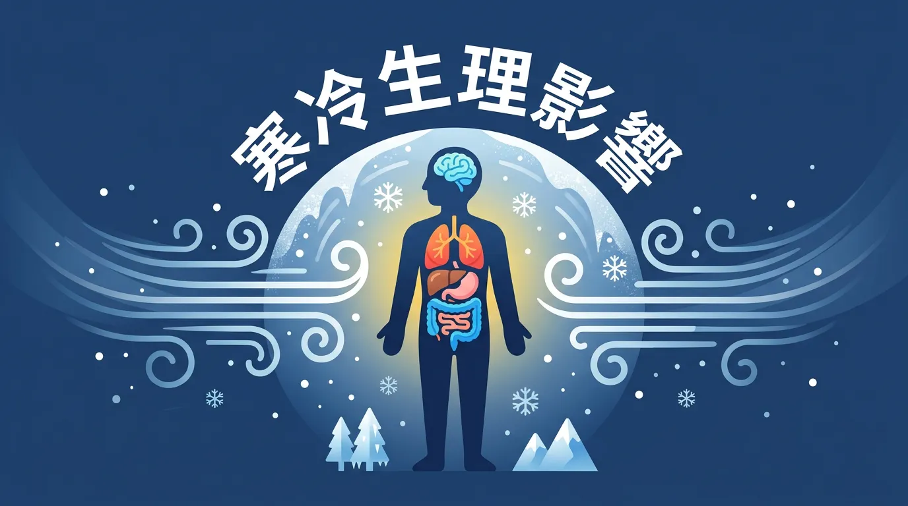

# 「穿太少會感冒」是真的嗎？破解低溫與病毒感染的科學真相

本文你會學到：冷空氣為什麼不會「帶來」病毒、冬天易感冒的三個科學原因（病毒存活、免疫屏障、室內聚集），以及實證有效的預防做法。一句話講：冷不會直接讓人感冒，病毒才是元兇；冬天多洗手、通風、必要時戴口罩可降低感染。

每當氣溫驟降，長輩總會叮嚀：「多穿一點，不然會感冒。」這句話只對一半。醫學上的「感冒」是超過 200 種病毒（如鼻病毒、流感病毒）引起的呼吸道感染——**冷空氣本身不含病毒**，但冬天確實是感冒與流感的高峰期，原因跟病毒特性與人的行為都有關。

---

## 全面盤點：快速摘要：為什麼冬天容易感冒？

<DataTable theme="blue" caption="冬天易感冒的關鍵因素">
  <Fragment slot="header">
    <tr><th>關鍵因素</th><th>科學解釋</th></tr>
  </Fragment>
  <tr><td><strong>病毒存活率</strong></td><td>低溫、低濕度下病毒在空氣中穩定性更高[^1]。</td></tr>
  <tr><td><strong>免疫屏障</strong></td><td>冷空氣使鼻腔黏膜血管收縮，降低白血球抗病毒效率。</td></tr>
  <tr><td><strong>室內聚集</strong></td><td>低溫使人待在密閉室內，飛沫與氣溶膠傳播機會增加。</td></tr>
  <tr><td><strong>維生素 D</strong></td><td>冬季日照減少，可能維生素 D 不足，影響免疫功能[^18]。</td></tr>
</DataTable>

<CardGroup>
  <Card title="病毒：冬季優勢" icon="🦠" type="warning">
    流感病毒包膜在寒冷下更穩定；乾燥空氣讓飛沫變小、懸浮更久、傳播更遠。
  </Card>
  <Card title="人體：防線變弱" icon="🫁" type="info">
    冷空氣使鼻腔纖毛變慢、黏膜血管收縮，送往呼吸道的免疫細胞減少。
  </Card>
</CardGroup>

<Takeaway title="預防冬季感冒" icon="🧤">
  <TakeawayItem title="勤洗手與口罩" type="success">對抗飛沫與接觸傳播最有效。</TakeawayItem>
  <TakeawayItem title="室內通風" type="info">定期開窗，即使天冷也讓空氣流通。</TakeawayItem>
  <TakeawayItem title="補水與維生素 D" type="warning">維持黏膜濕潤；冬季可評估[維生素 D](/fix-vitamin-d/)補充。</TakeawayItem>
  <TakeawayItem title="流感疫苗" type="success">顯著降低重症風險，見[天然免疫支持](/natural-immune-support/)。</TakeawayItem>
</Takeaway>

---

## 核心觀念：病毒的「冬季優勢」

### 1. 👉 溫度的穩定性
流感病毒有一層油性的「包膜」。在寒冷天氣下，這層包膜會變成類似蠟狀的固體，保護病毒在人與人之間傳遞時不被環境破壞。當病毒進入溫暖的呼吸道後，這層蠟便會融化，釋放出病毒進行感染。

### 2. 👉 濕度與飛沫傳播
冬天的空氣通常較乾燥。當病患咳嗽或打噴嚏時，飛沫中的水分會迅速蒸發，使飛沫變小、變輕。這些微小的氣溶膠（aerosol，空氣中懸浮的微小飛沫）能在空氣中懸浮更久，傳播距離也更遠[^3]。

---

## 重點解析：寒冷對人體的生理影響

雖然寒冷不直接產生病毒，但它會弱化我們的第一道防線：

- **鼻腔預熱失效**：當我們吸入極冷空氣時，鼻腔內的纖毛運動會變慢，這降低了排除黏液與病原體的能力。
- **血管收縮**：為了維持體溫，皮膚與黏膜血管會收縮，這意味著被送往呼吸道前線對抗病毒的免疫細胞變少了。

了解原因後，可以這樣預防：

---

## 進階討論：怎麼預防冬季感冒？

穿暖可以減少身體負擔，但真正有用的是這些：

1. **勤洗手與口罩**：這是對抗飛沫與接觸傳播最簡單、最有效的方法。
2. **保持室內通風**：即使天氣冷，也應定期開窗讓空氣流通。
3. **適度補水**：維持黏膜溼潤，有助於纖毛正常運作。
4. **補充維生素 D**：冬季日照不足的人群，可與醫師討論是否需使用[維生素 D 補充](/fix-vitamin-d/)。
5. **接種疫苗**：[流感疫苗](/natural-immune-support/)能顯著降低重症風險。

---

## 常見問題（FAQ）

### 冷空氣真的會把病毒帶進我身體嗎？

不會。寒冷本身沒有病毒，但冷空氣會使你的鼻腔纖毛運動變慢、鼻黏膜血管收縮，削弱第一道防線。同時，冬天病毒在乾冷空氣中更穩定，傳播效率高，所以冬天感冒多不是因為「冷」而是**病毒條件優化了**。

### 深度解析：穿厚衣服就不會感冒嗎？

穿暖能減少身體負擔與免疫消耗，但感冒主要靠飛沫與接觸傳播。穿再厚的衣服也擋不住病毒，真正有效的是**勤洗手、戴口罩、通風**等物理防護。

### 驚人真相：為什麼冬天打流感疫苗比感冒更重要？

感冒有 200 多種病毒，無法完全預防；但**流感疫苗能預防最具殺傷力的少數病毒**，顯著降低重症與死亡風險。尤其長者、幼兒與慢性病患，接種疫苗對生命安全影響最大。

### 吹冷氣、吃冰會「著涼」導致感冒嗎？

不會直接導致。但長期吹冷氣導致免疫失調、或冷刺激使黏膜血流減少，確實會**短暫削弱防線**，增加被已存在病毒感染的風險。重點是：感染需要病毒，單純「冷」無法產生病毒。

### 維生素 D 補充真的能防冬季感冒嗎？

部分人因冬季日照不足導致維生素 D 缺乏，而維生素 D 確實支持免疫功能。若你檢測發現缺乏，補充能改善；但若維生素 D 正常，額外補充對健康人群幫助有限，洗手與通風優先。

---

## 給你的最後建議

穿暖能減輕身體負擔，但防感冒的關鍵是**洗手**和**室內通風**。冬天除了穿夠衣服，記得常開窗、勤洗手，比多穿幾件更實際。

---

## 推薦閱讀：你可能也會喜歡

- [天然免疫力支持：除了維生素 C 還有什麼？](/natural-immune-support/)
- [室內空氣污染：如何打造與呼吸共生的純淨居家空間？](/indoor-air-pollute/)
- [正確清洗蔬果：流動水沖洗、物理摩擦與農藥移除的科學實證](/wash-vegetable/)
- [生活型態與免疫力](/lifestyle-immunity-factors/)

---

## 這裡有科學根據：參考文獻

以下文獻最後檢索：2026-02。

1. Lowen, A. C., et al. (2007). *Influenza virus transmission is dependent on relative humidity and temperature*. PLoS Pathogens.

3. Shaman, J., & Kohn, M. (2009). *Absolute humidity modulates influenza survival and transmission*. PNAS.

18. Zhu, Z., et al. (2022). *Association between vitamin D and influenza: meta-analysis*. Frontiers in Nutrition.

29. Foxman, E. F., et al. (2015). *Temperature-dependent innate defense against the common cold virus*. PNAS.