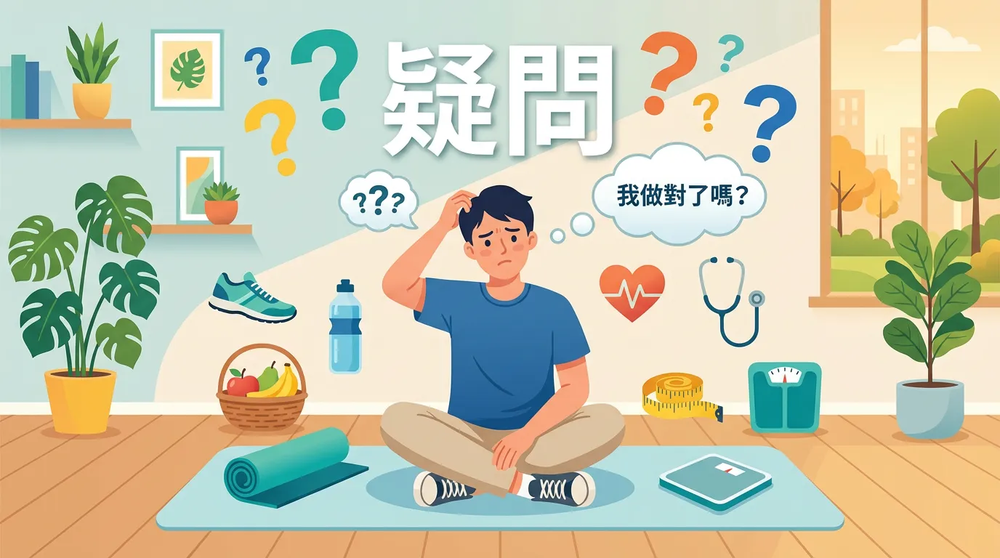
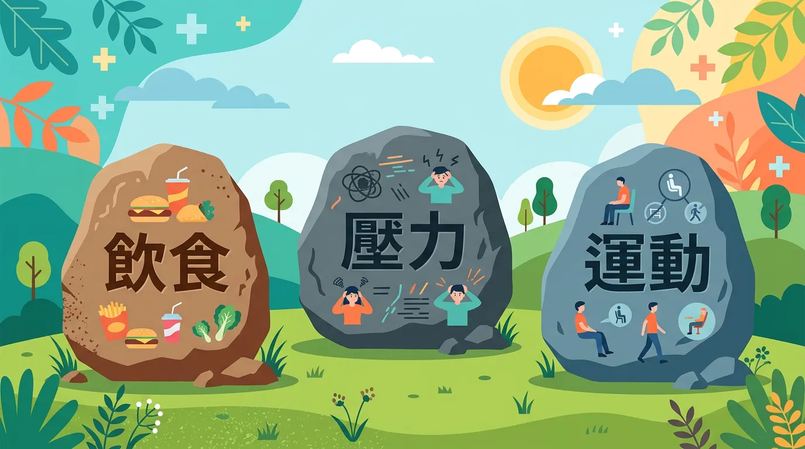
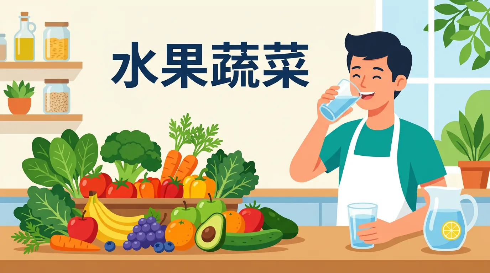
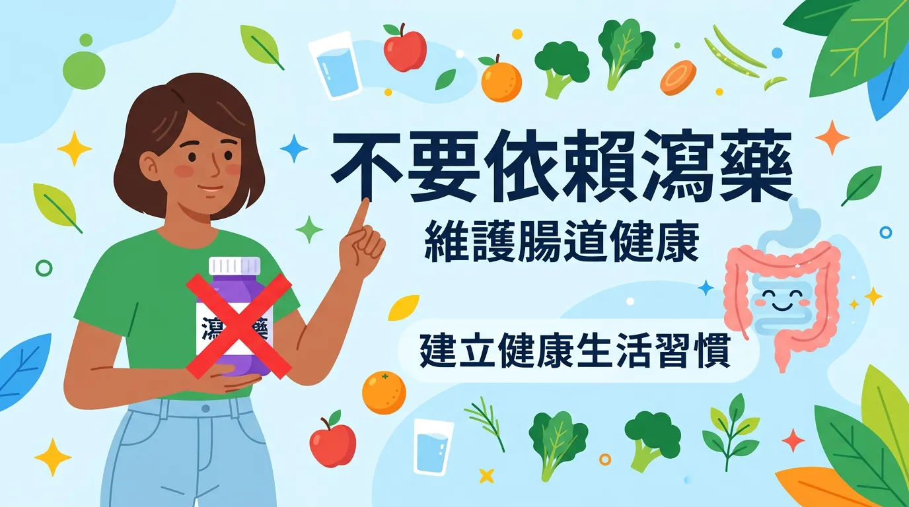

# 經常便秘怎麼辦？除了吃青菜，你還缺少的順暢解方

本文你會學到：醫學上怎麼定義便秘、常見三大成因（飲食、生活、藥物）、不需瀉藥的自然緩解法（高纖、水分、蹲姿、按摩），以及何時該就醫。直白地說：多數便秘是纖維與水分不足、久坐或忽視便意，先做到高纖多水與規律排便，多數能改善；血便或體重減輕要就醫。

便秘（constipation）不是一種病，而是一種很常見的症狀。全球約 15% 的人有這個困擾，年紀越大比例越高[^3]。長期便秘會腹脹、腹痛，也可能導致痔瘡、肛裂，甚至影響情緒。

<CardGroup>
  <Card title="常見成因：飲食與水分" icon="🥤" type="warning">
    精製澱粉、高脂、加工零食多，纖維與水分不足，糞便體積小、便質硬，最常見。
  </Card>
  <Card title="生活與藥物因素" icon="💊" type="info">
    缺乏運動、忽視便意、壓力；或補鐵劑、止痛藥、部分胃藥會加重便秘。先調整飲食與作息再考慮用藥。
  </Card>
</CardGroup>

<Simulation title="情境模擬" icon="🚽">
  你以為自己「腸子無力」所以狂吃益生菌。其實多數慢性便秘是**纖維與水分不夠**、或**久坐不動**。先做到每日 25g 纖維、2,000c.c. 水、走路 30 分鐘，兩週後往往就有感。
</Simulation>

---

## 核心觀念：快速摘要：你真的便秘嗎？

根據「羅馬準則」（Rome criteria，國際功能性腸道疾患診斷標準）的定義，過去三個月內若符合以下至少兩項，就屬慢性便秘：

<DataTable theme="blue" caption="慢性便秘判斷標準（羅馬準則）">
  <Fragment slot="header">
    <tr><th>症狀描述</th><th>判斷標準</th></tr>
  </Fragment>
  <tr><td><strong>排便頻率</strong></td><td>每週少於 3 次。</td></tr>
  <tr><td><strong>便質形態</strong></td><td>糞便乾硬、呈小球狀（似羊大便）。</td></tr>
  <tr><td><strong>排便感覺</strong></td><td>需過度用力、有排不乾淨的殘便感、或有阻塞感。</td></tr>
  <tr><td><strong>就醫警訊</strong></td><td><strong>血便、體重驟降、腹痛劇烈</strong>（需立即就醫）。</td></tr>
</DataTable>

---

## 驚人真相：為什麼會便秘？常見三大成因？

### 1. 👉 飲食與水分不足
這是最常見的原因。膳食纖維能增加糞便體積並軟化便質，而水分則是腸道蠕動的潤滑劑。
- **罪魁禍首**：精製澱粉、高脂肉類、加工零食。

### 2. 👉 生活型態與心理因素
- **缺乏運動**：身體不活動，腸道蠕動也會跟著減緩。
- **忽視排便衝動**：長期抑制便意會使直腸感覺遲鈍。
- **壓力**：腸道被稱為人的「第二大腦」，交感神經長期亢奮會抑制消化功能。

### 3. 👉 藥物與疾病
- **藥物副作用**：補鐵劑、止痛藥（嗎啡類）、某些降血壓藥物及胃藥（含鋁、鈣）[^8]。
- **疾病因素**：甲狀腺功能低下、糖尿病或腸梗阻。

了解成因後，多數人可以先從生活調整著手：

---

## 關鍵看點：不靠瀉藥怎麼改善？

在用藥之前，可以先試這些：

### 1. 👉 建立「三高一規律」

<Takeaway title="三高一規律" icon="🥬">
  <TakeawayItem title="高纖維" type="success">成年人每日 25–35g。推薦[全穀類](/macronutrients-guide/)、豆類、大份量蔬菜與高纖水果（如奇異果、火龍果）。</TakeawayItem>
  <TakeawayItem title="高水分" type="info">每日至少 2,000c.c. 清水。晨起一杯溫開水有助啟動「胃結腸反射」。</TakeawayItem>
  <TakeawayItem title="高活動" type="success">每天步行 30 分鐘，有效刺激腸道平滑肌。</TakeawayItem>
  <TakeawayItem title="規律排便" type="warning">每天固定時間（如早餐後 20 分鐘）如廁，營造放鬆環境。</TakeawayItem>
</Takeaway>

### 2. 👉 蹲姿的力量
使用馬桶時，腳下墊一個約 15 公分的小凳子，讓身體呈現 35 度蹲姿，有助於直腸與肛門的角度變直，讓排便更順暢。

### 3. 👉 腹部按摩
以肚臍為中心，依「順時針」方向進行環形按摩。模仿大腸蠕動方向，每日 3–5 分鐘。

---

## 專業視角：關於瀉藥的正確觀念

如果上述方法無效，可在藥師指導下使用輔助產品：

<DataTable theme="purple" caption="瀉藥類型與注意事項">
  <Fragment slot="header">
    <tr><th>類型</th><th>說明</th></tr>
  </Fragment>
  <tr><td><strong>膨脹型</strong>（如纖維粉）</td><td>副作用最少，但必須搭配大量飲水。</td></tr>
  <tr><td><strong>滲透型</strong>（如乳果糖、氧化鎂）</td><td>軟化糞便。</td></tr>
  <tr><td><strong>刺激型</strong>（如番瀉葉、芫荽子）</td><td><strong>不可長期使用</strong>，否則腸道會產生依賴性，讓便秘變得更頑固。</td></tr>
</DataTable>

---

## 千萬別搞錯：誰不適合只靠飲食調整或延遲就醫？

**血便、體重驟降、腹痛劇烈、排便習慣突然改變**者應盡快就醫排除腸阻塞或大腸病變。**長期服止痛藥、補鐵或胃藥**者便秘可能與用藥有關，勿自行停藥，應與醫師討論。**新生兒或長者**嚴重便秘須由醫師評估。

---

## 常見問題（FAQ）

### 實用拆解：益生菌能解決便秘嗎？

益生菌對腸道菌群有幫助，但多數便秘根本原因是**纖維與水分不足**。先做到每日 25g 纖維與 2,000c.c. 水，通常兩週內就見效；若無效，益生菌才是輔助選項。單靠益生菌卻忽視基礎飲食，效果有限。

### 全面盤點：大便乾硬該用瀉藥嗎？

不應第一時間用藥。先試「三高一規律」：高纖、高水、多活動、規律排便。若 2–3 週內無改善，可在藥師指導下用膨脹型瀉藥（副作用最少）。**絕對避免**長期用刺激型瀉藥（如番瀉葉），會產生腸道依賴。

### 揭秘！為什麼忽視便意會讓便秘越來越嚴重？

長期抑制便意會使直腸感覺神經遲鈍，到最後身體甚至感受不到排便訊號。這如同**「訓練」自己變便秘**。每天固定時間（如早餐後）如廁，即使無便意也要坐著，能逐漸恢復正常反射。

### 蹲姿馬桶比坐式馬桶更能改善便秘嗎？

是的。蹲姿讓直腸與肛門的角度更直，便於排便；坐式馬桶則會使該角度彎曲，需要更多用力。若家中無蹲廁，可在馬桶腳下墊 15 公分小凳子，模擬蹲姿，效果顯著。

### 血便、腹痛劇烈表示什麼？需要看醫生嗎？

**立即就醫**。血便可能源於痔瘡、肛裂、甚至腸道病變；劇烈腹痛與便秘合併可能預示腸梗阻。這些都不能自行判斷，必須由醫師檢查排除嚴重疾病。

---

## 給你的最後建議

便秘是身體在向你發出「缺少纖維、水分與休息」的警訊。透過調整飲食結構與生活作息，大多數人的便秘問題都能獲得顯著改善。若症狀持續超過三週或伴隨出血，請務必尋求腸胃科醫師的專業檢查。

---

## 推薦閱讀：你可能也會喜歡

- [地中海飲食：高纖保腸的健康首選](/mediterranean-diet/)
- [腸道健康基礎：益生菌與益生元的差別](/gut-health-fundamentals/)
- [正確清洗蔬果與飲食衛生](/wash-vegetable/)
- [痔瘡與血便的居家照護指南](/hemorrhoid-bloody-stools/)

---

## 這裡有科學根據：參考文獻

以下文獻最後檢索：2026-02。

2. *Guyton and Hall Textbook of Medical Physiology*. Role of Large Intestine in Absorption.

3. Bharucha, A. E., et al. (2013). AGA Medical Position Statement on Constipation. *Gastroenterology*.

8. Suares, N. C., & Ford, A. C. (2011). Prevalence of chronic idiopathic constipation. *The American Journal of Gastroenterology*.

11. *NIDDK*. Treatment for Constipation: Fiber and Lifestyle.