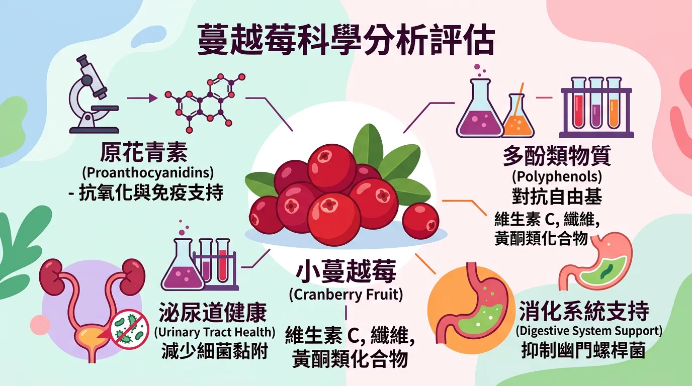
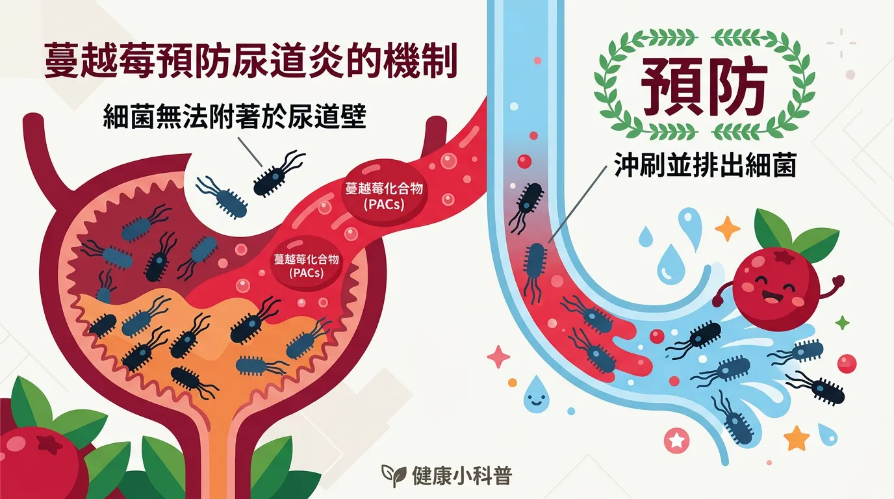
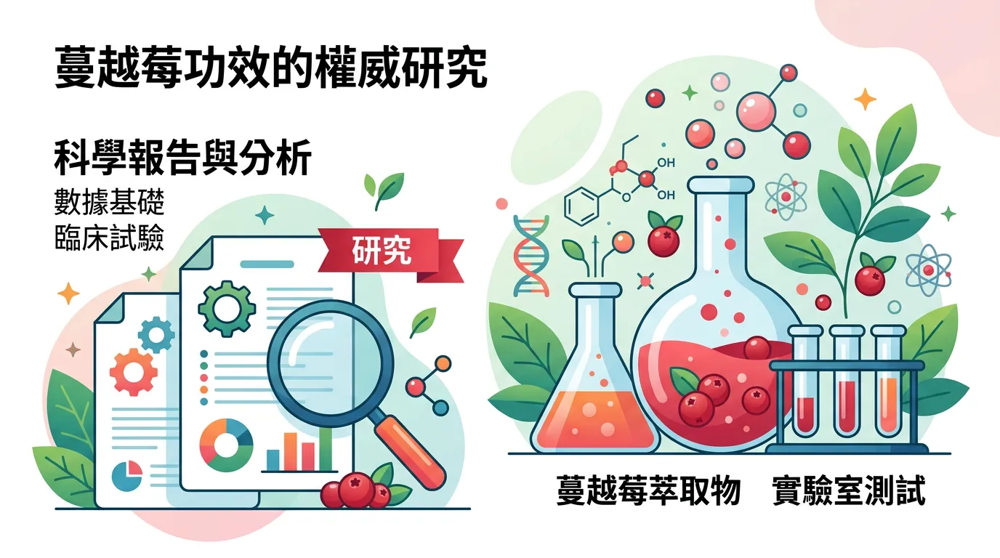
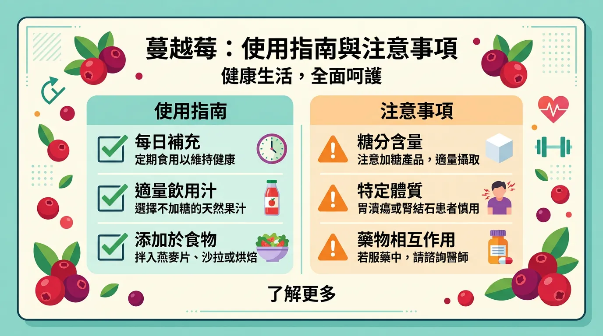
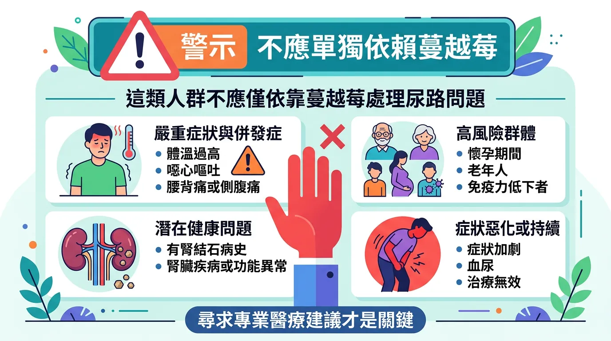

# 蔓越莓汁真的能預防尿道炎嗎？泌尿科醫師告訴你真相

本文你會學到：蔓越莓能否治療或預防泌尿道感染、PACs 抗黏附原理、Cochrane 結論與使用建議（劑量、禁忌），以及何時必須就醫。講到底，蔓越莓可輔助「預防復發」、不能取代抗生素治療；選足量 PACs 產品、配合多喝水，服抗凝血劑者須先問醫師。

泌尿道感染（UTI）是女性最常見的健康困擾之一。據統計，近三分之二的女性一生中至少會經歷一次感染，且約四分之一會在半年內復發。長期以來「喝蔓越莓汁」被視為自然法寶，但它究竟有效還是被過度神化？

---

## 全面盤點：快速摘要：蔓越莓的科學評價

<DataTable theme="blue" caption="蔓越莓與泌尿道感染醫學實證">
  <Fragment slot="header">
    <tr><th>項目</th><th>醫學實證結論</th></tr>
  </Fragment>
  <tr><td><strong>治療急性感染</strong></td><td>❌ 無效。一旦發生感染，必須使用抗生素治療。</td></tr>
  <tr><td><strong>預防復發感染</strong></td><td>✅ 有效。對易反覆感染的女性及兒童有顯著預防作用[^9]。</td></tr>
  <tr><td><strong>關鍵成分</strong></td><td><strong>A 型原花青素 (PACs)</strong>。能防止大腸桿菌黏附在膀胱壁。</td></tr>
  <tr><td><strong>產品選擇</strong></td><td>建議選擇標示 PACs 含量（每日需達 36mg 以上）的濃縮產品。</td></tr>
</DataTable>

---

## 原來是這樣！為什麼蔓越莓能預防感染？

蔓越莓並非透過「殺菌」或「改變尿液酸鹼度」來發揮作用。其真正的核心在於**「抗黏附」**。

大腸桿菌是引起泌尿道感染的首要元兇。這些細菌長有類似「小鉤子」的菌毛，能牢牢守在膀胱壁上。蔓越莓中的 **A 型原花青素（PACs，proanthocyanidins）** 就像是幫細菌戴上「手套」，讓它們無法鉤住膀胱黏膜，最終隨尿液被排出體外[^3]。

---

## 進階討論：權威研究怎麼說？

### Cochrane 系統回顧（2023）
Cochrane 為國際實證醫學資料庫。這項醫學界最具公信力的回顧分析了 50 項臨床試驗。結論顯示：口服蔓越莓產品（包含果汁、顆粒或膠囊）能顯著降低以下族群的復發性感染風險[^9]：
- **女性**（降低風險約 26%）
- **兒童**（降低風險約 54%）
- **高風險族群**（如手術後患者）

### 實用拆解：關於「蔓越莓汁」的限制
雖然研究支持預防效果，但現實中「果汁」往往含有大量添加糖。對於需要長期補充的女性，攝取過多糖分反而可能引起其他健康問題。因此，現代營養學更傾向推薦**高濃度的蔓越莓膠囊**。

了解原理與證據後，使用時可以這樣做：

---

## 重點解析：使用建議與注意事項

<Takeaway title="蔓越莓使用建議" icon="🫐">
  <TakeawayItem title="認明 PACs 含量" type="info">市售品質參差，預防效果需每日至少 **36mg** 原花青素 (PACs)[^4]。</TakeawayItem>
  <TakeawayItem title="多喝水才是王道" type="success">蔓越莓是輔助，大量飲水增加尿量、稀釋細菌，才是最基礎的防護。</TakeawayItem>
  <TakeawayItem title="不能取代藥物" type="danger">尿急、尿痛、發燒等急性症狀務必就醫用抗生素。蔓越莓無法救急。</TakeawayItem>
  <TakeawayItem title="注意交互作用" type="warning">服用抗凝血劑（如 Warfarin）者，使用高濃度蔓越莓前應諮詢醫師。</TakeawayItem>
</Takeaway>

---

## 必看指南！誰不適合只靠蔓越莓處理泌尿道問題？

**急性感染**（發燒、腰痛、劇痛）必須就醫用抗生素，蔓越莓無法治療。**服用抗凝血劑**者高濃度蔓越莓可能交互作用，須經醫師同意。**腎結石或草酸鹽結石**病史者大量蔓越莓前請諮詢醫師。兒童與孕婦劑量依醫師建議。

---

## 給你的最後建議

蔓越莓對**預防復發**有科學依據。易反覆感染的女性可選擇含足量 PACs 的補充品，並配合充足飲水與[泌尿道保健](/urinary-tract-infection/)，作為安全有效的自我照護；急性感染時仍須就醫用藥。

---

## 常見問題（FAQ）

### 蔓越莓汁可以治療正在進行的尿道炎嗎？

**不行**。若已出現尿急、尿痛、發燒等急性症狀，只有**抗生素**能有效殺死細菌。蔓越莓無法替代藥物治療，延誤用藥可能導致感染擴散至腎臟。必須立即就醫，蔓越莓只能作為康復後的預防輔助。

### 你可能不知道的為什麼蔓越莓果汁不如膠囊有效？

蔓越莓果汁往往含大量添加糖，糖分可能反而促進細菌增殖。更關鍵的是，果汁中 **PACs 含量遠低於膠囊**。研究證實預防效果需每日至少 **36mg PACs**，而一般果汁難以達到。膠囊與粉末是更濃縮的選擇。

### 喝了很久蔓越莓卻還是反覆感染，代表無效嗎？

不一定。可能是 **PACs 劑量不足、未足量飲水**，或體質本身易反覆感染（需醫師評估）。確認產品標示的 PACs 含量、每日喝足 2,000c.c. 水，持續 3–6 個月再評估；若仍反覆發作，需就醫排除泌尿道結構異常或其他病因。

### 我在服用 Warfarin（血液稀釋劑），能吃蔓越莓嗎？

**先諮詢醫師**。高濃度蔓越莓可能增強 Warfarin 效果，提高出血風險。低劑量或果汁通常安全，但高劑量補充品需經醫師確認後才能使用。

### 男性也會尿道炎嗎？蔓越莓對男性有效嗎？

男性尿道炎較罕見，但確實會發生。蔓越莓預防機制對男性同樣適用（阻止細菌黏附膀胱），但研究主要集中在女性與兒童。若男性反覆感染，應先就醫檢查是否有尿道結構問題。

---

## 推薦閱讀：你可能也會喜歡

- [泌尿道感染預防與治療完整指南](/urinary-tract-infection/)
- [正確清洗蔬果與農藥移除](/wash-vegetable/)
- [維生素 C 對免疫系統的真實貢獻](/vitamin-c/)
- [水質安全與健康：為什麼喝乾淨的水很重要](/water-quality-safety/)

---

## 這裡有科學根據：參考文獻

以下文獻最後檢索：2026-02。

3. Howell, A. B., et al. (2010). *PACs content and anti-adhesion activity in urine following cranberry consumption*. BMC Infectious Diseases.

4. Wang, C. H., et al. (2012). *Cranberry products for prevention of UTIs: a systematic review*. Archives of Internal Medicine.

9. Jepson, R. G., et al. (2023). *Cranberries for preventing urinary tract infections*. Cochrane Database of Systematic Reviews.