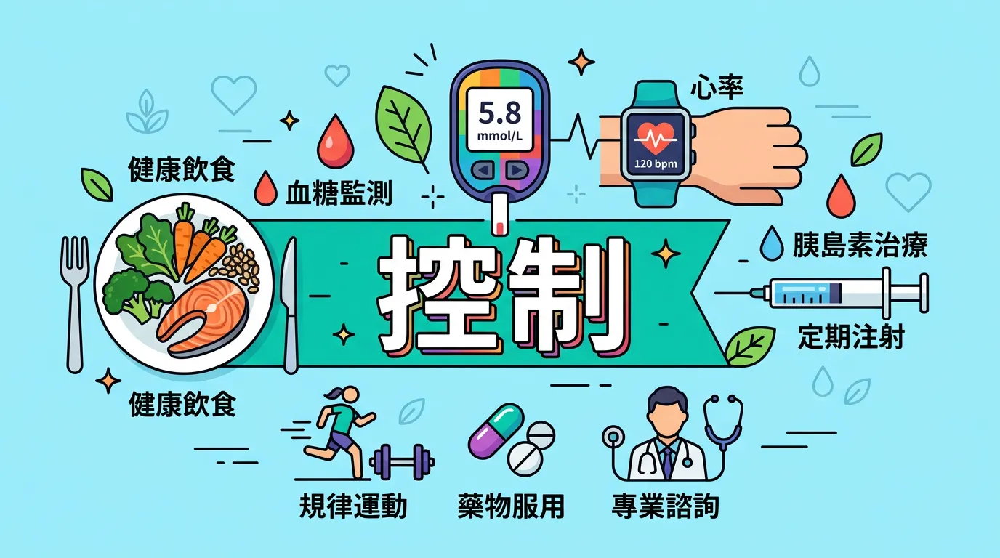
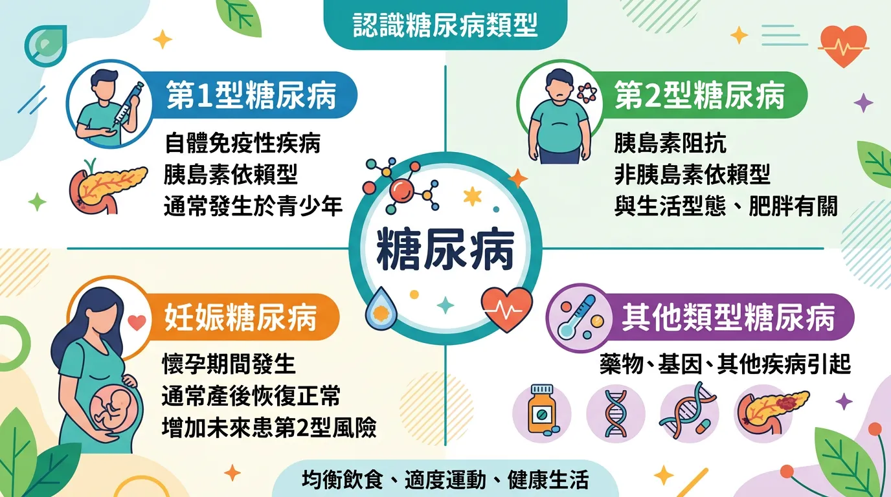
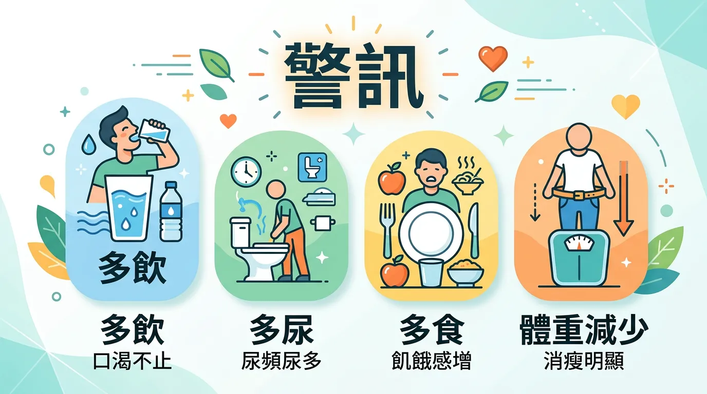
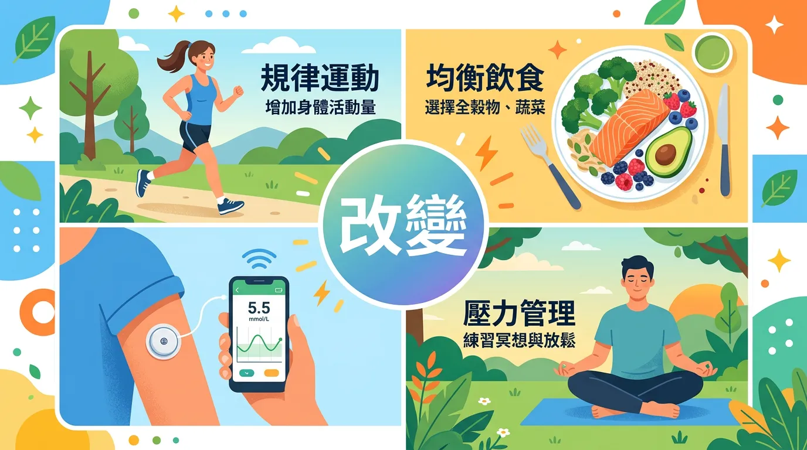

# 糖尿病前期還能逆轉嗎？穩定血糖的飲食與生活超實用策略

本文你會學到：糖尿病類型與早期徵兆、飲食與運動的實證建議、血糖與體重目標，以及壓力與睡眠的影響。

糖尿病（diabetes mellitus）是慢性代謝障礙，主因是胰島素分泌不足或作用不良（胰島素阻抗），導致血糖升高。長期高血糖會損害血管與神經，增加心臟病、腎病、視力與截肢等風險。

---

## 進階討論：快速摘要：糖尿病管理核心

| 關鍵環節 | 重點建議 | 目標設定 |
|----------|----------|----------|
| **飲食控制** | 採高纖、低 GI 飲食，定時定量，限制精緻糖。 | 糖化血色素 (HbA1c) < 7.0% |
| **規律運動** | 每週至少 150 分鐘中等強度運動，搭配肌力訓練。 | 維持理想 BMI (18.5–24) |
| **血糖監測** | 定期自我測量空腹與餐後血糖，了解波動規律。 | 空腹血糖 80–130 mg/dL |
| **藥物配合** | 遵照醫囑使用口服藥或胰島素，切勿自行停藥。 | 預防急性與慢性併發症 |

---

## 全面盤點：認識糖尿病的類型

1. **第 1 型糖尿病**：自體免疫疾病。胰臟完全無法分泌胰島素，通常在青少年時期發病，需終身注射胰島素。
2. **第 2 型糖尿病**：最常見的類型（占 90% 以上）。與遺傳、肥胖、久坐不動有關，特徵是「胰島素阻抗」。
3. **妊娠糖尿病**：懷孕期間血糖升高，產後通常會恢復，但未來患第 2 型糖尿病的風險會增加。

---

## 糖尿病的早期徵兆：別忽視「三多一少」

當血糖顯著升高時，身體會出現以下典型警告：
- **多尿**：頻繁跑廁所，特別是夜尿。
- **多喝**：異常口渴，怎麼喝水都無法緩解。
- **多吃**：容易感到飢餓，因為細胞無法獲得能量。
- **體重減輕**：肌肉與脂肪被分解以提供能量，導致體重不明原因下降。
- **其他**：傷口癒合緩慢、皮膚搔癢、視力模糊或手腳麻木。

---

## 預防與管理：你可以主導的四個改變

### 1. 飲食管理：GI 值與份量控制
- **選擇複雜碳水化合物**：以糙米、地中海飲食中的[全穀類](/mediterranean-diet/)取代白米飯與麵食。
- **增加膳食纖維**：蔬菜能延緩糖分吸收。
- **避免含糖飲品**：市售果汁與手搖飲是血糖飆升的元兇。

### 2. 運動策略：啟動肌肉的吞糖力
運動能顯著提升胰島素敏感度。肌肉在收縮時，即使不靠胰島素也能消耗葡萄糖。
- **建議**：快走、游泳或自行車，搭配每週 2 次的阻力訓練（如深蹲、彈力帶運動）。

### 3. 👉 體重管理
研究顯示，對於過胖者（BMI > 24），只要減輕原體重的 **5%–7%**，就能顯著降低第 2 型糖尿病的發生率，甚至讓早期糖尿病進入「緩解期」。

### 4. 👉 壓力與睡眠
長期的[壓力](/lifestyle-immunity-factors/)會讓壓力荷爾蒙（如皮質醇）升高，這會阻礙胰島素作用並促使肝臟釋放更多葡萄糖，導致血糖失控。

---

## 給你的最後建議

糖尿病不是「不能吃美食」的刑期，而是一個促使我們檢視生活方式的信號。透過**「精準飲食」**與**「規律活動」**，大多數患者都能與糖尿病和平共處，並維持與常人無異的生活品質與壽命。

---

## 常見問題（FAQ）

### 重點解析：糖尿病前期還能逆轉嗎？

可以，而且成功率相當高。美國糖尿病預防計畫（DPP）的研究顯示，透過生活方式干預（每週 150 分鐘中等強度運動 + 5–7% 體重減輕），糖尿病前期進展為第 2 型糖尿病的風險可降低 **58%**，效果優於部分藥物。關鍵是越早發現、越早行動。

### 專業視角：吃白米飯會讓血糖升高嗎？

會，但程度取決於食用方式。白米 GI 值約 72–73，屬於中高 GI 食物。若搭配蔬菜、蛋白質（豆腐、雞肉）和健康脂肪一起吃，可以顯著減緩血糖上升速度。比起「不能吃白米」，更實際的做法是：控制份量（半碗到一碗）、混入糙米或雜糧，以及搭配充足蔬菜。

### 第 2 型糖尿病患者可以停藥嗎？

部分情況下可以，但需要醫師評估和嚴格監控。研究（如 DiRECT 試驗）顯示，透過飲食介入達到顯著體重下降（10–15 kg 以上）的部分患者，可以達到「緩解」狀態（不需藥物而血糖維持正常）。但這不等於「痊癒」——若恢復原本飲食，血糖通常會再度上升。停藥必須在醫師監督下進行。

### 核心觀念：血糖多高算糖尿病？

依據台灣糖尿病學會標準：空腹血糖 ≥ 126 mg/dL（兩次以上）、隨機血糖 ≥ 200 mg/dL（伴有症狀）、口服葡萄糖耐量試驗 2 小時血糖 ≥ 200 mg/dL，或 HbA1c（糖化血色素）≥ 6.5%，即可診斷為糖尿病。空腹血糖 100–125 mg/dL 或 HbA1c 5.7–6.4% 屬於「糖尿病前期」，需要積極管理。

### 深度解析：糖尿病患者最該避免哪些食物？

最需要限制的是含糖飲料（珍珠奶茶、果汁、含糖咖啡）、精緻糕點（蛋糕、餅乾）、加工澱粉（白吐司、泡麵），以及高度加工食品。這些食物會快速升高血糖且營養密度低。但「偶爾吃一點」不等於絕對禁止，重點是控制頻率和份量，而非製造心理壓力。

---

## 推薦閱讀：你可能也會喜歡

- [地中海飲食：穩定血糖與保護心血管的最佳模式](/mediterranean-diet/)
- [科學減重與運動：永續瘦身的健康法則](/diet-loss-weight/)
- [心臟病預防：為什麼糖尿病人更需關注血管健康](/heart-disease-prevention/)
- [維生素 D 與代謝健康：缺乏與補充的科學實證](/fix-vitamin-d/)

---

## 這裡有科學根據：參考文獻

2. *American Diabetes Association (ADA)*. (2023). Standards of Care in Diabetes.

5. *The Lancet*. (2017). Type 2 diabetes global prevalence and burden.

12. *New England Journal of Medicine*. (2002). Reduction in the incidence of type 2 diabetes with lifestyle intervention.

15. *BMJ*. (2000). UKPDS 35: Association of glycaemia with macrovascular and microvascular complications.