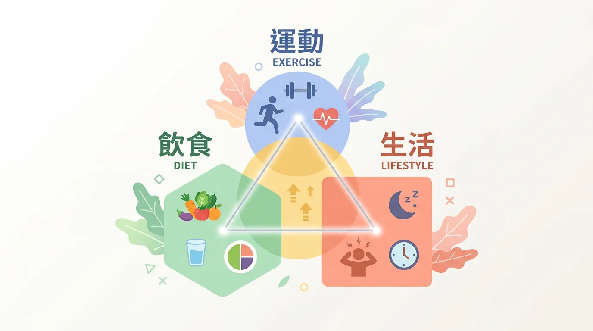
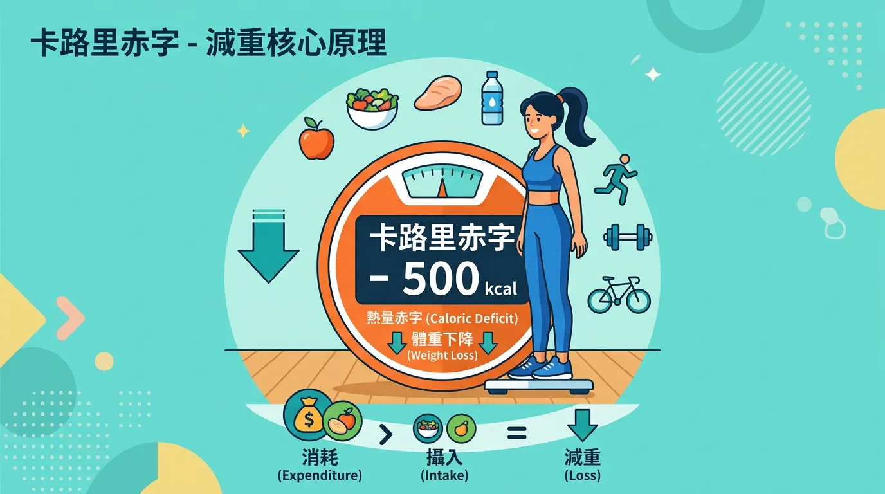
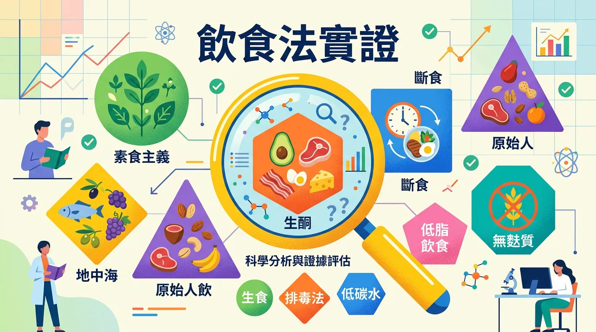
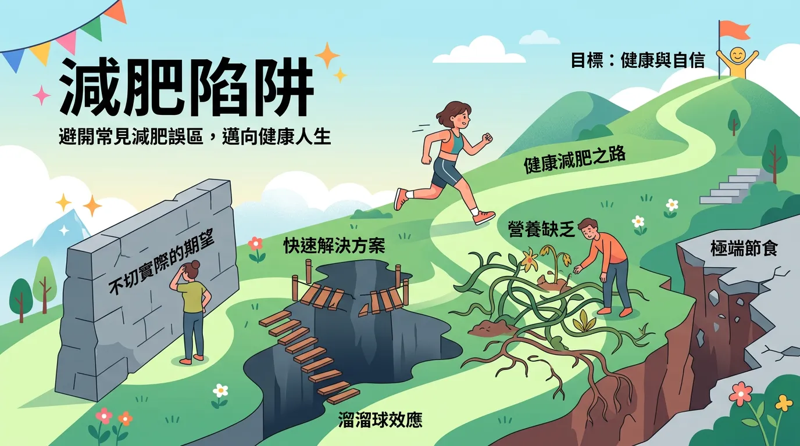
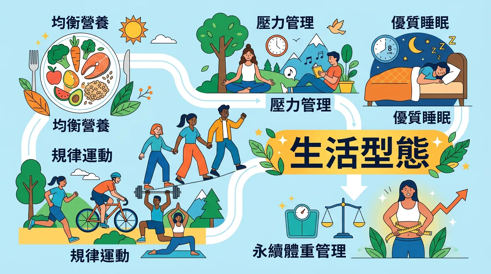
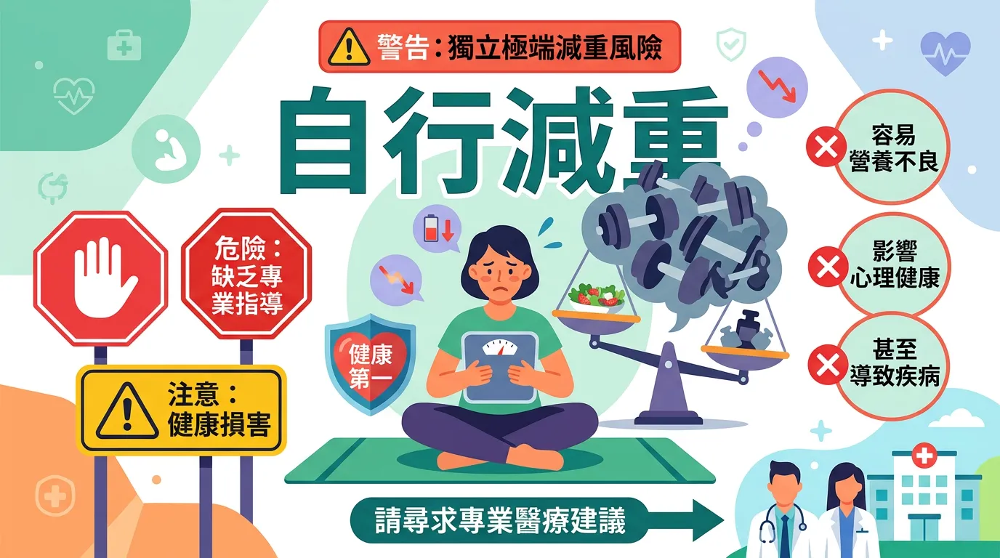

# 少吃多動為什麼不會瘦？打破減肥迷思的永續瘦身法則

本文你會學到：卡路里赤字與 BMR（基礎代謝率）／TDEE（每日總能消耗）、蛋白質與阻力訓練的角色、流行飲食法實證、常見陷阱，以及可持續的生活型態。換個說法：吃得比消耗少一點、保留足夠蛋白質與運動，穩健減重不傷身，離不開這幾個原則。

減肥（weight loss）是現代人最關注的健康議題之一。在充斥「一週瘦五公斤」或「神奇減肥茶」的訊息中，釐清科學證據很重要。成功的減重不只是數字下降，更是**體組成**（體脂肪減、肌肉維持）的優化。

---

## 實用拆解：快速摘要：減重的黃金三角

<DataTable theme="blue" caption="減重黃金三角">
  <Fragment slot="header">
    <tr><th>核心支柱</th><th>實踐關鍵</th><th>預期效果</th></tr>
  </Fragment>
  <tr><td><strong>卡路里赤字</strong></td><td>攝取熱量 &lt; 消耗熱量。</td><td>減重最基礎的物理法則[^1]。</td></tr>
  <tr><td><strong>蛋白質攝取</strong></td><td>每公斤體重需 1.2–1.6g。</td><td>保護肌肉免於在減重期間流失。</td></tr>
  <tr><td><strong>阻力訓練</strong></td><td>每週至少 2 次負重運動。</td><td>提昇基礎代謝率，避免「溜溜球效應」。</td></tr>
</DataTable>

---

## 核心原理：解析卡路里赤字 (Caloric Deficit)

無論你選擇哪種飲食法（生酮、低碳、斷食），減重的唯一途徑就是創造卡路里赤字。

### 關鍵看點：如何計算你的減重熱量目標？
1. **計算 BMR（基礎代謝率）**：你躺著不動呼吸心跳所需的熱量。
2. **計算 TDEE（每日總能消耗）**：根據你的活動量（久坐、輕量、中量、重量）加乘 BMR。
3. **設定赤字**：一般建議每日攝取量為 **TDEE 減去 300–500 大卡**。這樣可以在不影響生理機能的情況下，每週穩定減少約 0.5 公斤脂肪。

了解熱量與營養比例後，來看看常見飲食法的實證比較與要避開的陷阱。

---

## 進階討論：流行飲食法實證分析

<DataTable theme="purple" caption="流行飲食法實證比較">
  <Fragment slot="header">
    <tr><th>飲食法</th><th>特點與適合對象</th><th>優點</th><th>缺點</th></tr>
  </Fragment>
  <tr><td><strong>地中海飲食</strong></td><td>強調[全穀類](/mediterranean-diet/)、橄欖油與大量蔬果。</td><td><strong>可持續性最高</strong>，對心血管極佳。</td><td>減重速度較平緩。</td></tr>
  <tr><td><strong>間歇性斷食</strong></td><td>如 168 斷食。限制進食窗口。</td><td>簡化熱量控制，有助於[血糖管理](/diabetes-prevention-management/)。</td><td>初期易感到飢餓或情緒波動。</td></tr>
  <tr><td><strong>低碳/生酮飲食</strong></td><td>極低碳水化合物攝取。</td><td>短期減重速度快，抑制食慾效果佳。</td><td>難以長期維持，可能增加特定營養素缺乏風險。</td></tr>
</DataTable>

---

## 專業視角：避開減肥路上的常見陷阱

### 1. 👉 「減肥食品」的誤區
標榜「低脂」的餅乾往往加入更多糖分來提味；「運動飲料」的含糖量可能讓你跑完五公里後的消耗功虧一簣。學會[閱讀營養標籤](/reading-nutrition-labels/)是減重成功的第一步。

### 2. 👉 極端低熱量飲食
每日攝取低於 1,000 大卡會啟動身體的「節能模式」（代謝補償），導致基礎代謝率崩跌，一旦恢復飲食，體重會迅速反彈且報復性增加。

<Simulation title="情境模擬" icon="⚖️">
  你為了快速瘦身嚴格節食，每天只吃不到 1,000 大卡。幾週後體重掉了，但一恢復正常吃就**報復性反彈**甚至更重。身體已進入「節能模式」，代謝率崩跌。健康減重建議每週 0.5–1 公斤、熱量赤字約 300–500 大卡/天即可。
</Simulation>

### 3. 👉 過度依賴補充品
絕大多數的減肥茶、排毒錠僅具利尿或輕微腹瀉作用。目前科學實證最穩定的輔助品是**纖維粉**（增加飽足感）與**乳清蛋白**（輔助肌肉修復）。

---

## 全面盤點：建立可教化的生活型態

<Takeaway title="可持續的生活型態" icon="🏃">
  <TakeawayItem title="睡眠優化" type="warning">睡眠不足會讓飢餓素上升、皮質醇增加，身體更傾向儲存腹部脂肪。</TakeawayItem>
  <TakeawayItem title="壓力管理" type="info">壓力會誘發「情緒性進食」，影響減重成效。</TakeawayItem>
  <TakeawayItem title="非運動性活動 (NEAT)" type="success">爬樓梯、站著辦公等小習慣，加總起來往往比單次重訓更有感。</TakeawayItem>
</Takeaway>

---

## 這樣做就對了：誰不適合自行嚴格減重？

**懷孕或哺乳**、**飲食失調史**（厭食、暴食）、**青少年發育期**、**BMI 已過低**或**重症、術後**者，不應自行執行大幅熱量限制。若有慢性病或用藥，請先與醫師或營養師討論安全減重範圍。

---

## 給你的最後建議

給自己的目標不是「瘦到跟模特兒一樣」，而是**「比昨天的自己更健康」**。健康的減重速度應控制在**每週 0.5 至 1 公斤**。記住，真正能讓你瘦下一輩子的，不是某一餐吃了什麼，而是你長期堅持的健康生活習慣。

---

## 常見問題（FAQ）

### 一週減重多少算健康？會不會反彈？

**健康速度是每週 0.5–1 公斤**。超過此速度的減重往往伴隨肌肉流失與代謝崩跌，一旦恢復飲食會立刻反彈且報復性增加。緩速減重更難但能確保減掉的主要是脂肪而非肌肉，長期維持效果遠優於快速減重。

### 吃減肥食品（低脂餅乾、無糖飲料）真的能瘦嗎？

**標籤欺騙性大**。低脂往往加入更多糖分；無糖可能用人工甘味劑。這些產品卡路里數未必低。減肥的關鍵不在「選減肥食品」而在**整體熱量攝取與三大營養素（蛋白質、碳水、脂肪）的平衡**。閱讀營養標籤、計算總熱量遠比信任行銷用語重要。

### 極低熱量飲食（每天不到 1,000 卡）為什麼會導致代謝崩跌？

身體會啟動「節能模式」，大幅降低基礎代謝率。看似在快速瘦身，實際是身體在防飢荒。一旦恢復正常進食，代謝依然低迷，極易反彈。這也是為什麼嚴格節食者往往瘦得快、胖得更快。

### 生酮飲食短期見效是因為減脂還是只掉水分？

多數是**水分流失**。碳水化合物儲存時附帶水分，低碳會快速排水，短期體重銳減。但真正的脂肪減少速度與其他飲食相近。若無法長期維持生酮，復食後水分反彈，體重會迅速回升。

### 間歇性斷食適合所有人嗎？有禁忌族群嗎？

**不適合**：懷孕或哺乳婦女、飲食失調史患者、血糖控制不穩的糖尿病患、正在長身體的青少年。這些人群若嘗試斷食需在醫師或營養師監督下進行。對大多數健康成人，適度間歇性斷食（如 168）安全有效。

---

## 推薦閱讀：你可能也會喜歡

- [地中海飲食：科學公認最健康的永續飲食法](/mediterranean-diet/)
- [間歇性斷食：如何正確執行 168 斷食？](/intermittent-fasting/)
- [肌肉流失比長肉快？減重期間的蛋白質攝取關鍵](/macronutrients-guide/)
- [糖尿病預防：血糖波動與體重控制的關係](/diabetes-prevention-management/)

---

## 這裡有科學根據：參考文獻

以下文獻最後檢索：2026-02。

1. Hall, K. D., et al. (2021). *Effect of specific diets on energy intake*. Nature Medicine.

2. *Mifflin-St Jeor Equation* for BMR calculation.

4. *Journal of the American Dietetic Association*. (2007). Systematic review of weight loss outcomes.

6. Swift, D. L., et al. (2014). *The role of exercise in weight loss and maintenance*. Progress in Cardiovascular Diseases.