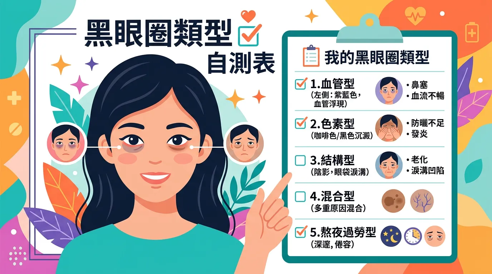
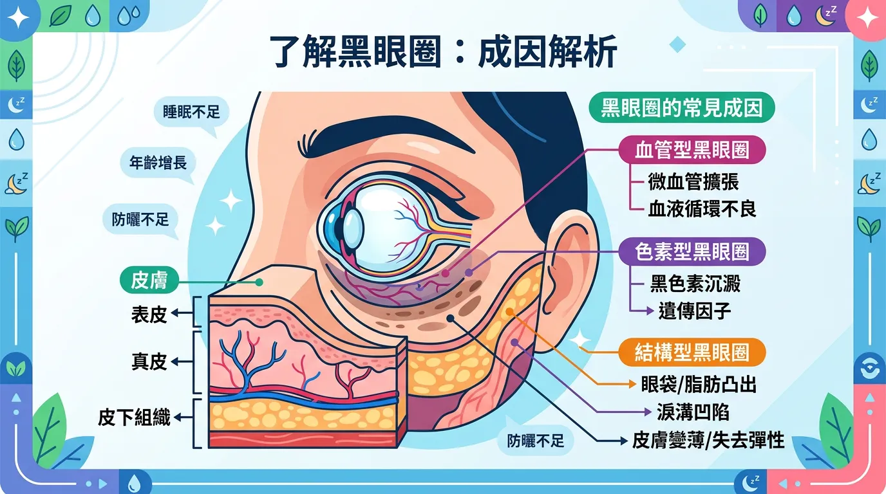
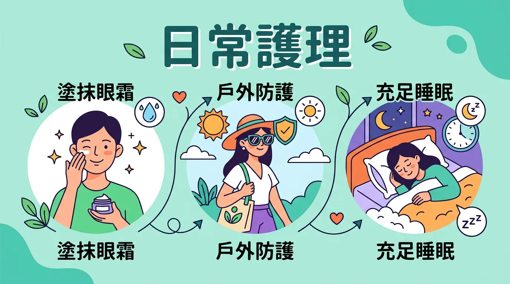

# 狂睡覺也消不掉？3 種類型黑眼圈對症下藥的終極解析

本文你會學到：色素型、血管型、結構型黑眼圈的辨識與成因、日常護理與專業治療選項，以及按壓／拉動／仰頭等簡易自測法。說得白一點：先分清是色素、血管還是結構型，防曬與保濕對色素型有幫助，淚溝型多半要醫美才明顯改善。

黑眼圈（periorbital hyperpigmentation）俗稱熊貓眼，是常見的面部困擾。很多人以為只是「睡不夠」，其實成因更複雜。先正確辨識類型，才能對症處理。

---

## 專業視角：快速摘要：黑眼圈自測表

| 類型 | 特徵描述 | 簡易測試法 | 核心成因 |
|----------|----------|------------|----------|
| **色素型** | 呈褐色、咖啡色，範圍較廣。 | **拉動測試**：拉開皮膚顏色不變。 | 紫外線、磨擦、發炎後沉著。 |
| **血管型** | 呈青紫色、藍紅色。 | **按壓測試**：按壓時顏色變淡。 | 過敏性鼻炎、熬夜、用眼過度。 |
| **結構型** | 隨光影變化，通常伴隨眼袋。 | **仰頭測試**：仰頭時顏色變淡。 | 淚溝凹陷、眼袋突出造成的陰影。 |

---

## 深入解析：為什麼你的黑眼圈揮之不去？

### 1. 色素型黑眼圈 (Pigmented Type)
這是由於黑色素在眼周皮膚堆積而成。
- **成因**：長期曝曬、卸妝揉搓過度、或是[濕疹/異位性皮膚炎](/eczema-atopic-dermatitis/)引起的慢性發炎。
- **自救**：加強[全臉防曬](/how-to-choose-sunscreen/)，使用含有維生素 C、傳明酸或菸鹼醯胺的[眼霜](/eye-cream/)。

### 2. 血管型黑眼圈 (Vascular Type)
眼周皮膚極薄，皮下血管血流淤塞或擴張時，顏色就會透出來。
- **成因**：**過敏性鼻炎**是主因（鼻塞導致血液回流不暢）、長期熬夜、用眼過度。
- **自救**：溫熱敷（促進循環）、控制鼻過敏、保證充足睡眠。

### 3. 結構型黑眼圈 (Structural Type)
這其實是「視覺上的假象」，是凹陷或突起造成的陰影。
- **成因**：老化導致膠原蛋白流失使眼窩凹陷（淚溝），或是眼底脂肪突出（眼袋）。
- **自救**：化妝遮瑕、醫美填充（玻尿酸）或手術處理（眼袋回填）。

---

## 重點解析：日常護理：除了早睡還能做什麼？

1. **不要揉眼睛**：揉眼會導致慢性發炎與黑色素沉澱，甚至拉扯出細紋。
2. **墊高枕頭**：睡覺時稍微墊高頭部，有助於減少晨起時的眼部水腫。
3. **冷熱交替敷**：針對血管型黑眼圈，冷熱交替（先熱後冷）能收縮擴張的血管。
4. **補充鐵質**：[貧血](/macronutrients-guide/)會讓肌膚顯得蒼白，使底下的青紫色血管更明顯。

---

## 核心觀念：專業治療建議

若日常保養效果有限，可根據類型諮詢醫師：
- **色素型**：淨膚雷射、皮秒雷射。
- **血管型**：染料雷射（針對紅血管）。
- **結構型**：自體脂肪填充、微整形注射。

---

## 給你的最後建議

黑眼圈是身體發出的「壓力訊號」。雖然醫美與保養品能改善外觀，但要真正的「去黑」，核心仍在於規律的作息與良好的環境管理。別再盲目購買昂貴產品，先找出你的黑眼圈到底屬於哪一類吧！

---

## 常見問題（FAQ）

### 實用拆解：黑眼圈只有睡眠才能解決嗎？

不完全是。**充足睡眠對血管型黑眼圈最有幫助**，但對色素型黑眼圈的影響有限。色素型黑眼圈主要源於紫外線傷害和過度摩擦，需要加強防曬和溫和清潔；血管型則與過敏性鼻炎、循環不佳有關，需要改善鼻過敏症狀和冷熱敷；結構型黑眼圈純粹是解剖學問題（淚溝凹陷），睡眠無法改變。所以先診斷黑眼圈類型，再針對性調整生活習慣才是關鍵。

### 拉動、按壓、仰頭測試到底測什麼，可靠嗎？

這三個測試各有目的。**拉動測試**區分色素型（拉開皮膚顏色不變）和非色素型；**按壓測試**判斷血管型（按壓時顏色變淡代表血管擴張）；**仰頭測試**檢測結構型（仰頭時色澤變淡表示是光影造成的錯覺）。這些測試並非 100% 準確，但能幫助初步判斷，搭配皮膚科醫師的檢查結果會更精準。如果對症下藥 8 週無效果，應尋求專業醫學檢查。

### 吃鐵質補充品真的能改善黑眼圈嗎？

**部分有幫助，但只限於貧血型黑眼圈**。貧血會讓皮膚蒼白，導致底下的青紫色血管更顯著，補充鐵質能改善這類情況。然而先決條件是你確實有缺鐵性貧血（需驗血確認），否則盲目補鐵無益。此外，補鐵見效需要 6-8 週，這段期間也要確保充足維生素 C 攝取以促進鐵吸收。如果沒有貧血問題，補鐵對黑眼圈的幫助有限。

### 醫美治療黑眼圈需要多少次，效果能維持多久？

**這取決於治療方式和黑眼圈類型**。淨膚雷射通常需要 4-6 次（間隔 2-4 週），療程後效果可維持 3-6 個月；玻尿酸填充結構型黑眼圈（淚溝）效果明顯，但需每 9-12 個月補打一次；自體脂肪填充則效果較持久，但需要微創手術。選擇前應與醫師詳細討論預期效果和維護成本，並確認你的黑眼圈類型是否適合該治療。

### 過敏性鼻炎會導致黑眼圈嗎，治療鼻炎能改善黑眼圈嗎？

**是的，過敏性鼻炎是血管型黑眼圈的主要誘因**。鼻塞導致血液回流受阻，眼周血管擴張充血，就會出現青紫色黑眼圈。控制過敏症狀（使用抗過敏藥物、鼻噴劑或免疫療法）能在 2-4 週內明顯改善血管型黑眼圈。此外，溫熱敷和充足睡眠也能輔助促進循環。所以如果你同時有黑眼圈和過敏症狀，先治療過敏往往比購買眼霜更有效果。

---

## 推薦閱讀：你可能也會喜歡

- [眼霜挑選指南：針對黑眼圈與細紋的有效成分](/eye-cream/)
- [防曬與抗老：預防眼周色素沉澱的第一道防線](/how-to-choose-sunscreen/)
- [濕疹與皮膚炎：如何處理因搔抓引起的眼周變黑](/eczema-atopic-dermatitis/)
- [生活方式免疫力：為什麼壓力會讓黑眼圈無所遁形](/lifestyle-immunity-factors/)

---

## 這裡有科學根據：參考文獻

1. Mayo Clinic. (2023). *Dark Circles Under Eyes: Symptoms and Causes*.
3. *Allergy & Asthma Network*. (2023). *Allergies and Dark Circles*.
10. *Dermatology Times*. (2022). *Classification and management of periorbital hyperpigmentation*.