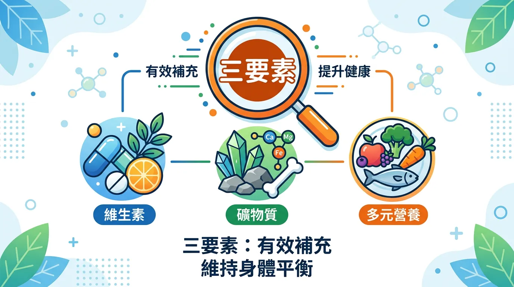
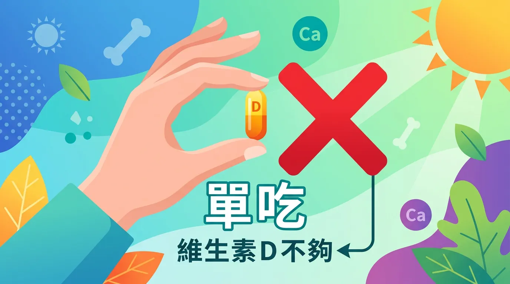
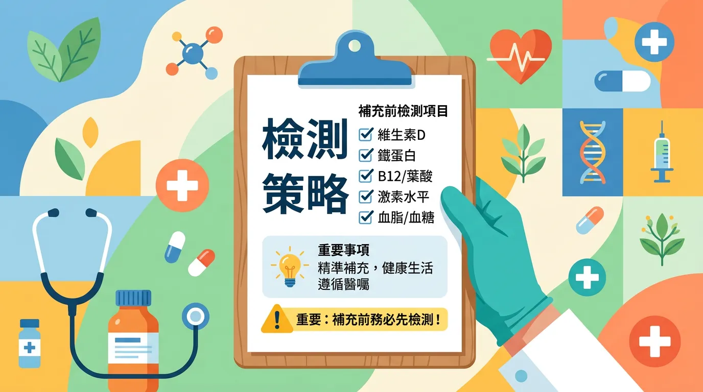
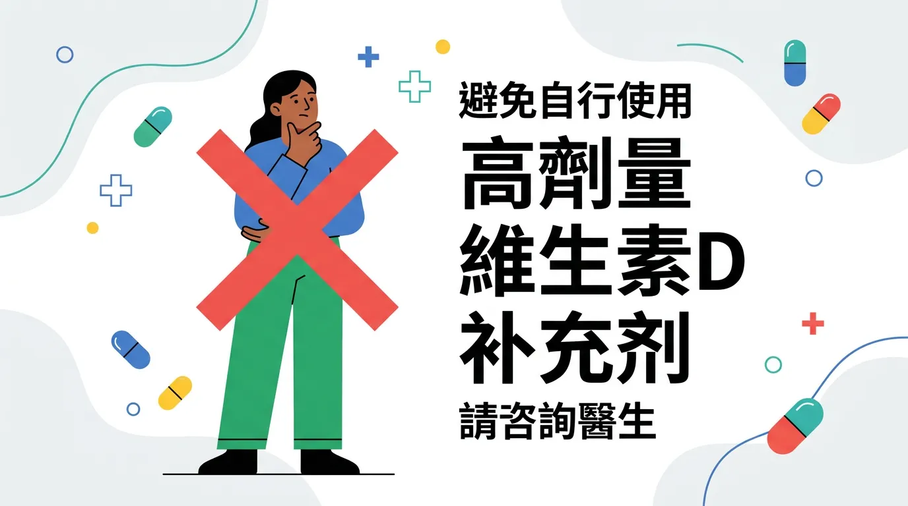

# 你的維他命 D 可能都白吃了！揭開吸收率翻倍的正確吃法

本文你會學到：為何要搭配 K2 與鎂、隨餐與油脂的重要性、劑量與抽血目標，以及先檢測再補充的流程。一句話總結：維他命 D 要隨餐吃、配 K2 與鎂，先抽血再決定劑量，過量會高鈣傷腎，勿盲目高劑量。

維生素 D（vitamin D）在體內更像**類固醇荷爾蒙**，調節超過 2,000 個基因。台灣雖陽光充足，國人不足率仍高。它關乎[骨質](/how-to-prevent-osteoporosis/)、免疫、情緒與認知。

---

## 核心觀念：快速摘要：高效補充三要素

<DataTable theme="blue" caption="維生素 D 高效補充三要素">
  <Fragment slot="header">
    <tr><th>關鍵因素</th><th>專業建議</th><th>錯誤做法</th></tr>
  </Fragment>
  <tr><td><strong>服用時機</strong></td><td>隨<strong>大餐</strong>（含油脂）服用。</td><td>空腹服用（吸收率極低）。</td></tr>
  <tr><td><strong>輔助因子</strong></td><td>必須並用 <strong>維生素 K2</strong> 與 <strong>鎂</strong>。</td><td>單獨大量服用維生素 D。</td></tr>
  <tr><td><strong>劑量策略</strong></td><td>建議先抽血檢測，維持在 40–60 ng/mL。</td><td>盲目跟風高劑量。</td></tr>
</DataTable>

<CardGroup>
  <Card title="維生素 K2：導鈣入骨" icon="🦴" type="success">
    D 增加鈣吸收，K2 把鈣導向骨骼。缺 K2 時鈣可能沉積血管造成血管鈣化[^144]。建議選 MK-7 形式。
  </Card>
  <Card title="鎂：活化維生素 D" icon="⚡" type="warning">
    D 的轉化與活化都需要鎂。缺鎂時補再多 D 也易呈「鈍化態」[^160]。適量堅果、深綠蔬菜或補充鎂。
  </Card>
</CardGroup>

<Callout icon="⚠️" title="實用提醒：先檢測，後策略">
請檢測 **25-hydroxy Vitamin D**（血中維生素 D 濃度指標）：&lt; 20 缺乏（需醫師衝刺劑量）、20–30 不足（每日 2,000–4,000 IU）、30–60 理想（維持 1,000–2,000 IU）、&gt; 100 過量（停藥並就醫）。勿盲目高劑量。
</Callout>

---

## 背後原因大公開：為什麼不能「單吃」維生素 D？

單獨補充高劑量維生素 D 可能隱藏風險，因為它需要一整套「醫療團隊」協作：
1. **維生素 K2 (MK-7)**：維生素 D 增加鈣質吸收，但 K2 負責將鈣「導向」骨骼。沒有 K2，鈣質可能沉積在血管中，造成**血管鈣化**[^144]。
2. **鎂 (Magnesium)**：體內所有維生素 D 的轉化與活化步驟，都需要鎂作為輔酶。若缺鎂，補充再多 D 也是無效的「鈍化態」[^160]。
3. **優質油脂**：維生素 D 是脂溶性的。搭配[橄欖油或亞麻仁油](/eat-oil/)服用，能提升約 30-50% 的生物利用率。

---

## 重點解析：近年研究：認知功能與預防失智

臨床研究指出，維生素 D 在神經系統有保護作用：
- **失智症預防**：血液濃度低於 20 ng/mL 者，患失智症風險增加 25%[^8]。
- **大腦排毒**：維生素 D 能輔助清除類澱粉蛋白 (Amyloid beta) 沉積，減少腦部慢性發炎。

了解協同因子與風險後，補充前可以這樣規劃：

---

## 專業視角：⚠️ 補充流程：先檢測，後策略

不要猜測你的濃度，直接去診所要求檢測 **"25-hydroxy Vitamin D"**：
- **< 20 ng/mL (缺乏)**：需由醫師規劃「衝刺劑量」(Loading Dose)。
- **20 - 30 ng/mL (不足)**：建議每日補充 2,000 - 4,000 IU。
- **30 - 60 ng/mL (理想)**：每日補充 1,000 - 2,000 IU 作為維護。
- **> 100 ng/mL (過量)**：有高鈣血症風險，應立即停藥。

---

## 這樣做就對了：誰不適合自行高劑量補充維生素 D？

**腎功能異常**、**高血鈣**、**肉芽腫疾病**（如類肉瘤）者補充須經醫師評估。**與利尿劑或部分心臟用藥**可能交互，用藥中請先問醫師。濃度 > 100 ng/mL 屬過量，應停藥並就醫。兒童與孕婦劑量須依醫師建議。

---

## 給你的最後建議

維生素 D 是[整體健康計畫](/gut-health-fundamentals/)的基石，但絕非萬靈丹。透過科學的角度配置 K2 與鎂，並選擇正確的服用時機，才能真正讓這顆「陽光維他命」照亮你的健康。

---

## 常見問題（FAQ）

### 維生素 D 一定要和 K2 一起吃嗎？

**強烈建議是**。維生素 D 能增加鈣質吸收，但 K2 負責將鈣「導向骨骼」而非血管。如果只補 D 而缺 K2，鈣質可能沉積在血管造成血管鈣化，反而傷害心血管健康。K2 的最佳形式是 **MK-7**（更易被吸收），存在於納豆、起司、發酵蔬菜。若用補充品，建議找同時含 D 和 K2 的複方產品，劑量更容易控制。

### 吃維生素 D 一定要搭配脂肪嗎，什麼時候吃最好？

**是的，維生素 D 是脂溶性維生素**，吸收率取決於同時攝取的脂肪量。空腹服用吸收率極低，應在**含油脂的大餐中或飯後服用**，能提升 30-50% 吸收率。橄欖油、亞麻仁油或含天然脂肪的堅果、魚肉都是好搭配。避免單獨吞維生素 D，配一杯含脂肪的食物（如牛奶、優格）會更有效。

### 維生素 D 過量會怎樣，補到多少 ng/mL 才夠？

**血液濃度超過 100 ng/mL 屬過量，會導致高鈣血症風險，傷害腎臟**。理想範圍是 **40-60 ng/mL**，用於維護健康；30-40 ng/mL 是可接受但仍偏低的狀態。補充劑量應根據檢測結果調整：低於 20 缺乏（需醫師衝刺劑量）、20-30 不足（每日 2000-4000 IU）、30-60 理想（每日 1000-2000 IU維持）。千萬不可盲目高劑量補充。

### 檢測維生素 D 要驗哪一項，多久驗一次？

**檢測項目是「25-hydroxy Vitamin D」**，這是血液中維生素 D 的有效濃度指標。第一次檢測確定劑量後，可每 8-12 週驗一次，確認補充劑量是否合適。達到理想濃度後，可改為每 6 個月驗一次以確保穩定。檢測費用通常 500-1000 元，是值得的投資，因為能避免過量或不足的風險。

### 原來是這樣！為什麼在陽光充足的台灣還是這麼多人缺乏維生素 D？

**原因多重**。台灣雖陽光充足，但都市人多數長期待在室內（陽光被玻璃阻擋 90% UVB），戶外活動時間不足，年長者皮膚對陽光的轉化能力下降，飲食中維生素 D 來源有限。此外，**腸道吸收能力**也會隨年齡下降。所以即使常曬太陽也需要檢測和適度補充。理想做法是同時增加戶外活動時間（每週 3-4 次 10-15 分鐘）和飲食補充。

---

## 推薦閱讀：你可能也會喜歡

- [如何預防骨質疏鬆：維生素 D 與鈣質的精準配比](/how-to-prevent-osteoporosis/)
- [生活方式影響力：為什麼城市人即使曬太陽也缺 D？](/lifestyle-immunity-factors/)
- [食用油挑選指南：如何利用好油提升脂溶性維生素吸收？](/eat-oil/)
- [腸道健康基礎：微生物菌群如何輔助維生素轉化？](/gut-health-fundamentals/)

---

## 這裡有科學根據：參考文獻

以下文獻最後檢索：2026-02。

1. *NEJM*. (2007). *Vitamin D deficiency: A worldwide problem*.
8. *GrassrootsHealth*. (2024). *Vitamin D and Dementia Risk: Large-scale Study*.
144. *Journal of Nutrition and Metabolism*. (2017). *Vitamin K2 and its role in vascular calcification*.
160. *Journal of the American Osteopathic Association*. (2018). *Role of Magnesium in Vitamin D Activation*.