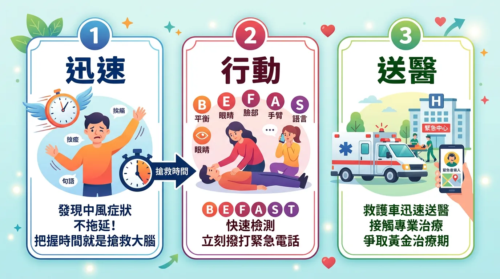
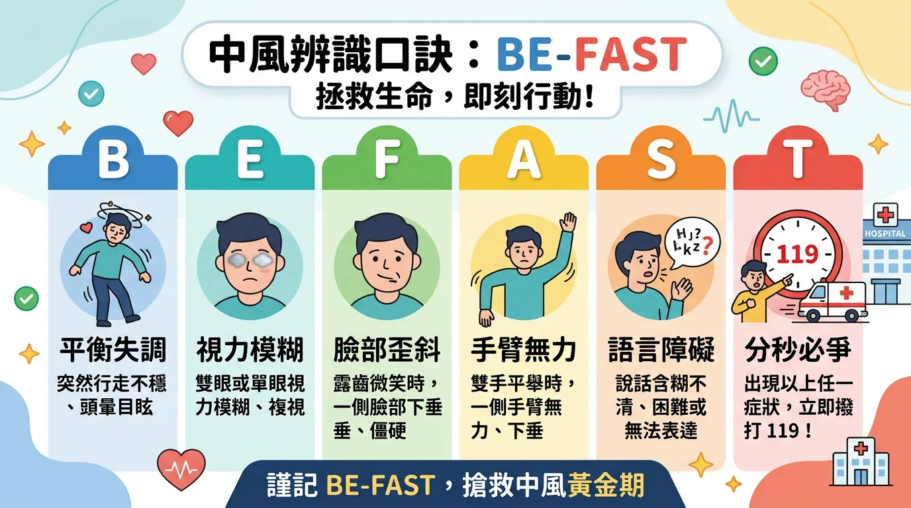
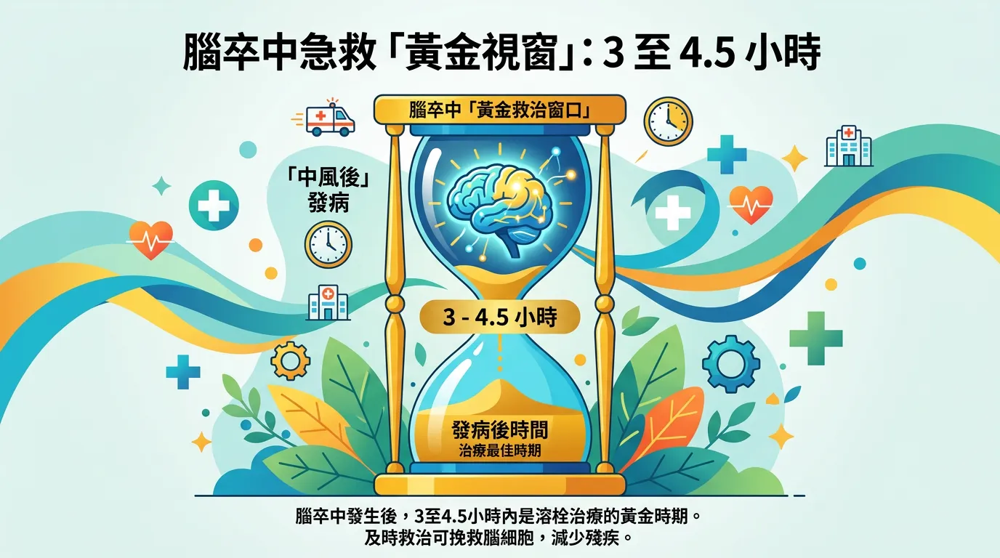
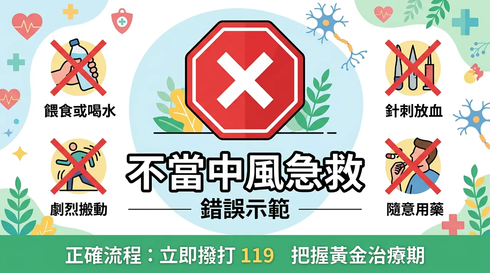
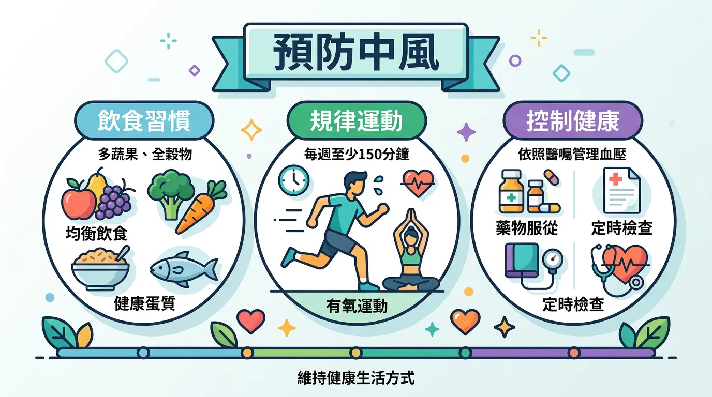
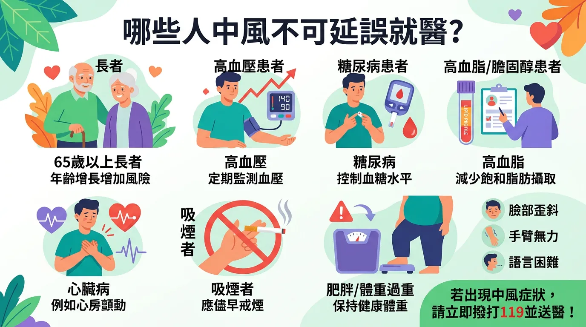
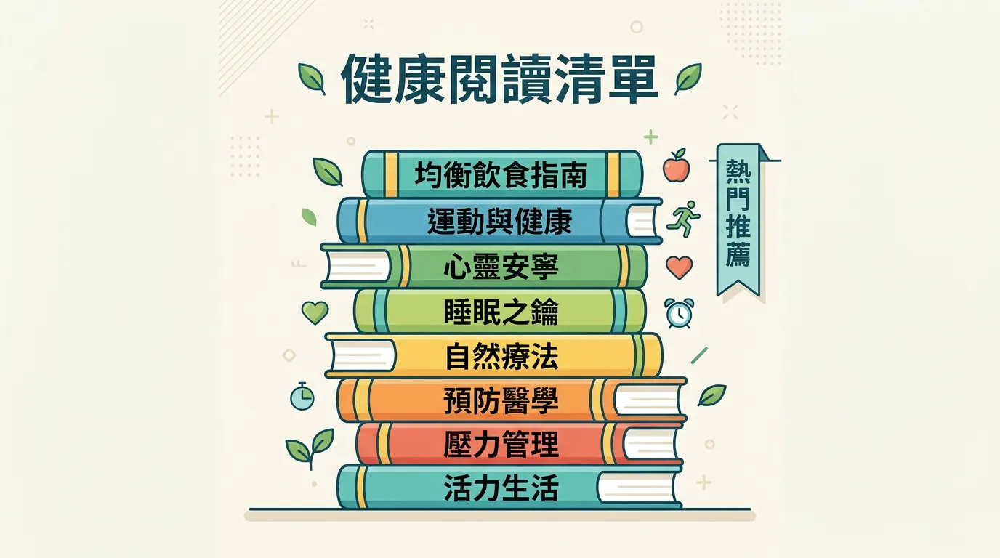

# 遇到中風怎麼辦？記住 BE-FAST 口訣，搶救大腦黃金 3 小時

本文你會學到：BE-FAST 辨識法則、溶栓黃金時間與急救三步驟。若用一句話概括：臉歪、手無力、口齒不清等任一出現就懷疑中風，立刻打 119、記發病時間，不餵食不放血，搶黃金 3 小時。

中風（Stroke）是全球致殘與死亡的主要原因之一。在台灣，約 87% 的中風屬於「缺血性中風」[^1]（腦血管阻塞）。當大腦血流中斷，腦細胞會因缺氧而在數分鐘內開始死亡。**時間就是大腦**，及早識別並送醫，是決定病患能否恢復自理能力的唯一關鍵。

---

## 重點解析：快速摘要：中風急救三部曲

<DataTable theme="blue" caption="中風急救三部曲">
  <Fragment slot="header">
    <tr><th>階段</th><th>核心行動</th><th>注意事項</th></tr>
  </Fragment>
  <tr><td><strong>1. 辨識</strong></td><td>運用 <strong>BE-FAST</strong>（平衡、眼、臉、手臂、言語、時間的辨識口訣）法則。</td><td>符合其中一項即應懷疑中風。</td></tr>
  <tr><td><strong>2. 報警</strong></td><td>立即撥打 <strong>119</strong>。</td><td>告知「疑似中風」，由救護車送具溶栓能力醫院。</td></tr>
  <tr><td><strong>3. 守候</strong></td><td>記錄發病確切時間。</td><td><strong>嚴禁</strong>餵食、餵藥或放血。</td></tr>
</DataTable>

<Callout icon="🚫" title="實用提醒：絕對不能做的錯誤急救">
**不可扎針放血**（延誤送醫、感染風險）。**不可擅自給降壓藥**（身體代償性升壓以維持腦血流）。**不可餵食或飲料**（吞嚥困難易吸入性肺炎）。立即 119、記錄發病時間。
</Callout>

---

## 專業視角：辨識徵兆：BE-FAST 法則

傳統的 FAST 已進化為更全面的 **BE-FAST**，能涵蓋更多後腦區域的中風徵兆：
- **B (Balance)**：**平衡**功能喪失，突然走路不穩、向一側傾斜。
- **E (Eyes)**：**視力**模糊、複視（看到兩個影）或半側視野缺失。
- **F (Face)**：**臉部**不對稱，微笑時嘴角歪斜。
- **A (Arms)**：**手臂**無力，平舉時一側會不由自主垂下。
- **S (Speech)**：**言語**不清，說話含糊或聽不懂他人的指令。
- **T (Time)**：**時間**關鍵，一旦出現上述任一症狀，立即送醫！

---

## 搶救時間窗：黃金 3 - 4.5 小時

- **靜脈溶栓 (rt-PA)**：發病後 **3 小時內**（部分病患可延長至 4.5 小時）透過點滴注射血栓溶解劑，能大幅降低殘障率[^4]。
- **動脈取栓 (EVT)**：對於大血管阻塞，現在技術已可延長至發病後 **24 小時內**進行機械取栓手術，為晚期發病的病患帶來生機[^12]。
- **小中風 (TIA)**：症狀若在幾分鐘內消失，不可掉以輕心，這是「大中風」即將來臨的最後警訊，必須立即檢查。

---

## 深度解析：⚠️ 絕對不能做的錯誤急救

1. **不可「扎針放血」**：這不僅無效，還會延誤寶貴的送醫時間，並增加感染風險與血壓波動。
2. **不可「給予降壓藥」**：中風初期身體會代償性調高血壓以供應腦部微弱血流，擅自降壓可能導致腦缺血惡化。
3. **不可「餵食食物或飲料」**：中風常伴隨吞嚥困難，強行餵食極易造成吸入性肺炎窒息。

除了急救，日常可以這樣降低風險：

---

## 實用拆解：如何預防中風？

- **控制三高**：[高血壓](/hypertension_management/)是中風的首要推手。
- **地中海飲食**：多攝取堅果、橄欖油與[新鮮蔬果](/mediterranean-diet/)以維持血管彈性。
- **定期篩檢**：特別是心房顫動（AFib）患者，其腦中風風險是常人的 5 倍。

---

## 這樣做就對了：誰不適合在家觀察或延遲送醫？

**BE-FAST 任一徵兆出現**即應視為中風，勿等「看看會不會好」或自行送醫，應打 119 由救護車送具溶栓能力醫院。**小中風 (TIA)** 症狀雖會消失，仍是警訊，須立即就醫檢查。切勿放血、餵藥或餵食。

---

## 給你的最後建議

中風的預後不在於診所的藥膏，而在於**「急診室的速度」**。記住 BE-FAST，在關鍵時刻，你就是拯救家人大腦的英雄。

---

## 常見問題（FAQ）

### 到底什麼是 BE-FAST？每一個字母代表什麼？

**BE-FAST 是快速辨識中風徵兆的口訣。** B = 平衡失調；E = 視力異常；F = 臉部歪斜；A = 手臂無力；S = 言語不清；T = 時間關鍵。任何**一項症狀出現就應懷疑中風**，不要等待症狀消失或自行判斷，應立即撥打 119 送往有溶栓能力的醫院。

### 中風後搶救的黃金時間到底是多久？

**關鍵是發病後 3-4.5 小時。** 這個時間窗口內可進行**靜脈溶栓 (rt-PA)**，注射血栓溶解劑能大幅降低殘障率。對於**大血管阻塞**的患者，現代技術已可延長至發病後 24 小時內進行**動脈取栓手術**。時間越短效果越好，因為每分鐘都有大量腦細胞因缺氧而死亡。

### 中風時可以放血或貼藥膏嗎？為什麼不行？

**絕對不可以，這會延誤送醫與危害生命。** 放血不僅無法治療中風，還會延誤寶貴的送醫時間、增加感染風險並造成血壓波動。中風是腦血管問題，需要專業醫療介入。家庭偏方會導致病情惡化，甚至威脅患者性命。

### 小中風（TIA）症狀會自己消失，還需要急救嗎？

**必須立即就醫，不可掉以輕心。** 小中風（暫時性腦缺血發作）症狀雖然在幾分鐘或幾小時內消失，但它是「大中風」即將來臨的**最後警訊**。患者需立即接受檢查以評估中風風險，並進行預防性治療，否則風險極高。

### 中風患者能給他吃東西或喝藥嗎？為什麼不行？

**絕對禁止，容易造成吸入性肺炎。** 中風常導致吞嚥困難，強行餵食食物、飲料或藥物，極易讓東西進入氣管而非食道，引發**吸入性肺炎**甚至窒息。最安全的做法是保持禁食，記錄發病時間，立即送醫由醫護人員處理。

---

## 推薦閱讀：你可能也會喜歡

- [心臟病預防：心房顫動與血栓風險的關聯](/heart-disease-prevention/)
- [地中海飲食：保護心腦血管的黃金飲食策略](/mediterranean-diet/)
- [高血壓管理指南：如何在家穩定你的血管壓力](/hypertension_management/)
- [糖尿病與神經受損：代謝疾病如何悄悄傷害你的腦血管](/diabetes-prevention-management/)

---

## 這裡有科學根據：參考文獻

以下文獻最後檢索：2026-02。

1. *Circulation*. (2019). *Heart disease and stroke statistics*.
4. *The Lancet*. (2014). *Effect of treatment delay on the effects of intravenous thrombolysis*.
6. *Stroke*. (2009). *Definition and evaluation of transient ischemic attack*.
12. *Medical Device Network*. (2025). *Stroke Technology: New Treatments Giving Patients A Second Chance*.