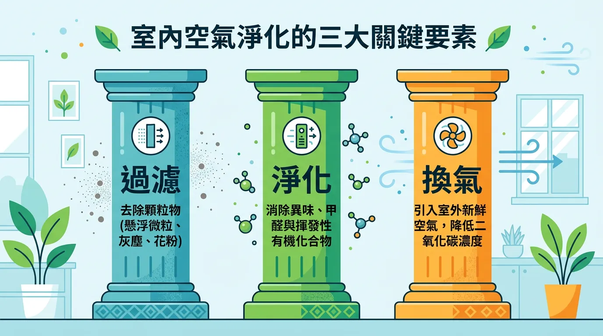
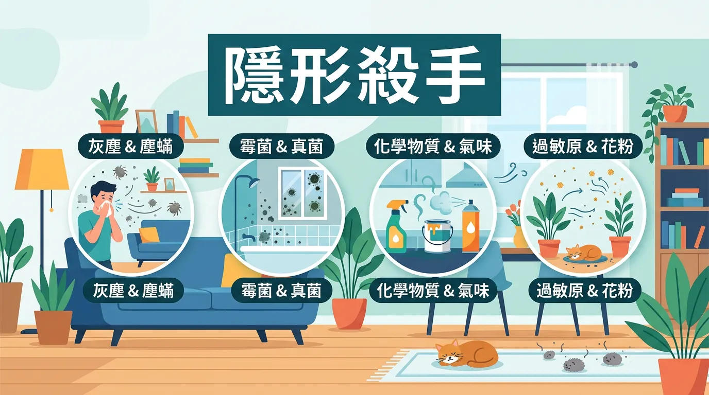
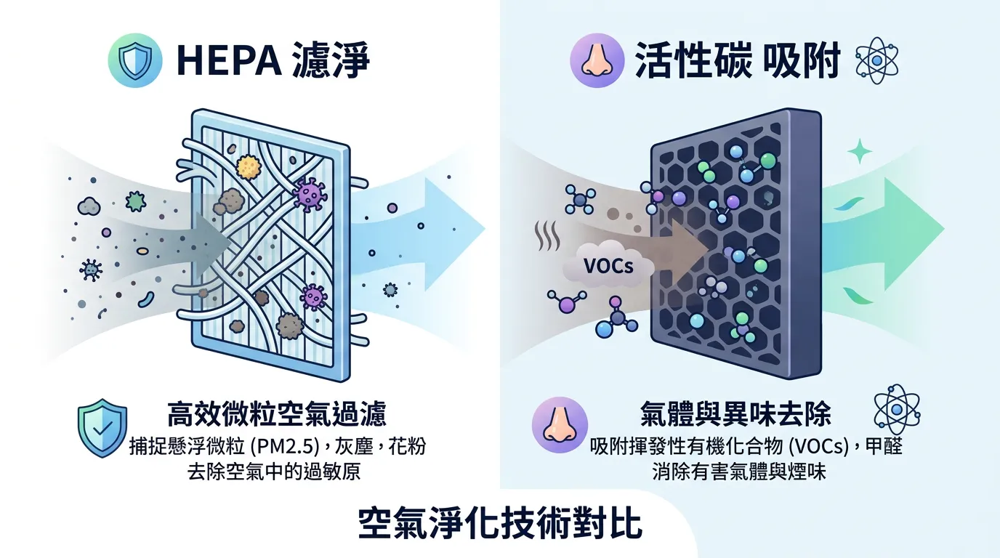
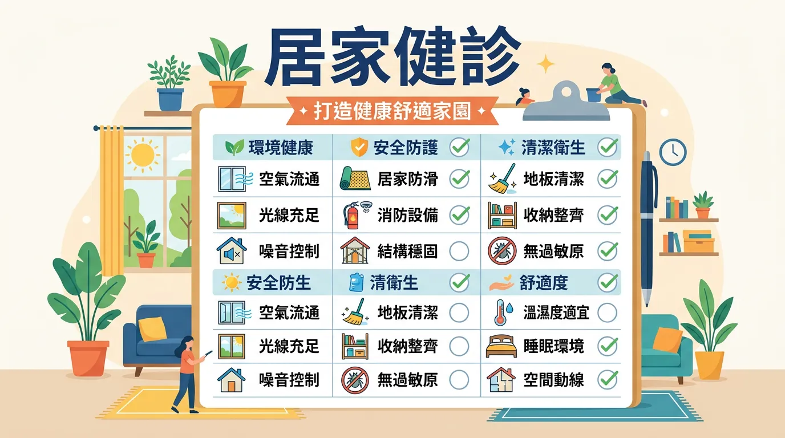

# 以為關窗就沒事？小心室內空氣比戶外還毒的日常陷阱

本文你會學到：甲醛、TVOC（總揮發性有機物）與 PM2.5 的危害，以及源頭減量、通風與清淨機策略。講到底，室內空氣常比室外髒，減少新裝潢揮發、常開窗與清淨機可改善；敏感或氣喘者更要注意。

我們平均有 90% 的時間待在室內，但建築物內部的空氣品質往往比室外更差。長期暴露於低濃度的**甲醛、揮發性有機化合物 (VOCs) 與 PM2.5** 中，會導致所謂的「病態建築症候群 (Sick Building Syndrome)」，引發頭痛、慢性疲勞以及[免疫系統](/natural-immune-support/)的負擔。

---

## 全面盤點：快速摘要：室內空氣淨化三支柱

<DataTable theme="blue" caption="室內空氣淨化三支柱">
  <Fragment slot="header">
    <tr><th>改善層級</th><th>具體行動</th><th>優先順序</th></tr>
  </Fragment>
  <tr><td><strong>1. 源頭減量</strong></td><td>低甲醛家具、禁菸、減少香氛與噴霧。</td><td><strong>最高優先</strong>（最經濟有效）</td></tr>
  <tr><td><strong>2. 機械通風</strong></td><td>定期開窗、全熱交換器 (ERV/HRV)。</td><td>降低二氧化碳與累積毒素</td></tr>
  <tr><td><strong>3. 空氣淨化</strong></td><td>HEPA + 活性碳濾網清淨機。</td><td>處理殘餘微粒與化學異味</td></tr>
</DataTable>

<CardGroup>
  <Card title="甲醛與 TVOC" icon="🏠" type="danger">
    甲醛來自合板、系統櫃，釋放期可達 3–15 年。TVOC 來自油漆、清潔劑、香水。高溫潮濕時釋放量增。
  </Card>
  <Card title="清淨機怎麼選" icon="🌬️" type="info">
    **HEPA 13（高效濾網）以上**攔截 PM2.5 與過敏原；**厚實活性碳**吸附甲醛與 VOCs。依房間大小看 CADR 值。
  </Card>
</CardGroup>

---

## 誰在污染你的家？室內隱形殺手清單

### 1. 甲醛 (Formaldehyde)
主要來自系統櫃、合板與含膠黏劑的建材。它具有致癌性且釋放期長達 **3-15 年**。即使新家裝潢已久，在高溫潮濕（如台灣夏季）時釋放量仍會激增[^108]。

### 2. TVOC (總揮發性有機化合物)
來自油漆、清潔劑、香水、指甲油甚至影印機。這些化學分子與臭氧反應後，會形成更細小的有害奈米微粒，直達肺泡[^4]。

### 3. 👉 氡氣 (Radon)
一種無色無味的放射性氣體，來源於花崗岩建材或地基裂縫。它是僅次於吸菸的**第二大肺癌誘因**。

了解室內污染物後，可以這樣挑選與改善：

---

## 🛠️ 空氣清淨機挑選指南：HEPA vs 活性碳

市面上許多清淨機僅標榜 HEPA，但針對室內氣體污染，你需要更完整的過濾系統：
- **HEPA 13 以上濾網**：針對 **PM2.5、過敏原、粉塵**（物理攔截）。
- **厚實活性碳層**：針對 **化學異味、VOCs、甲醛**（化學吸附）。
- **CADR 值 (潔淨空氣輸出率)**：應根據房間空間大小選擇，數值愈高代表淨化速度愈快。

---

## 專業視角：🌿 健康住宅查檢表

- [ ] **對流開窗**：每日至少兩次，每次 15 分鐘。
- [ ] **植物輔助**：擺放虎尾蘭、常春藤等植物，雖改善有限但能調節濕度。
- [ ] **濕度控制**：維持在 **50-60%** 之間，預防黴菌與塵蟎滋生[^11]。
- [ ] **減法居家**：減少使用化學香氛蠟燭與強效合成清潔劑。

---

## 給你的最後建議

改善室內空氣不是一勞永逸的工程，而是一場關於「行為改變」的馬拉松。透過有意識地篩選建材與維持良好的[通風習慣](/air-quality-health/)，你能為全家人創造一個真正可以深呼吸的避風港。

---

## 常見問題（FAQ）

### 甲醛在新裝潢家裡會釋放多久？開窗能加速除甲醛嗎？

**甲醛釋放期長達 3-15 年，不只是新房才有問題。** 高溫潮濕時（如台灣夏季）釋放量會大幅增加。開窗通風確實能**加速稀釋與帶走甲醛**，建議每日至少開窗兩次、每次 15 分鐘。不過單靠開窗無法完全消除甲醛，需結合源頭減量（選低甲醛家具）與空氣清淨機（含厚實活性碳）才最有效。

### 空氣清淨機應該怎麼選？HEPA 濾網就夠了嗎？

**不夠。應選 HEPA 13 + 厚實活性碳層雙層設計。** HEPA 只能攔截物理微粒（PM2.5、過敏原），無法吸收化學氣體（甲醛、TVOC）。厚實活性碳層才能吸附這些有害化學物。另需參考 **CADR 值**（潔淨空氣輸出率），應根據房間大小選擇，數值越高淨化速度越快。

### TVOC 是什麼？對健康有什麼影響？

**TVOC = 總揮發性有機化合物，來自油漆、清潔劑、香水、影印機等。** 這些化學分子容易與空氣中臭氧反應，形成更細小的有害奈米微粒，可直達肺泡，引發呼吸道發炎、哮喘惡化。敏感族群應優先減少 VOC 來源（減少香氛蠟燭、強效清潔劑），搭配清淨機處理。

### 氡氣看不見、聞不到，應該怎樣檢測？住在有氡氣風險的地區怎麼辦？

**氡氣是無色無味放射性氣體，來自花崗岩建材與地基裂縫，是肺癌第二大誘因。** 需要專業檢測儀器才能測出。若住在花崗岩建築或地基潮濕區域，應加強**地下室與一樓的通風**，裝設全熱交換器 (ERV) 能常年安全通風。家中若有長期吸菸者或氡氣風險，應更積極改善。

### 一分鐘看懂：開窗通風、植物、除濕都有幫助嗎？三者的優先順序是什麼？

**優先順序：開窗通風 > 空氣清淨機 > 植物與除濕。** 開窗通風是最經濟且高效的方式。植物雖能調節濕度與美化環境，但改善污染效果有限（通常低估）。除濕應維持室內濕度在 50-60% 之間，預防黴菌與塵蟎滋生。三者應配合，從源頭減量、通風、淨化形成完整策略。

---

## 推薦閱讀：你可能也會喜歡

- [空氣品質與健康：室內外空氣安全完整指南](/air-quality-health/)
- [漂白水與消毒劑：如何安全清理居家環境而不傷害肺部？](/bleach/)
- [天然免疫支持：清潔的空氣與良好的睡眠如何共同運作？](/natural-immune-support/)
- [水質安全指南：除了呼吸，你喝的水是否也藏有隱形風險？](/water-quality-safety/)

---

## 這裡有科學根據：參考文獻

以下文獻最後檢索：2026-02。

4. *Environmental Science & Technology*. (2024). *Nanoparticle formation from VOC-ozone reactions*.
8. *Chemical Reviews*. (2010). *Formaldehyde in the indoor environment*.
11. *EHP*. (2011). *Health effects of dampness, mold, and dampness-related agents*.
108. *Taiwan EPA*. (2024). *Indoor Air Quality Act and Management Guidelines*.