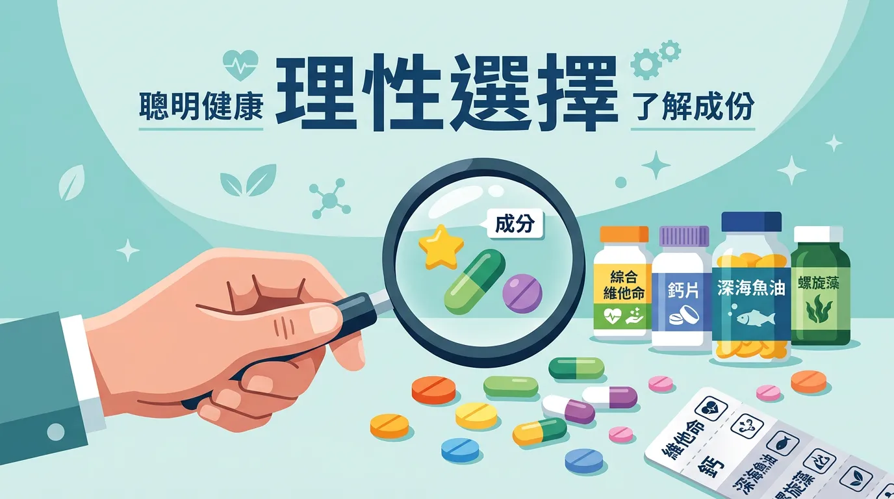
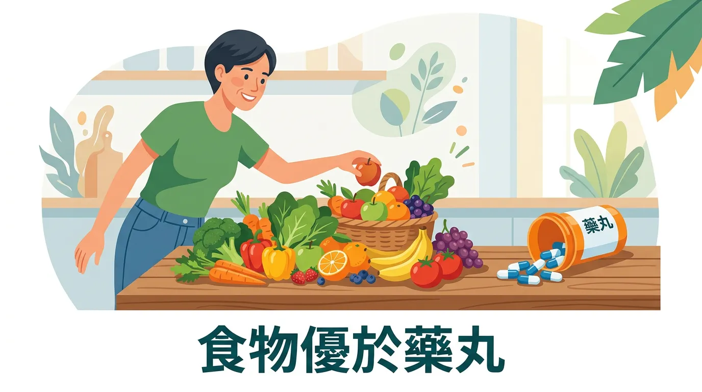
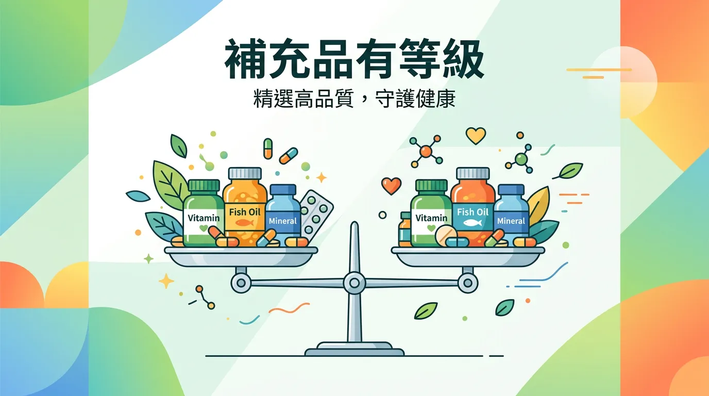
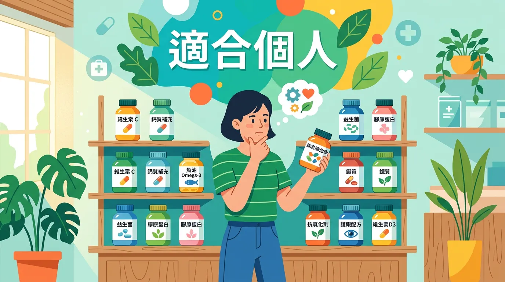

# 吞了一堆保健食品真的有效嗎？破解生物利用率的行銷話術

本文你會學到：保健食品的實證分級、生物利用率與小綠人標章挑選要點。講到底，先以均衡飲食為主，有明確缺乏或需求時再精準補充，並認明實證與認證，離不開這幾個原則。

保健食品產業是一個充滿熱情的市場，但對於消費者而言，最重要卻也最難回答的問題是：**「這顆藥丸真的能讓我更健康嗎？」**。醫學界普遍認為：保健食品是「補充」而非「替代」。當我們理解了營養素的**生物利用率 (Bioavailability)** 與實證等級後，才能避免落入行銷噱頭的陷阱。

---

## 快速摘要：保健食品的理性挑選準則

<DataTable theme="blue" caption="保健食品理性挑選準則">
  <Fragment slot="header">
    <tr><th>檢核項目</th><th>詳細說明</th><th>建議行動</th></tr>
  </Fragment>
  <tr><td><strong>1. 實證分級</strong></td><td>是否有隨機雙盲對照試驗 (RCT) 支持？</td><td>優先參考 Examine.com 或醫學期刊。</td></tr>
  <tr><td><strong>2. 認證標章</strong></td><td>台灣「小綠人」健康食品標章。</td><td>認明衛福部核可的 13 項特定功效。</td></tr>
  <tr><td><strong>3. 生物利用率</strong></td><td>化學型態是否易於人體吸收？</td><td>檸檬酸鈣優於碳酸鈣；[D3 優於 D2](/fix-vitamin-d/)。</td></tr>
  <tr><td><strong>4. 原型食物優先</strong></td><td>食物中營養具協同作用。</td><td>除非特定缺乏，否則以[均衡飲食](/mediterranean-diet/)為主。</td></tr>
</DataTable>

<CardGroup>
  <Card title="吃食物優於吃藥丸" icon="🥗" type="success">
    原型食物含多種成分協同吸收；單一高劑量合成維生素可能競爭或增加代謝負擔。見[維生素 C](/vitamin-c/)等。
  </Card>
  <Card title="精準補充" icon="🩺" type="info">
    透過[血液檢測](/fix-vitamin-d/)確認缺乏後再補充，而非亂槍打鳥。孕期葉酸、長者 B12 等有明確需求時再補。
  </Card>
</CardGroup>

---

## 重點解析：為何「吃食物」優於「吃藥丸」？

人體經過數百萬年的演化，已習慣從複雜的「原型食物」中獲取營養。
- **協同作用 (Synergy)**：一顆柳丁除了 [維生素 C](/vitamin-c/)，還含有類黃酮、纖維與多種微量元素，這些成分會共同運作以優化吸收率。
- **孤立合成物**：單一高劑量的合成維生素有時會與其他營養素產生競爭，甚至在體內產生不必要的代謝負擔。

---

## 🔬 實證分級：並非所有補充品都平等

在醫學證據的金字塔中：
1. **多國臨床試驗 (RCT)**：最有力的證據（如葉黃素與 AREDS2（年齡相關眼病研究第2期）研究）。
2. **觀察性研究**：顯示相關性，但不代表因果關係（如多數宣稱抗癌的草藥）。
3. **動物或細胞實驗**：僅代表「具備潛力」，不代表對人體有效。

**2024 年趨勢**：現代醫學更強調「精準營養」，即透過[血液檢測](/fix-vitamin-d/)確認缺乏後再進行有目的性的補充，而非「亂槍打鳥」式的使用。

了解實證分級後，在台灣選購時可以認明這些標章：

---

## 🛡️ 台灣特色：認明「小綠人」健康食品標章

在台灣，只有通過嚴格安全性與科學證明的產品，才能標示「健康食品」並宣稱療效。目前衛福部公告的 13 項功效包括：**調節血脂、免疫調節、骨質保健**等。若產品宣稱的功能不在這 13 項內（如：增加智力、壯陽），則屬於法律上的「一般食品」，效用未獲官方保證。

---

## 到底適不適合你？誰不適合亂槍打鳥式補充？

**懷孕、哺乳**、**正在服藥**（尤其抗凝血、免疫抑制）、**肝腎功能異常**者，補充前應諮詢醫師或營養師。有**過敏史**或**曾對補充劑不良反應**者勿自行嘗試新產品。兒童與長者劑量須依專業建議。

---

## 給你的最後建議

保健食品不是萬靈丹。如果你擁有穩定的[睡眠與生活型態](/lifestyle-immunity-factors/)、規律的[阻力訓練](/how-to-prevent-osteoporosis/)與高品質的[原型飲食](/mediterranean-diet/)，大多數昂貴的補充品對你而言其實是多餘的。唯有針對特定需求（如：孕期葉酸、長者 B12）進行精準補充，才能發揮最大的健康投資報酬率。

---

## 常見問題（FAQ）

### 關鍵看點：保健食品吃再多也不會過量嗎？

不是的。某些脂溶性維生素（如維生素 A、D、E、K）與礦物質（如鐵、硒）**過量補充可能造成毒性**。懷孕者、兒童、肝腎功能異常者更需謹慎。建議先透過血液檢測確認缺乏，再在專業醫療人員指導下補充。

### 背後原因大公開：為什麼醫生說我應該吃食物而不是補充品？

原型食物中的**營養成分會彼此協同作用**，增加吸收效率且減少代謝負擔。一顆橙子除了維生素 C，還含有類黃酮、纖維與多種微量元素，比單一高劑量合成維生素的效果更全面也更安全。

### 小綠人標章真的代表保健食品有效嗎？

台灣「小綠人」健康食品標章代表**通過衛福部嚴格的安全性與科學證實**，限定 13 項功效（如調節血脂、免疫調節）。有此標章的產品效果更值得信賴，但仍不適合過量或長期無目的補充。

### 專業視角：保健食品和藥物可以一起吃嗎？

**關鍵要看藥物類型**。某些補充品（如維生素 K、高劑量維生素 E）會與抗凝血劑交互作用；草本補充品可能干擾免疫抑制劑效果。任何補充品與處方藥並用前，應洽詢醫師或藥師以避免危險交互作用。

### 深度解析：我應該每天補充綜合維生素嗎？

若你飲食均衡、定期運動、睡眠充足，**綜合維生素通常不是必須的**。反而可能造成脂溶性維生素蓄積。比較理性的做法是先評估個人飲食缺口（如素食者補 B12、長者補 D），再進行精準補充。

---

## 推薦閱讀：你可能也會喜歡

- [營養補充品安全指南：如何避免過量攝取導致的肝腎負擔？](/supplement-safety-guide/)
- [維生素 D 完整指南：為什麼它是現代人最值得考慮的補充品？](/fix-vitamin-d/)
- [地中海飲食：如何從原型食物中攝取天然的抗氧化能量？](/mediterranean-diet/)
- [葉黃素與視力保護：AREDS2 臨床實證後的選擇策略](/lutein-is-sufficiency/)

---

## 這裡有科學根據：參考文獻

以下文獻最後檢索：2026-02。

1. *NIH Office of Dietary Supplements*. (2024). *Dietary Supplements: What You Need to Know*.
2. *Examine.com*. (2024). *Evidence-based nutrition and supplement analysis*.
10. *FDA*. (2024). *Dietary Supplement Regulation and Safety*.
108. *TFDA*. (2024). *Health Food Management Act: The 13 Specific Functional Claims*.