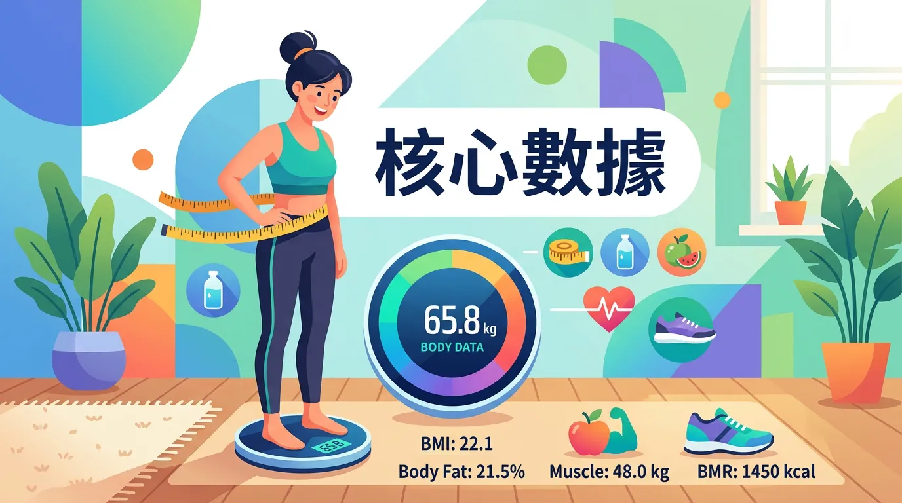
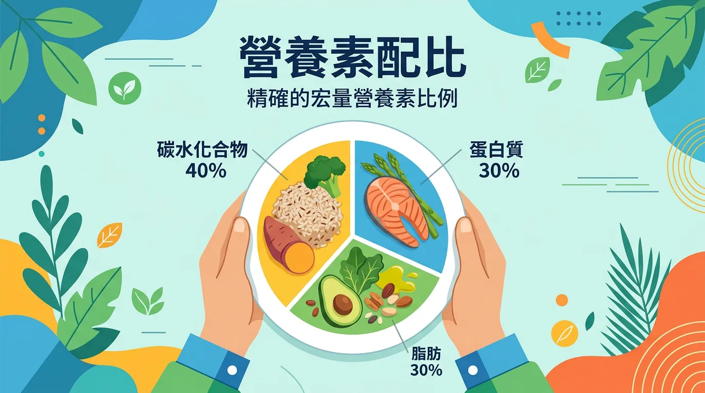

# 不知從何開始吃得健康？教你算出專屬 TDEE 與無痛抓菜單

本文你會學到：BMR、TDEE 計算與依目標訂定的巨量營養素比例。若用一句話概括：先算一天總消耗熱量，再依減脂／增肌／維持目標調整吃進去的量與蛋白質比例，就是膳食規劃的核心。

很多人認為「吃得健康」就是偏食某些食物，但真正的膳食規劃是一套建立在**熱量平衡 (Energy Balance)** 與**營養密度 (Nutrient Density)** 之上的科學系統。透過系統化的規劃，你可以在不犧牲生活品質的前提下，精準達成減脂、增肌或維持健康的目標。

---

## 第一步：掌握你的核心數據 (TDEE)

在開始任何飲食計畫前，你必須知道身體每天消耗多少能量。
1. **BMR (基礎代謝率)**：維持生命最低限度所需的熱量（即使躺著不動）。
2. **TDEE (Total Daily Energy Expenditure，總熱量消耗)**：BMR 加上日常活動、工作與運動後的總消耗熱量。

<DataTable theme="blue" caption="依目標的熱量策略">
  <Fragment slot="header">
    <tr><th>目標</th><th>攝取熱量</th></tr>
  </Fragment>
  <tr><td><strong>減脂</strong></td><td>TDEE 的 85–90%</td></tr>
  <tr><td><strong>增肌</strong></td><td>TDEE 的 110%</td></tr>
  <tr><td><strong>維持</strong></td><td>等於 TDEE</td></tr>
</DataTable>

---

## 核心觀念：第二步：巨量營養素的精準配比

掌握總量後，接下來是「質量」的分配。
- **蛋白質 (Protein)**：建議攝取量為體重 (kg) × 1.2 至 2.2 克。這能確保在熱量缺口時保留肌肉量，並提高飽足感[^11]。
- **脂肪 (Fat)**：佔總熱量的 20% - 30%。足夠的脂肪對於維持[激素平衡與脂溶性維生素吸收](/macronutrients-guide/)至關重要。
- **碳水化合物 (Carbs)**：補足剩餘的熱量。優先選擇中低 GI（升糖指數）的複合型醣類，以維持[穩定的血糖波動](/diabetes-prevention-management/)。

---

## 專業視角：第三步：「微調整」與環境打造

膳食規劃失敗的主因通常不是知識不足，而是「難以執行」。
- **備餐 (Meal Prep)**：週末花 2 小時預處理蛋白質與切洗蔬菜，能減少忙碌時選擇外食的機率。
- **彈性原則 (80/20 法則)**：80% 的熱量來自高品質的原型食物，20% 留給喜愛的社交飲食，這是長期堅持的關鍵。
- **環境控制**：清理櫥櫃中的高度加工食品，讓健康的選擇成為「阻力最低的路徑」。

---

## 給你的最後建議

膳食規劃不是一種限制，而是一種對身體主權的掌控。當你了解自己的 [TDEE 與巨量比例](/macronutrients-guide/)，你就能在享受美食與追求健康之間找到完美的動態平衡。

---

## 常見問題（FAQ）

### 我如何知道自己的 TDEE 是多少？

最準確的方法是**先使用 Mifflin-St Jeor 公式計算 BMR（基礎代謝率）**，再乘以活動係數。BMR = 10×體重(kg) + 6.25×身高(cm) - 5×年齡 - 161（女性）。然後根據活動量乘以 1.2-1.9 的係數。但公式只是估算，建議試驗 2-3 週後根據體重與精力反應調整。

### 關鍵看點：減脂時真的要靠意志力餓肚子嗎？

不需要。關鍵是**攝取高蛋白質與高纖維**來提升飽足感。在相同熱量缺口下，高蛋白飲食（體重×1.6-2.2g 蛋白質）能減少肌肉流失、加速脂肪氧化，同時讓你更有飽足感。加上備餐與環境控制，你能舒適地在熱量缺口中堅持。

### 「80/20 法則」是什麼意思？

這意味著 **80% 的熱量應來自高品質的原型食物**（蔬菜、瘦肉、全穀物），**20% 可留給喜歡的食物**（甜點、宵夜）。這樣既能達成營養目標，又能享受社交飲食的彈性，是比極端限制更可持續的做法。

### 蛋白質需要體重×2.2g 那麼多嗎？

取決於目標。**減脂時 1.6-2.2g/kg 能最大化肌肉保留與飽足感**；**增肌時 1.6-2.2g/kg 用於組織修復**；**維持狀態時 0.8-1.2g/kg 足夠**。過量蛋白質會轉化為脂肪，並增加肝腎負擔，不需要無限制增加。

### 進階討論：備餐真的能改變飲食習慣嗎？

絕對能。**減少決策疲勞**是備餐的核心優勢。當健康食物已準備好，你選擇外食的動機就大幅下降。週末花 2-3 小時預處理蛋白質與蔬菜，能將平日健康飲食的執行成本降到最低，是讓膳食規劃長期可行的實務關鍵。

---

## 推薦閱讀：你可能也會喜歡

- [巨量營養素：蛋白質、醣類與脂肪在體內的代謝路徑解析](/macronutrients-guide/)
- [地中海飲食：科學界公認最易於長期堅持的膳食模式](/mediterranean-diet/)
- [閱讀營養標籤：如何在 30 秒內判斷這項食品是否符合你的配比？](/reading-nutrition-labels/)
- [間歇性斷食：如何將時控性進食與精準膳食規劃結合？](/intermittent-fasting/)

---

## 這裡有科學根據：參考文獻

以下文獻最後檢索：2026-02。

10. *Mifflin-St Jeor Equation*. (1990). *A new predictive equation for resting energy expenditure*.
11. *Journal of the International Society of Sports Nutrition*. (2024). *Protein and exercise: Recent consensus*.
15. *USDA MyPlate Guidelines*. (2024). *Balanced portion control strategies*.
23. *Nature Medicine*. (2024). *Energy intake and diet quality in weight management*.