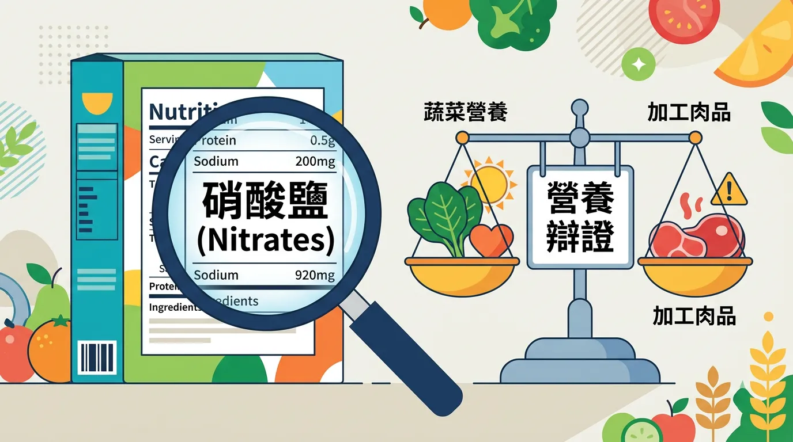
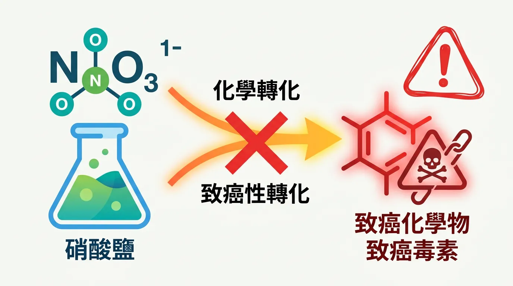
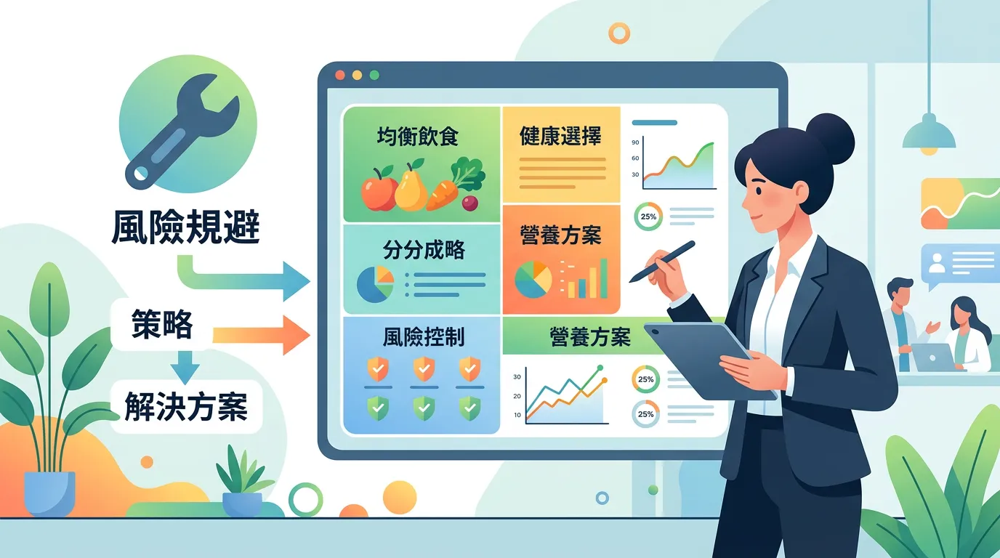
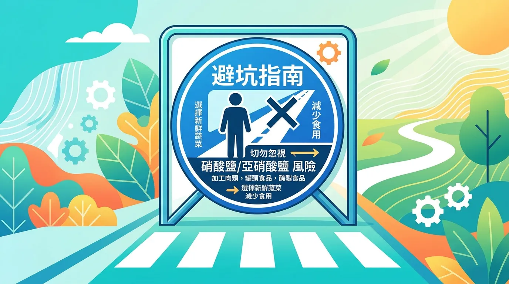
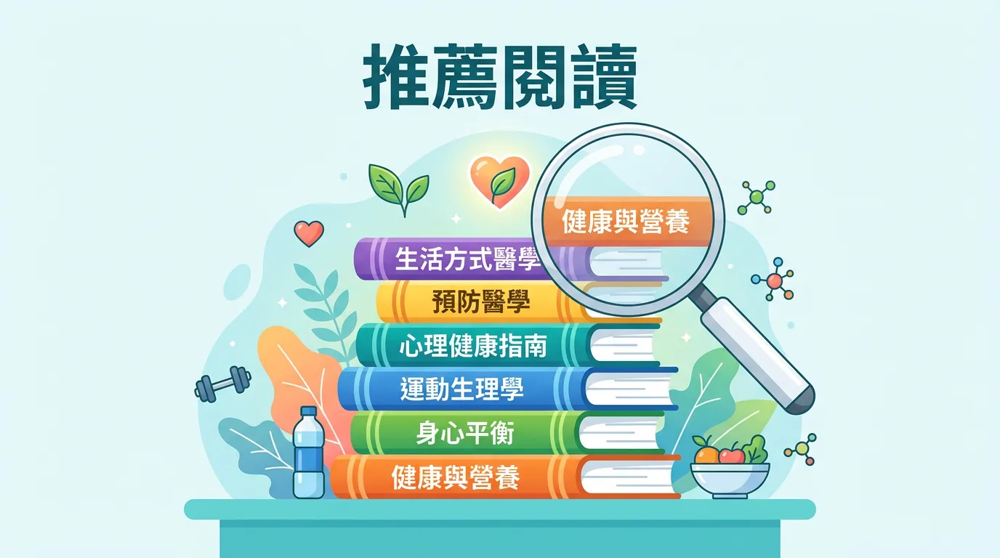

# 吃香腸配養樂多會致癌嗎？破解硝酸鹽與亞硝胺的飲食迷思

本文你會學到：硝酸鹽在體內的代謝、加工肉品與癌症連結及如何阻斷亞硝胺形成。歸根結底，蔬菜裡的硝酸鹽多半有益，加工肉品裡的亞硝胺要少碰；吃加工肉時配蔬果與維他命 C，並注意飲水品質。

在食品科學中，**硝酸鹽 (Nitrate)** 是一個充滿爭議的關鍵字。它既是植物生長必需的養分，也是延長加工肉品保鮮期的防腐劑。然而，大眾最擔心的並非硝酸鹽本身，而是其轉化後的代謝產物——**亞硝胺 (Nitrosamines)**。

---

## 全面盤點：快速摘要：硝酸鹽的健康辯證

<DataTable theme="blue" caption="硝酸鹽來源與風險">
  <Fragment slot="header">
    <tr><th>來源</th><th>風險評估</th><th>生理機制</th></tr>
  </Fragment>
  <tr><td><strong>天然蔬菜</strong></td><td>✅ 低風險（益大於弊）</td><td>維生素 C 與多酚阻斷亞硝胺形成。</td></tr>
  <tr><td><strong>加工肉品</strong></td><td>⚠️ 中高風險</td><td>高溫烹調易產生 N-亞硝基化合物，IARC（國際癌症研究機構）一級致癌物[^11]。</td></tr>
  <tr><td><strong>飲用水</strong></td><td>⚠️ 潛在風險</td><td>高濃度硝酸鹽（農業流失）與大腸癌風險相關。</td></tr>
  <tr><td><strong>生理效應</strong></td><td>雙面刃</td><td>硝酸鹽可轉化為一氧化氮 (NO)，有助[血管擴張與血壓](/heart-disease-prevention/)。</td></tr>
</DataTable>

<Callout icon="🥗" title="實用提醒：風險規避對策">
優先原型食物、減少加工肉品；蒸煮或微波取代高溫煎烤；搭配富含維生素 C 水果或[地中海飲食](/mediterranean-diet/)大量蔬菜；關注[水質安全](/water-quality-safety/)。
</Callout>

---

## 🔬 化學轉化：從硝酸鹽到致癌物質

硝酸鹽 (NO3) 進入體內後，會被口腔細菌與胃酸轉化為亞硝酸鹽 (NO2)。關鍵的危險發生於：
- **亞硝胺形成**：在酸性環境（如胃部）中，亞硝酸鹽與蛋白質中的胺類結合。
- **高溫催化**：煎炸培根或燒烤加工火腿時，高溫會加速亞硝胺的合成。
- **抗氧化抑制**：[維生素 C](/vitamin-c/) 與維生素 E 能抑制亞硝化反應，這是為何大量吃菜能「抵消」部分風險的科學依據。

了解轉化與風險後，可以這樣規避：

---

## 專業視角：🛠️ 風險規避與飲食對策

1. **優先原型食物**：減少攝取含亞硝酸鹽的加工肉品（香腸、培根、火腿）。
2. **改變烹調技巧**：改用蒸、煮或微波，避免高溫煎烤加工肉類以減少有害物質生成。
3. **建立抗氧化屏障**：在食用加工肉品時，務必搭配富含維生素 C 的水果或[地中海飲食](/mediterranean-diet/)中的大量蔬菜。
4. **關注水質安全**：確保飲用水源符合[國家衛生標準](/water-quality-safety/)，特別是在農業發達地區。

---

## 避坑指南：誰不適合忽略硝酸鹽／亞硝胺風險？

**嬰幼兒**（尤其 6 個月以下）飲用水與副食品中的硝酸鹽濃度須特別注意，避免高硝酸鹽井水沖泡配方奶。**胃癌高風險**或**常吃加工肉品**者應減少加工肉、多配蔬果。**懷孕**者建議以原型食物與乾淨水源為主。

---

## 給你的最後建議

硝酸鹽不應被妖魔化，關鍵在於「來源」與「背景」。來自蔬菜的硝酸鹽搭配其天然的抗氧化盾牌，對人類通常是有益的；而加工肉品中的硝酸鹽則需謹慎管理。透過[了解營養標籤](/reading-nutrition-labels/)與落實均衡飲食，你可以有效掌握這場化學拔河的全局。

---

## 常見問題（FAQ）

### 深度解析：蔬菜中的硝酸鹽真的會致癌嗎？

蔬菜中的硝酸鹽本身**低風險**，甚至有益。關鍵在於蔬菜同時含有**維生素 C、多酚與膳食纖維**，這些抗氧化物質能阻斷亞硝胺的形成。科學研究顯示，大量吃菠菜、甜菜等高硝酸鹽蔬菜的人群，癌症風險並未升高；反而因高纖高抗氧化而降低風險。

### 加工肉品（火腿、香腸）中的亞硝胺危害有多大？

加工肉品含有的**亞硝酸鹽添加物**在高溫烹調時會轉化為亞硝胺，被國際癌症研究機構（IARC）列為**一級致癌物**。世界衛生組織（WHO）建議每週加工肉品攝取量不超過 25-30 克（約半根香腸）。偶爾食用風險低，但經常食用與大腸癌風險增加 21% 相關。

### 如果要吃加工肉品，怎樣才能降低風險？

最好的方法是**減少份量與頻率**，但若要吃可搭配以下策略：1) **改變烹調方式**——改用蒸或微波代替高溫煎烤；2) **搭配蔬果**——同時進食富含維生素 C 的番茄、檸檬或柑橘；3) **優先天然香料**——用蒜、迷迭香等天然抗氧化物質調味；4) **限制份量**——每月不超過 4-5 次。

### 井水或自來水中的硝酸鹽濃度要多高才危險？

世界衛生組織與各國環保署的飲用水安全標準為**每升 50 毫克硝酸鹽**以下（以硝酸鹽計）。超過此標準的水源（常見於農業地區因化肥流失）會增加大腸癌風險。若擔心水質，可用**活性碳濾水器或逆滲透系統**移除，或送水樣檢驗確認。

### 實用拆解：嬰幼兒對硝酸鹽為什麼特別敏感？

6 個月以下嬰幼兒的**胃酸濃度與腸道菌群尚未發育完全**，無法有效轉化硝酸鹽。高濃度硝酸鹽會導致亞硝酸鹽聚集，引發「藍嬰症」（methemoglobinemia），導致血紅素無法攜帶氧氣。建議嬰幼兒配方奶與副食品用**檢測合格的低硝酸鹽水源**調配與烹飪。

---

## 推薦閱讀：你可能也會喜歡

- [地中海飲食：如何利用高抗氧化結構中和環境與飲食毒素？](/mediterranean-diet/)
- [維生素 C 指南：阻斷亞硝化反應的細胞內核心防禦者](/vitamin-c/)
- [心臟病預防：一氧化氮與血管內皮健康的動態平衡](/heart-disease-prevention/)
- [水質安全指南：深解析飲用水中的化學污染物與移除技術](/water-quality-safety/)

---

## 這裡有科學根據：參考文獻

以下文獻最後檢索：2026-02。

11. *International Agency for Research on Cancer (IARC)*. (2015). *Carcinogenicity of consumption of red and processed meat*.
15. *NutriNet-Santé Study*. (2024). *Artificial nitrites and nitrates from additives and cancer risk*.
16. *The New England Journal of Medicine*. (2024). *Dietary patterns and the formation of N-nitroso compounds*.
23. *EFSA Journal*. (2024). *Re-evaluation of nitrites and nitrates as food additives*.