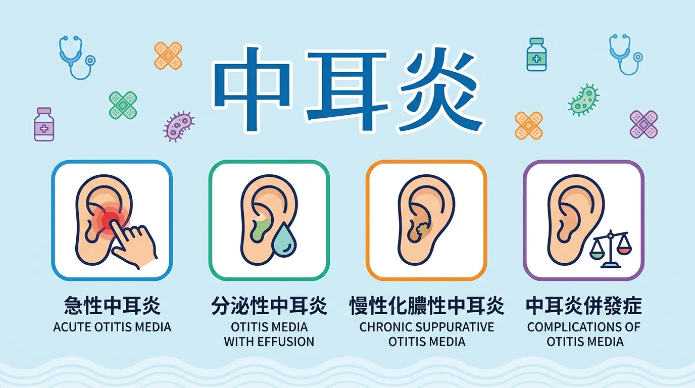
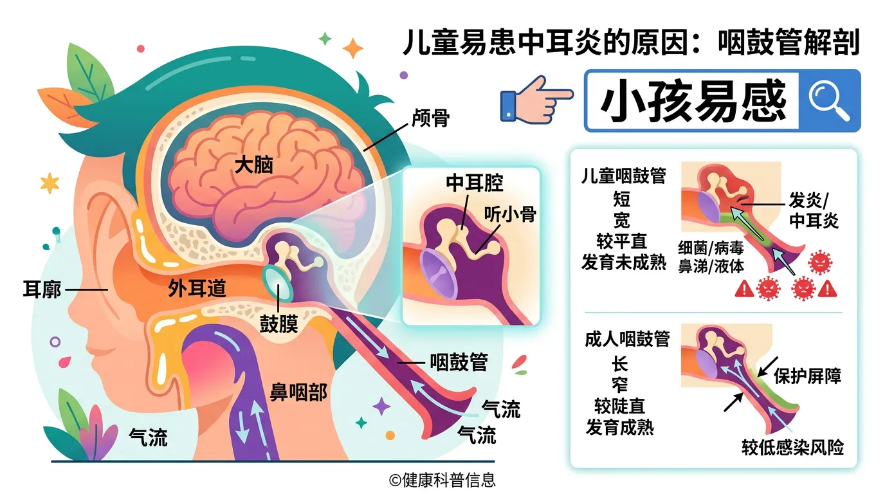

# 孩子反覆耳朵痛是中耳炎？教你分辨症狀與抗生素的正確使用時機

本文你會學到：AOM 與 OME 的區別、兒童易發中耳炎的原因與觀察治療準則。講到底，小孩耳咽管短又水平易感染，輕症可先觀察 48–72 小時，持續燒痛或 2 歲以下要完成抗生素療程；疫苗有助預防。

急性中耳炎 (Acute Otitis Media, AOM) 是僅次於普通感冒的兒科常見疾病。據統計，約 80% 的兒童在三歲前至少經歷過一次中耳感染。這不僅是家長的噩夢，更是造成兒童傳導性聽力損失的主因之一。

---

## 快速摘要：中耳炎的分類與臨床特徵

| 類型 | 定義 | 關鍵症狀 | 治療重點 |
|----------|----------|--------------|----------|
| **急性中耳炎 (AOM)** | 中耳腔的急性細菌或病毒感染。 | 耳痛、發燒、鼓膜紅腫。 | 止痛為主，視情況使用抗生素。 |
| **滲出性中耳炎 (OME)** | 中耳積水但無明顯發炎感染。 | 聽力下降、悶塞感、無痛。 | 追蹤觀察，避免濫用抗生素。 |
| **慢性化膿性中耳炎** | 鼓膜穿孔且長期流膿。 | 反覆流耳膿、聽力受損。 | 需專科醫師長期追蹤。 |

---

## 🔬 解剖學真相：為什麼「小孩」特別容易中耳炎？

兒童的中耳炎高發率源於生理構造尚未成熟：
1. **耳咽管構造**：兒童的耳咽管比成人更**短、窄、且呈水平狀**。當鼻咽部發生[上呼吸道感染](/cold-weather-cause-cold/)或過敏時，病原體極易經由這條「快速道路」逆流進入中耳。
2. **腺樣體肥大**：位於耳咽管開口附近的腺樣體若因感染腫大，會阻礙中耳排水。
3. **免疫系統尚未完善**：對肺炎鏈球菌等常見病原的抵抗力較弱。

---

## 🛠️ 治療準則：抗生素管理 (Antibiotic Stewardship)

現代醫學強調「精準用藥」，並非所有中耳炎都要立即吃抗生素：
- **觀察等待 (Watchful Waiting)**：對於 2 歲以上、症狀輕微、單側發炎且無特殊風險因素的兒童，醫師建議先觀察 **48-72 小時**[^5]。
- **抗生素介入**：若持續發燒、劇烈疼痛或 2 歲以下嬰幼兒，則需按醫囑完成 7-10 天的抗生素療程（首選通常為阿莫西林）。
- **預防勝於治療**：接種肺炎鏈球菌疫苗 (PCV13/15/20) 與流感疫苗能顯著降低發病率[^6]。

---

## 給你的最後建議

中耳炎並不可怕，關鍵在於**及時止痛**與**正確診斷**。家長應警惕孩子出現抓耳朵、不明原因哭鬧或聽覺反應遲鈍等徵兆。透過[改善環境衛生](/indoor-air-pollute/)、遠離二手菸以及落實[疫苗接種計畫](/children-nutrition-health/)，能為孩子的耳部健康建立堅實的防線。

---

## 常見問題（FAQ）

### 孩子經常抓耳朵或拉耳朵，是中耳炎嗎？

這是家長常見的疑問。抓耳朵可能是**中耳炎的早期信號**，也可能只是孩子的好奇行為、濕疹或耳垢堆積。真正的中耳炎通常伴隨以下症狀：**發燒（38°C 以上）、哭鬧不安、夜間睡眠干擾、耳朵流膿或鼓膜穿孔後的液體流出**。如果孩子同時有感冒症狀和耳部不適，應立即就醫檢查。

### 專業視角：中耳炎一定要吃抗生素嗎？

不一定。根據美國小兒科學會最新指南，**2 歲以上、症狀輕微、無高危因素**的孩子可以先「觀察等待」**48-72 小時**，看症狀是否自然改善。醫師會處方止痛藥物（如乙醯胺酚或布洛芬）緩解耳痛。但如果孩子**2 歲以下、發燒持續、耳痛加劇或有流膿**，則需立即開始抗生素治療。

### 滲出性中耳炎和急性中耳炎有什麼不同？

**急性中耳炎（AOM）**是突發的感染，有發燒、耳痛、鼓膜紅腫，需要積極治療。**滲出性中耳炎（OME）**是中耳內有積水但沒有感染發炎，孩子主要表現為聽力下降或悶塞感，沒有耳痛。OME 通常自我消退，不需要抗生素，只需追蹤。兩者混淆會導致不必要的抗生素濫用。

### 全面盤點：中耳炎復發頻繁是正常的嗎？

一年內超過 3 次是「復發性中耳炎」，這時要尋找根本原因。可能包括：**腺樣體肥大阻礙耳咽管、過敏性鼻炎導致鼻咽部腫脹、二手菸暴露、不適當的臥姿喝奶（嬰幼兒）**。若復發頻繁，耳鼻喉科醫師可能建議打肺炎鏈球菌疫苗、評估腺樣體手術或過敏管理。

### 什麼時候需要戶外活動限制或停止游泳？

中耳炎**急性期**（有發燒或耳痛）應停止游泳，防止髒水進入耳道加重感染。等症狀完全消退、醫師確認鼓膜無穿孔後，才能恢復游泳。如果孩子因濕疹或其他原因需要長期使用耳塞，應由醫療專業人員教導正確使用方式。戶外活動通常可以正常進行，除非孩子發高燒或全身症狀嚴重。

---

## 推薦閱讀：你可能也會喜歡

- [兒童營養與健康：各階段成長發育的黃金指南](/children-nutrition-health/)
- [室內空氣污染：二手菸與懸浮微粒如何誘發兒童中耳炎症？](/indoor-air-pollute/)
- [天然免疫支持：從科學角度看益生菌與多醣體的防禦作用](/natural-immune-support/)
- [生活方式與免疫：睡眠節律對兒童感染康復的關鍵影響](/lifestyle-immunity-factors/)

---

## 這裡有科學根據：參考文獻

5. *American Academy of Pediatrics*. (2024). *Clinical Practice Guideline: Diagnosis and Management of Acute Otitis Media*.
6. *The Lancet Infectious Diseases*. (2024). *Impact of pneumococcal conjugate vaccines on otitis media trends*.
9. *Frontiers in Public Health*. (2025). *Global burden and epidemic trends of otitis media in pediatrics*.