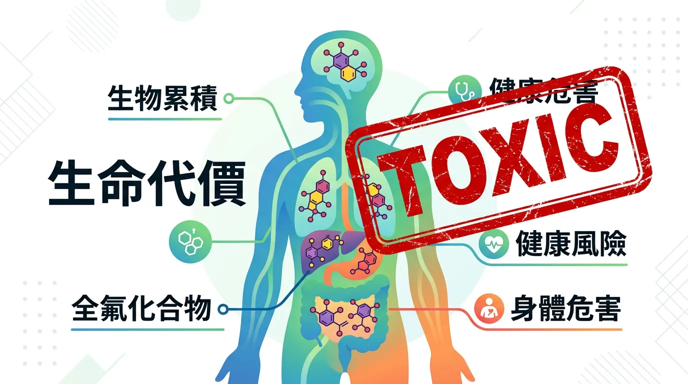
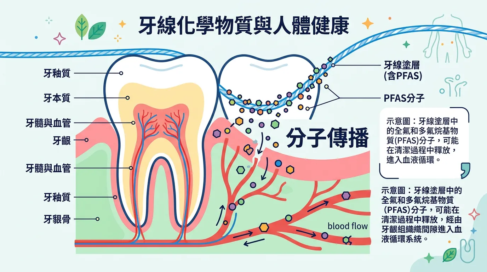
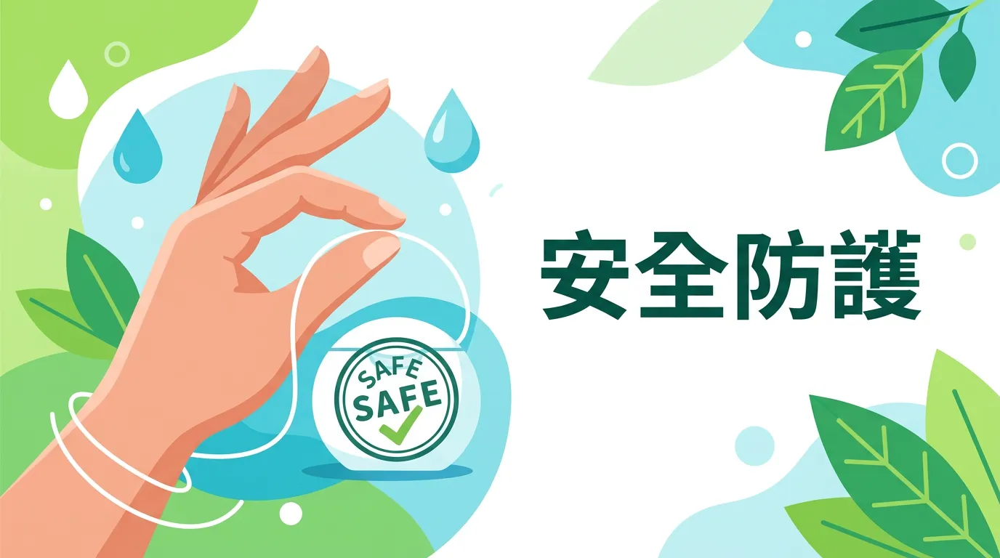

# 你用的牙線含有毒致癌物嗎？揭開 PTFE 牙線背後的 PFAS 危機

本文你會學到：PTFE 牙線中的 PFAS 暴露途徑、健康風險與安全替代方案。講到底，滑順型 PTFE 牙線可能含 PFAS，改選尼龍或天然蠟牙線、並注意飲用水過濾，可減少暴露。

全氟/多氟烷基物質 (PFAS) 因其極其穩定的碳氟鍵，在自然界與人體中幾乎不降解，故被稱為「永恆化學品」。最新研究指出，日常使用的某些滑順型牙線（PTFE 材質），可能是這類合成毒素進入人體的一種隱蔽路徑。

---

## 快速摘要：PFAS 的生物累積性與健康代價

<DataTable theme="red" caption="PFAS 暴露與健康風險">
  <Fragment slot="header">
    <tr><th>暴露指標</th><th>健康風險</th><th>臨床發現</th></tr>
  </Fragment>
  <tr><td><strong>免疫系統</strong></td><td>免疫抑制、疫苗反應下降。</td><td>降低對[肺炎鏈球菌疫苗](/otitis-media/)反應率。</td></tr>
  <tr><td><strong>內分泌干擾</strong></td><td>甲狀腺功能減退、荷爾蒙失調。</td><td>與[妊娠併發症](/pregnancy-maternal-health/)及發育遲緩相關。</td></tr>
  <tr><td><strong>器官毒性</strong></td><td>肝臟損傷、膽固醇升高。</td><td>長期接觸增加[非酒精性脂肪肝](/diabetes-prevention-management/)風險。</td></tr>
  <tr><td><strong>致癌風險</strong></td><td>睪丸癌、腎臟癌。</td><td>累積性暴露風險（非單指牙線）。</td></tr>
</DataTable>

<Callout icon="🦷" title="實用提醒：無毒口腔替代方案">
避開「極速滑動」、「類特氟龍」或未標明材質的蠟質牙線。改用**尼龍**、**天然蠶絲**或**竹纖維**牙線。PFAS 更大來源是[飲用水](/water-quality-safety/)：建議 NSF 53/58 認證濾水器（活性碳或 RO）。
</Callout>

---

## 🔬 分子機制：從牙線塗層到血液循環

PTFE（聚四氟乙烯）本身是相對穩定的聚合物，但其生產過程中使用的「加工助劑」（如 PFOA 或 PFHxS）才是真正的毒性來源：
1. **生物累積 (Bioaccumulation)**：PFAS 會與血液中的蛋白質（如白蛋白）結合，半衰期長達數年[^12]。
2. **跨代轉移**：研究發現 PFAS 能通過胎盤屏障與母乳進行「跨代轉移」，影響新生兒的初期發育[^10]。
3. **系統性暴露**：雖然牙線的使用面積小，但其直接接觸牙齦黏膜。黏膜的血管豐富，可能加速微量化學物質的系統性吸收。

了解暴露途徑後，可以這樣選擇與防護：

---

## 🛠️ 無毒口腔護理要點：預防性原則

1. **識別標籤**：避開標榜「極速滑動 (Glide)」、「類特氟龍」或具有蠟質塗層但未標明材質的牙線。
2. **替代方案**：選擇**尼龍 (Nylon)**、**天然蠶絲 (Silk)** 或**竹纖維**材質的牙線。這些材質通常不包含 PFAS 塗層。
3. **水源過濾**：牙線只是冰山一角。更重要的 PFAS 來源是[飲用水](/water-quality-safety/)。建議加裝具備 NSF 53 或 NSF 58 認證的濾水器（如活性碳或 RO 逆滲透）。
4. **源頭減量**：減少一次性[防油包裝與紙餐盒](/micro-plastic/)的使用，這些材料通常塗有 PFAS 以阻隔油脂。

---

## 給你的最後建議

我們不應因為害怕 PFAS 而停止清潔牙齒。牙齒健康對於[心血管預防](/heart-disease-prevention/)至關重要。關鍵在於**明智的材料選擇**。透過改用無毒牙線並關注整體的[環境毒素減量](/micro-plastic/)，你可以在維護口腔衛生的同時，守護全身的內分泌平衡。

---

## 常見問題（FAQ）

### 我現在用的是 PTFE 牙線，要立即停止使用嗎？

不需要驚慌停止。PTFE 牙線造成的 PFAS 暴露是**慢性低劑量累積**，單次使用對健康影響有限。但如果擔心長期暴露，可以逐步**更換為尼龍、蠶絲或竹纖維牙線**。更重要的是關注**飲用水品質**，因為飲水中的 PFAS 濃度遠高於牙線，這是 PFAS 暴露的主要來源。若要測量體內 PFAS 濃度，可向醫療機構詢問血清檢查。

### 所有標榜「滑順」的牙線都含有 PFAS 嗎？

滑順的牙線不一定全含 PFAS，但**標榜『特氟龍』、『PTFE』或『Glide』品牌**的牙線較可能含有 PFAS。購買時應仔細看**標籤成分**，選擇明確標示為「尼龍」或「天然材質」的產品。許多天然蠶絲與竹纖維牙線也提供良好的滑順度，無需 PFAS 塗層。購買前上網查詢品牌的成分透明度資訊。

### PFAS 在體內會停留多久，會造成永久傷害嗎？

PFAS 的**半衰期長達 2-9 年**，意味著排出體外的速度極慢，會在血液中長期累積。它不會像其他污染物那樣被快速代謝。PFAS 與多種慢性病相關，包括免疫抑制、甲狀腺功能障礙、肝臟損傷。一旦暴露，**減少進一步暴露是最重要的**——改用安全牙線、使用高效濾水器、減少使用防油食品包裝，都能有效降低血液中的 PFAS 濃度增長速度。

### 怎樣判斷自己的飲用水中是否有 PFAS？

大多數市政自來水部門不常公開 PFAS 檢測結果。可以：1) **查詢當地水質報告** — 許多地方政府網站有飲用水質量檢測報告；2) **進行私人檢測** — 部分檢測機構可測量飲水中的 PFAS，但費用較高（約 USD $200-500）；3) **改善措施** — 無論檢測結果如何，安裝 **NSF 53 或 NSF 58 認證濾水器**（活性碳或逆滲透）能有效去除大部分 PFAS。

### 孕期如果要避免 PFAS，需要停止使用牙線嗎？

絕對不要為了避免 PFAS 而放棄牙線使用。牙齒健康對孕期血管與免疫系統至關重要。應改為**選用安全材質牙線**（尼龍、蠶絲、竹纖維）**同時改善飲用水過濾**。研究顯示，孕期 PFAS 暴露主要來自飲用水與食品包裝，牙線是相對次要的來源。重點是**多管齊下**——安全牙線 + 濾水器 + 減少塑膠包裝食品，才能有效降低孕期 PFAS 暴露。

---

## 推薦閱讀：你可能也會喜歡

- [微塑膠與環境荷爾蒙：如何在日常生活中實踐『源頭減量』？](/micro-plastic/)
- [飲用水品質安全：PFAS 與重金屬過濾的家戶終端解決方案](/water-quality-safety/)
- [口腔清潔基礎：利用正確的物理性清潔工具取代化學性塗層產品](/how-to-brush-your-teeth/)
- [孕期營養與母體健康：預防環境毒素對胎兒發展的潛在影響](/pregnancy-maternal-health/)

---

## 這裡有科學根據：參考文獻

以下文獻最後檢索：2026-02。

10. *Silent Spring Institute*. (2024). *Serum concentrations of PFASs and dental flossing behavior: A 10-year follow-up*.
12. *Environmental Health Perspectives*. (2024). *PFAS as immunotoxicants: Mechanisms and public health implications*.
13. *Toxicology and Applied Pharmacology*. (2025). *Intergenerational transfer of persistent organic pollutants*.
14. *Harvard T.H. Chan School of Public Health*. (2024). *PFAS in consumer products: A systematic assessment of oral care items*.