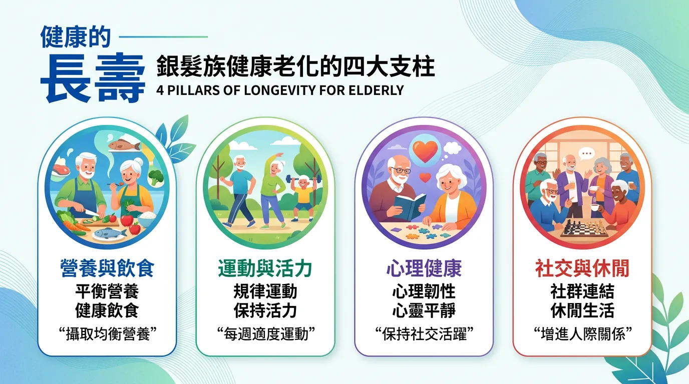
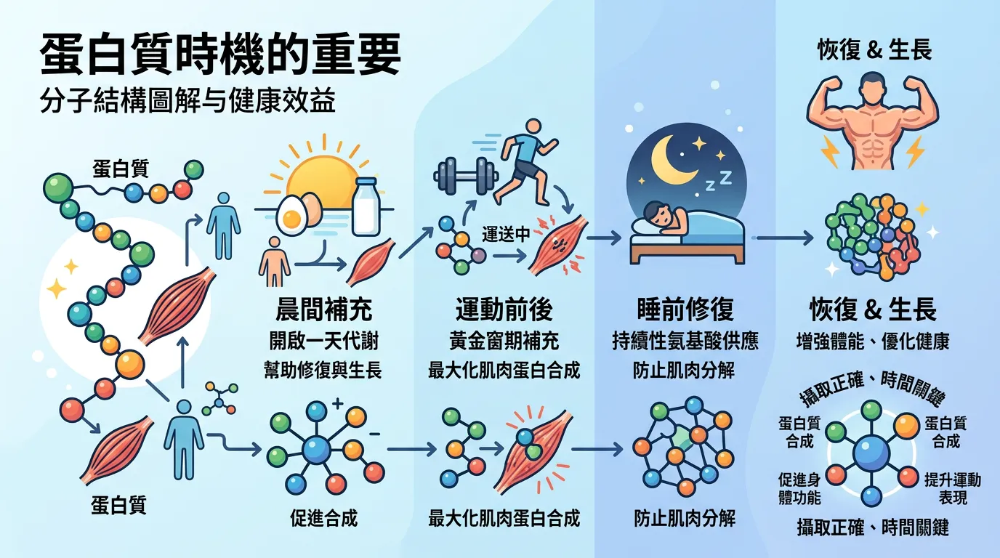
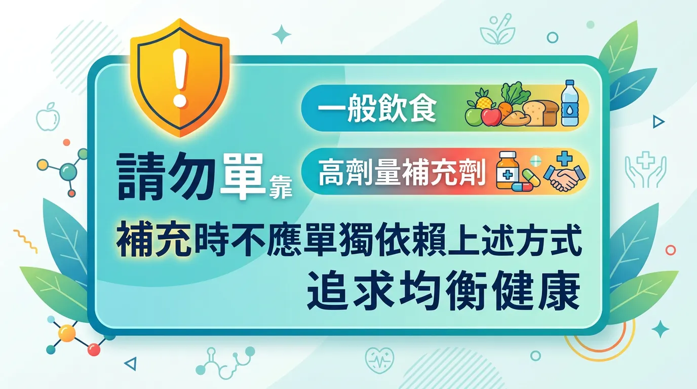

# 年紀大吃不下怎麼辦？長輩預防肌少症的黃金飲食對策

本文你會學到：肌少症預防、炎性衰老的營養干預與 B12、Omega-3 的認知儲備角色。簡單講，銀髮族要足量蛋白質、維生素 D 與 B12、適度運動，並注意藥物與營養交互，必要時由營養師評估。

隨著歲月增長，人體會進入「合成代謝阻抗 (Anabolic Resistance)」狀態，這意味著老年人需要更高比例的營養密度與更精準的吸收策略，才能維持骨骼強度、肌肉量與認知功能。

---

## 快速摘要：銀髮族健康長壽的「四大支柱」

<DataTable theme="blue" caption="銀髮族四大支柱">
  <Fragment slot="header">
    <tr><th>健康維度</th><th>核心挑戰</th><th>關鍵營養介入</th></tr>
  </Fragment>
  <tr><td><strong>肌肉量維持</strong></td><td><strong>肌少症</strong> (Sarcopenia)。</td><td>高品質蛋白質（富含亮胺酸）、[抗阻力運動](/macronutrients-guide/)。</td></tr>
  <tr><td><strong>認知功能</strong></td><td>神經萎縮、[B12 吸收障礙](/micronutrients-beyond-vitamins/)。</td><td>B12、葉酸、DHA (Omega-3)。</td></tr>
  <tr><td><strong>骨骼強度</strong></td><td>骨質流失、跌倒風險。</td><td>[維生素 D3 + K2](/how-to-prevent-osteoporosis/)、鈣質。</td></tr>
  <tr><td><strong>免疫監控</strong></td><td><strong>炎性衰老</strong> (Inflammaging)。</td><td>抗氧化劑（維生素 C/E）、[益生菌與益生元](/probiotics-prebiotics-guide/)。</td></tr>
</DataTable>

<Callout icon="🥩" title="實用提醒：單餐蛋白質 25–30 g">
老年人肌肉對蛋白質敏感度下降，單餐攝取 **25–30 g** 優質蛋白質可跨越「亮胺酸門檻」、啟動肌肉合成。B12 可選舌下錠/口服噴劑避開胃內因子依賴；採[地中海飲食](/mediterranean-diet/)抗炎；定時飲水防脫水與譫妄。
</Callout>

---

## 🔬 分子機制：為什麼「蛋白質時間」很重要？

老年人的肌肉對蛋白質的敏感度下降。研究顯示，與其平均分配，不如在單餐中攝取超過 **25-30 克** 的優質蛋白質，以跨越「亮胺酸門檻 (Leucine Threshold)」，啟動肌肉合成訊號 [^5]。這對於預防因肌肉流失導致的免疫下降至關重要 [^27]。

了解蛋白質與老化機制後，可以這樣落實營養要點：

---

## 🛠️ 銀髮族精準營養要點：生理功能保全

- **消化優化 (Absorption Audit)**：
  - 由於胃酸分泌減少，應監控[維生素 B12](/micronutrients-beyond-vitamins/) 的水平，必要時選擇舌下錠或口服噴劑以避開胃內因子依賴路徑。
- **抗炎飲食 (Anti-Inflammatory)**：
  - 採取[地中海飲食](/mediterranean-diet/)模式，富含橄欖油與深色蔬果，以降低系統性低密度發炎 (Inflammaging)，保護心血管與神經系統 [^22]。
- **水分與電解質監控**：
  - 渴覺神經退化易導致慢性脫水及急性譫妄。建議制定「定時飲水計算法」，並配合適量電解質保持[心臟電生理穩定](/heart-disease-prevention/)。
- **微量元素防禦**：
  - 補充[鋅與維生素 D](/natural-immune-support/) 以強化受衰老影響的先天免疫反應。

---

## 避坑指南：誰不適合僅靠一般飲食或自行高劑量補充？

**吞嚥困難、多重用藥、腎功能異常**者須由醫師或營養師評估蛋白質與電解質份量。**已確診肌少症或骨鬆**者運動與補充劑須依醫囑。**B12 缺乏**可能需注射型，勿自行大量口服。有出血傾向或抗凝血者魚油劑量須經醫師同意。

---

## 給你的最後建議

老化是一個生理轉型的過程。透過**高品質蛋白質**重建底層結構，以及**精準微量元素**修補生理漏洞，我們能大幅延緩失能的發生。記住，[營養補充](/quality-supplement-selection/)是為了支持生活品質，而核心永遠在於那份保持社交與運動的生命活力。

---

## 常見問題（FAQ）

### 原來是這樣！為什麼老年人的蛋白質需求比年輕人高？

老年人會進入「**合成代謝阻抗**」狀態，肌肉對蛋白質的敏感度下降。這意味著需要更高比例的優質蛋白質，且應在**單餐中集中攝取 25-30 克**以跨越「亮胺酸門檻」，才能啟動肌肉合成信號。與其平均分散，不如在早餐或午餐一次攝足，這樣才能有效預防肌少症與免疫功能下降。

### 老年人應該怎樣補充 B12？口服有效嗎？

由於**胃酸分泌減少與內因子下降**，許多老年人無法從食物或普通口服藥有效吸收 B12。建議選擇**舌下錠或口腔噴劑**，可直接經由口腔黏膜吸收，避開胃內因子依賴路徑。血液檢測 B12 與同半胱氨酸水平能幫助確認是否真正缺乏；若已診斷缺乏，定期注射型補充效果最確實。

### 維生素 D 和 K2 怎樣一起補充才能預防骨鬆？

**維生素 D 與 K2 需要協同作用**才能有效維持骨骼健康。D3 促進鈣吸收，但 K2 才是激活骨鈣蛋白與把鈣牢牢固定在骨骼中的關鍵。建議補充 D3 1000-2000 IU/天，搭配含 K2（特別是 MK-7 形式）50-100 mcg/天，同時攝取適量鈣質（乳製品或鈣補充），並進行負重運動以最大化效果。

### 地中海飲食對老年人有什麼具體好處？

地中海飲食**富含橄欖油與深色蔬果**，能降低系統性低密度發炎（炎性衰老），從而保護心血管與神經系統。對老年人來說，這個飲食模式特別能延緩認知衰退、降低心血管事件風險，並支持腸道健康。與其復雜補充劑，採用此飲食模式往往效果更穩定且副作用更少。

### 老年人容易脫水，應該怎樣確保水分攝取？

老年人的**渴覺神經退化**，容易陷入慢性脫水而不自覺。建議制定「定時飲水計算法」：每天體重（公斤）× 30 毫升 = 目標飲水量，分散在全天飲用。配合適量電解質補充（如含鈣鎂的飲料），可維持心臟電生理穩定，預防急性譫妄與跌倒風險。定期監測尿液顏色與濃度也能判斷水分狀況。

---

## 推薦閱讀：你可能也會喜歡

- [地中海飲食：建構高齡健康的抗炎與認知保護底層架構](/mediterranean-diet/)
- [如何預防骨質疏鬆：維生素 D、K2 與鈣質在骨質代謝中的協同科學](/how-to-prevent-osteoporosis/)
- [微量營養素：維生素 B12 與葉酸在預防神經退化中的關鍵角色](/micronutrients-beyond-vitamins/)
- [益生菌與益生元：透過調節腸道微菌叢改善高齡者免疫功能](/probiotics-prebiotics-guide/)

---

## 這裡有科學根據：參考文獻

以下文獻最後檢索：2026-02。

4. *Journal of the American Medical Directors Association*. (2024). *Evidence-based recommendations for optimal dietary protein intake in older people*.
19. *The Lancet Healthy Longevity*. (2024). *Vitamin B12 deficiency in the elderly: New diagnostic and therapeutic approaches*.
22. *Circulation*. (2024). *Omega-3 fatty acids and inflammaging: Effects on cardiovascular and cognitive health*.
27. *Medicine and Science in Sports and Exercise*. (2024). *Exercise for the prevention of sarcopenia and functional decline*.