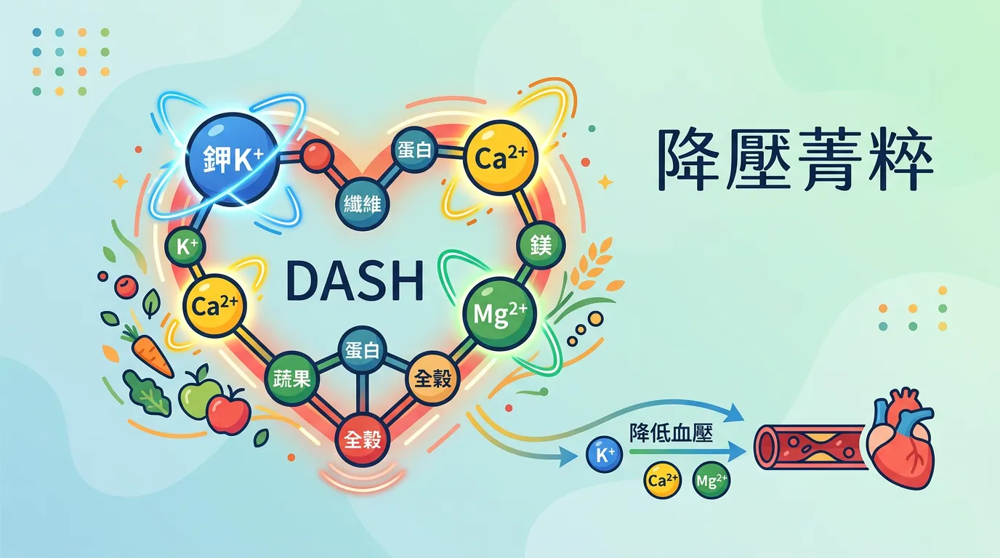
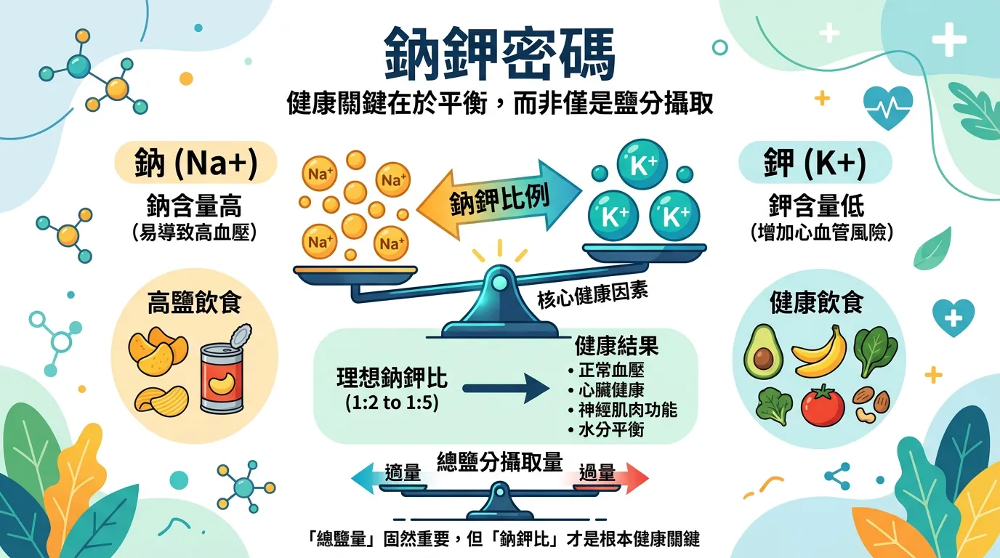
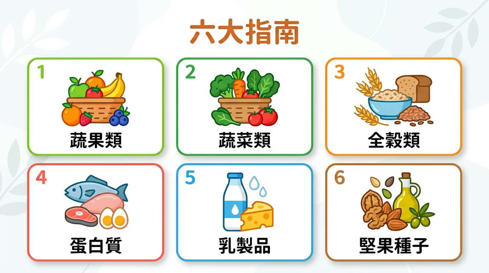
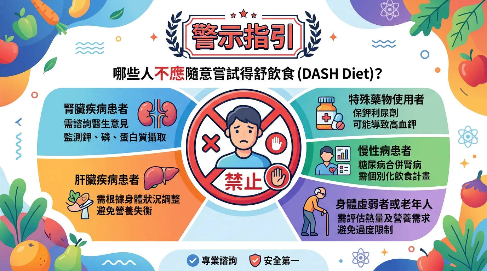

# 高血壓患者的救星！跟著 DASH 得舒飲食，吃回降壓超能力

本文你會學到：鈉鉀平衡、內皮功能維護與 DASH 核心食物與執行要點。白話一點：少鹽多鉀、多吃蔬菜水果與全穀、適量低脂乳品與堅果，有助於穩定血壓，這就是得舒飲食的重點。

「得舒飲食」(Dietary Approaches to Stop Hypertension, DASH) 是全球醫學界公認控制原發性高血壓的首選飲食策略。其核心科學並非單純「限鹽」，而是透過**高鉀、高鎂、高鈣**的協同作用，調節平滑肌張力並修復血管內皮功能。

---

## 快速摘要：DASH 飲食的降壓機制

<DataTable theme="blue" caption="DASH 降壓機制">
  <Fragment slot="header">
    <tr><th>關鍵機制</th><th>生理作用</th><th>核心食物</th></tr>
  </Fragment>
  <tr><td><strong>離子置換 (Na-K 幫浦)</strong></td><td>鉀排出鈉，降低血容量壓力。</td><td>葉菜類、[香蕉](/macronutrients-guide/)、豆類。</td></tr>
  <tr><td><strong>內皮保護</strong></td><td>增加一氧化氮 (NO)，舒張血管。</td><td>甜菜根、深色蔬菜。</td></tr>
  <tr><td><strong>鈣鎂協同</strong></td><td>維持心肌與平滑肌收縮穩定。</td><td>低脂乳製品、堅果、種子。</td></tr>
  <tr><td><strong>胰島素管控</strong></td><td>減少精緻糖，[血糖穩定](/diabetes-prevention-management/)降發炎。</td><td>全穀物（燕麥、糙米）。</td></tr>
</DataTable>

<Callout icon="📊" title="實用提醒：鈉鉀比與實踐">
每日鈉降至 **1,500–2,300 mg**、鉀提高至 **4,700 mg**，可達媲美單一降壓藥效果。全穀 6–8 份、蔬果各 4–5 份、低脂乳製品 2–3 份、精質蛋白 &lt; 6 份、堅果 4–5 份/週；限糖與隱藏鹽。可結合[地中海飲食](/mediterranean-diet/)。
</Callout>

---

## 🔬 分子基礎：為什麼「鈉鉀比」比總鹽量更重要？

現代飲食最大的問題是「鈉多鉀少」。高鉀攝取能啟動腎臟的排鈉機制，並直接舒張受壓的血管壁。DASH 飲食建議每日鈉攝取應降至 **1,500-2,300 毫克**，同時將鉀攝取提高至 **4,700 毫克**[^4]。這種精準的比例平衡，在多項研究中顯示能達到媲美「單一降壓藥物」的降壓效果[^7]。

掌握原理後，可以這樣落實在每日飲食：

---

## 🛠️ DASH 精準實踐要點：六大分類法

1. **全穀物 (6-8 份/日)**：取代白米麵。推薦燕麥、大麥，其中的 β-葡聚醣具備額外的[代謝益處](/diabetes-prevention-management/)。
2. **蔬菜與水果 (各 4-5 份/日)**：重點選擇含「硝酸鹽」的蔬菜（如菠菜、甜菜）以支持血管擴張。
3. **低脂乳製品 (2-3 份/日)**：提供鈣質與胜肽，協助血壓調節。
4. **精質蛋白質 (< 6 份/日)**：以魚類、禽肉代替紅肉，並納入植物性蛋白質（豆類）。
5. **堅果與種子 (4-5 份/週)**：鎂離子的重要來源，能穩定神經與血管張力。
6. **限糖與限鈉**：嚴格控管[添加糖](/reading-nutrition-labels/)與加工食品中的隱藏鹽分。

---

## 必看指南！誰不適合 DASH 得舒飲食？

**嚴重腎病**需限鉀者應在醫師或營養師指導下調整份量；**低血壓**或正在使用降壓藥者須監測血壓避免過低；**高鉀血症**者不宜自行提高鉀攝取。用藥或特殊疾病者請先諮詢醫師。

---

## 給你的最後建議

DASH 飲食不僅是針對[高血壓](/heart-disease-prevention/)的處方，更是一套預防[骨質疏鬆](/how-to-prevent-osteoporosis/)與代謝疾病的全方位健康藍圖。透過**高營養密度**的食物選擇，我們能從源頭改善血管彈性。建議與[地中海飲食](/mediterranean-diet/)結合，利用優質油脂（橄欖油）進一步降低系統性炎症，實現心血管系統的全面修復。

---

## 常見問題（FAQ）

### DASH 飲食和地中海飲食的差別在哪？對血壓效果哪個更好？

**DASH 飲食專門針對血壓控制設計，地中海飲食則著重全體心血管健康。** DASH 強調精確的鈉鉀比例與高纖維蔬果，而地中海飲食重點在優質油脂（橄欖油）。研究顯示，將兩者結合—DASH 框架加上地中海的橄欖油與魚類—能達到最佳血壓降低與發炎改善，效果優於單獨採用。

### 限制鹽分到多少才是安全的？完全不吃鹽行嗎？

**DASH 建議每日鈉攝取 1,500-2,300 毫克（約 4-6 克鹽），不是完全不吃鹽。** 完全限鹽反而危險，因為身體需要鈉來維持電解質平衡與神經傳導。關鍵在於**鈉鉀比例**—通過提高鉀攝取至 4,700 毫克/天，讓鉀排出鈉，達到血壓控制。避免加工食品中的隱藏鹽比計算每日摘克數更重要。

### 我正在服用降壓藥，還能實踐 DASH 飲食嗎？

**可以，但需醫師監測。** 實際上，DASH 飲食與降壓藥能協同作用。但由於飲食調整會逐漸降低血壓，若同時服用降壓藥，醫師可能需要調整藥物劑量以避免血壓過低。建議在開始 DASH 飲食時告知醫師，定期監測血壓，以便適時調整用藥。

### 我有慢性腎病，能夠遵循 DASH 飲食嗎？

**DASH 強調高鉀食物，但腎病患者需限鉀，這產生了衝突。** 若有慢性腎病或高鉀血症，應在腎臟科醫生或營養師指導下調整 DASH 原則，可能需要降低鉀攝取目標，改為 2,000-3,000 毫克/天。這類患者一定要避免自行高劑量補充鉀，以免危害心臟。

### 多久能看到 DASH 飲食的降血壓效果？

**多數人在 2-4 週內就能看到明顯效果，部分人甚至能達到媲美單一降壓藥的降幅。** 完全遵循 DASH 原則（控制鈉、增加鉀鎂鈣）的患者，平均血壓可下降 8-14 毫汞柱收縮壓。效果取決於基線血壓、遵循程度與個人體質，建議至少堅持 8-12 週才能完整評估效果。

---

## 推薦閱讀：你可能也會喜歡

- [地中海飲食：如何結合優質脂肪與 DASH 原則優化心臟健康？](/mediterranean-diet/)
- [糖尿病預防管理：DASH 飲食在穩定胰島素反應中的關鍵作用](/diabetes-prevention-management/)
- [心臟病預防：從內皮功能修復看動脈粥狀硬化的早期干預](/heart-disease-prevention/)
- [如何預防骨質疏鬆：DASH 飲食中的鈣鎂協同與骨密度維護](/how-to-prevent-osteoporosis/)

---

## 這裡有科學根據：參考文獻

以下文獻最後檢索：2026-02。

4. *New England Journal of Medicine*. (2024). *Effects on blood pressure of reduced dietary sodium and the DASH diet: A multi-center trial*.
7. *JAMA*. (2024). *DASH diet and lifestyle modification: Impact on resistant hypertension*.
8. *Hypertension*. (2025). *Potassium-to-Sodium ratio and its longitudinal effect on cardiovascular endpoints*.
12. *National Heart, Lung, and Blood Institute (NHLBI)*. (2025). *Latest DASH Eating Plan Guidelines for Hypertensive Population*.