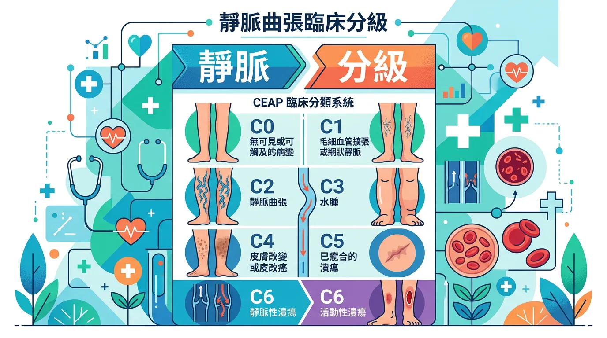
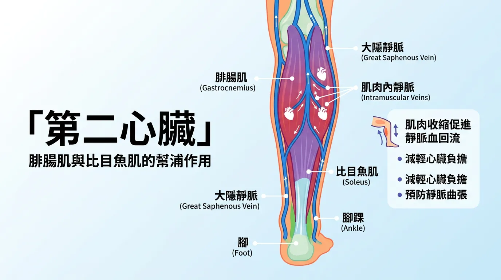
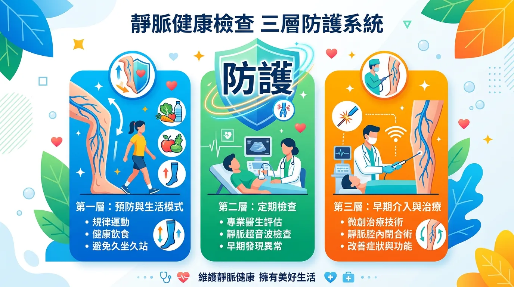
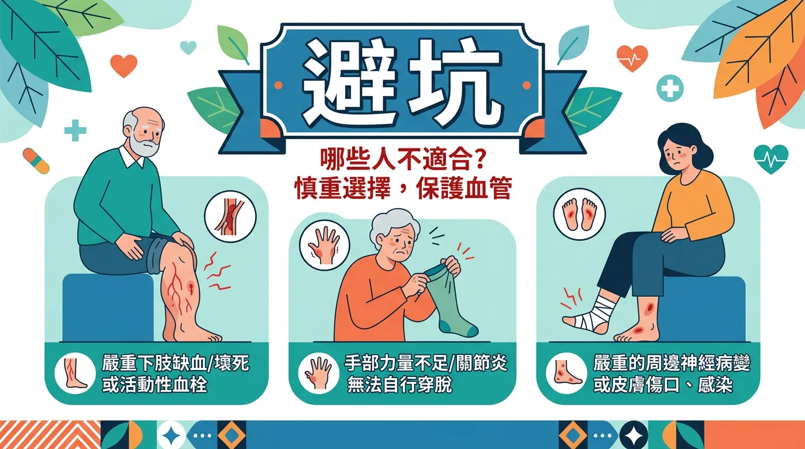

# 腿上浮出青筋是靜脈曲張嗎？小心第二心臟衰竭的危險訊號

本文你會學到：瓣膜失靈機制、CEAP 分級與從彈性襪到微創消融的治療選項。說穿了，久站久坐要動、穿彈性襪有助緩解；若紅腫痛、皮膚潰瘍或疑似血栓應就醫，懷孕與凝血異常者治療須經醫師評估。

靜脈曲張（Varicose Veins）是慢性靜脈功能不全（CVI，Chronic Venous Insufficiency）的病生理外顯，影響全球約 25%-30% 的成年人。其根源在於下肢靜脈瓣膜無法對抗重力，導致血液反流與淤滯。這不僅影響美觀，更可能引發慢性皮膚炎、[潰瘍](/rose-spots/)甚至深層靜脈血栓。

---

## 快速摘要：靜脈曲張的臨床分級（CEAP，臨床嚴重度分級）

<DataTable theme="blue" caption="CEAP 臨床分級">
  <Fragment slot="header">
    <tr><th>階段</th><th>臨床表現</th><th>風險等級</th></tr>
  </Fragment>
  <tr><td><strong>C1</strong></td><td>蜘蛛網狀或網狀靜脈擴張（&lt; 3 mm）。</td><td>低，主要外觀影響。</td></tr>
  <tr><td><strong>C2</strong></td><td>扭曲且突出的靜脈（&gt; 3 mm）。</td><td>中，需開始介入預防。</td></tr>
  <tr><td><strong>C3–C4</strong></td><td>下肢水腫、皮膚色素沉著（濕疹樣）。</td><td>高，可能皮膚纖維化。</td></tr>
  <tr><td><strong>C5–C6</strong></td><td>已癒合或活動性靜脈性潰瘍。</td><td>極高，<strong>需立即醫療處置</strong>。</td></tr>
</DataTable>

<Takeaway title="三層級防禦" icon="🦵">
  <TakeawayItem title="物理動力" type="success">規律走路、游泳、單車；每日睡前抬腿 15 分鐘高於心臟。</TakeawayItem>
  <TakeawayItem title="壓力介入" type="info">二級以上醫用壓力襪（20–30 mmHg），需專業測量。</TakeawayItem>
  <TakeawayItem title="醫療消融" type="warning">EVLA 閉合病變靜脈；硬化劑針對蜘蛛網狀靜脈。見[心臟病預防](/heart-disease-prevention/)。</TakeawayItem>
</Takeaway>

---

## 🔬 生理機制：為什麼小腿是「第二顆心臟」？

心臟負責將血液泵向全身，但要將血液從足部推回心臟，則依賴**小腿肌肉幫浦 (Calf Muscle Pump)**。
1. **瓣膜功能 (Valvular Function)**：靜脈內有單向瓣膜，防止血液因重力倒流。當瓣膜受損，壓力會傳導至淺層靜脈，使其膨張變形。
2. **微循環淤滯**：長期站立或久坐會使壓力累積，導致白血球附著在血管壁，引發局部炎症反應，這是造成[皮膚變黑與發癢](/rose-spots/)的主因。

了解機制後，可以依三層級這樣做：

---

## 🛠️ 靜脈健康檢查要點：三層級防禦

- **層級一：物理動力優化 (The Pump Protocol)**：
  - **規律運動**：走路、游泳與單車能強化腓腸肌幫浦。
  - **體位引流**：每日睡前抬高雙腿 15 分鐘，使其高於心臟水平，利用重力輔助回流[^1]。
- **層級二：精準壓力介入 (Compression Grading)**：
  - 穿著二級以上（20-30 mmHg）的醫用壓力襪。注意：壓力襪需由專業人員測量，避免過緊造成缺血。
- **層級三：醫療消融與硬化 (Clinical Intervention)**：
  - **微創血管內雷射（EVLA，血管內雷射閉合術）**：以熱能閉合病變大隱靜脈。
  - **硬化劑注射 (Sclerotherapy)**：針對蜘蛛網狀靜脈進行微米化學封閉。

---

## 避坑指南：誰不適合只靠彈性襪或自我護理？

**腿部突然腫痛、發紅發熱**可能為深層靜脈血栓，應立即就醫。**皮膚潰瘍、出血或感染**須由血管外科或皮膚科處理。**懷孕**者彈性襪壓力與治療方式須依產檢醫師建議。**凝血功能異常或正在服用抗凝血劑**者，侵入性治療前須經評估。

---

## 給你的最後建議

靜脈曲張的預防核心在於「動態」與「壓力管理」。對於[長期久坐或久站的職業](/lifestyle-immunity-factors/)人群，主動激活小腿肌肉幫浦是抗衰老的關鍵。若已出現持續性疼痛或皮膚變化，應尋求[心血管外科醫師](/heart-disease-prevention/)的評估，防範血栓併發症。

---

## 常見問題（FAQ）

### 靜脈曲張和深層靜脈血栓有什麼差別？都要緊急就醫嗎？

**靜脈曲張通常是**淺層靜脈**的慢性擴張，不是緊急病況；深層靜脈血栓（DVT）是腿部深層靜脈的血液凝聚，風險極高。** 靜脈曲張的症狀是緩慢的酸痛、腫脹與皮膚變化；DVT 表現為腿部突然腫痛、發紅發熱、甚至呼吸困難。若腿部突然脹痛，應立即就醫排除 DVT。靜脈曲張可逐漸處理，但 DVT 須立刻治療以防肺栓塞。

### 醫用彈性襪（20-30 mmHg）真的能改善靜脈曲張嗎？

**能幫助緩解症狀與防止惡化，但無法根治。** 彈性襪透過外部壓力幫助靜脈回流，減輕小腿酸痛與腫脹。關鍵是要穿著**正確的壓力等級**（20-30 mmHg 為二級，最常用），需由專業人員測量尺寸，否則過緊反而導致缺血。長期配合彈性襪與運動能預防惡化，但若已有皮膚潰瘍或症狀持續加重，應考慮微創治療如血管內雷射。

### 背後原因大公開：為什麼小腿被稱為「第二顆心臟」？怎樣激活它？

**小腿肌肉收縮時會幫助血液從腿部泵回心臟，對抗重力。** 當你走路、游泳或單車運動時，腓腸肌的反覆收縮就像一個幫浦，將血液送回心臟。久坐或久站會停止這個幫浦作用，導致血液淤滯。激活「第二顆心臟」的方法是**規律運動**（每天 30 分鐘行走）與**抬腿**（睡前抬腿 15 分鐘高於心臟）。

### 靜脈曲張會導致靜脈血栓或皮膚潰瘍嗎？風險有多高？

**在高階段（C5-C6）可能導致。** 靜脈曲張本身通常不會直接導致血栓，但長期慢性靜脈功能不全會導致微循環淤滯、皮膚發炎與組織纖維化，最終可能演變為靜脈性潰瘍。真正的血栓風險與靜脈曲張無直接關係，但任何靜脈手術或長期卧床會增加血栓風險。若出現潰瘍或皮膚破損，應立即就醫以防感染與進一步惡化。

### 血管內雷射閉合術（EVLA）的治癒率是多少？有風險嗎？

**治癒率約 90-95%，是目前微創治療中效果最佳的方法。** EVLA 透過導管內的雷射能量閉合病變的大隱靜脈，復發率遠低於傳統手術。風險較低，主要包括瘀青、神經暫時麻木（通常數週恢復），極少發生血栓或燒傷。選擇經驗豐富的血管外科醫師很重要。治療後仍需穿彈性襪 1-2 週並避免劇烈運動。

---

## 推薦閱讀：你可能也會喜歡

- [心臟病預防：靜脈血栓與動脈硬化的共同預防路徑](/heart-disease-prevention/)
- [生活方式與免疫：慢性炎症如何透過微循環淤滯影響皮膚健康](/lifestyle-immunity-factors/)
- [更年期與長者健康：荷爾蒙變化對靜脈壁彈性與瓣膜功能的影響](/senior-health-nutrition/)
- [皮膚發炎與玫瑰斑：如何區分靜脈性皮膚炎與典型的皮膚病變](/rose-spots/)

---

## 這裡有科學根據：參考文獻

以下文獻最後檢索：2026-02。

1. *Journal of Vascular Surgery*. (2024). *Varicose veins and chronic venous insufficiency: Global clinical practice guidelines update*.
7. *European Journal of Vascular and Endovascular Surgery*. (2024). *Endovenous thermal ablation vs. conventional surgery: A 10-year follow-up meta-analysis*.
8. *Phlebology*. (2025). *Mechanisms of microcirculatory failure in advanced venous disease*.
9. *Vascular Medicine*. (2025). *Genetic risk factors and molecular markers in primary varicose veins*.