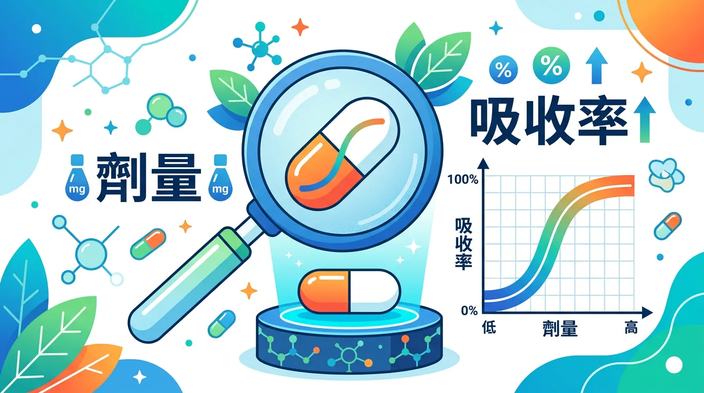
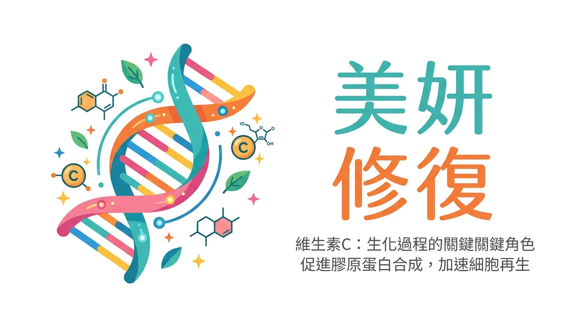
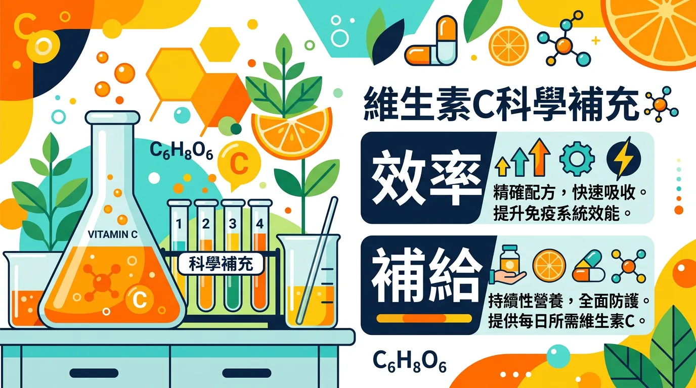

# 維他命 C 吃太多會結石？抗氧化聖品的正確劑量與吸收真相

本文你會學到：雙相吸收與劑量關係、膠原合成角色與高劑量草酸結石風險。講到底，維他命 C 分次吃吸收較好，單次過量反而吸收差且增加腎負擔；有腎結石史者每日限 1,000 mg 以下並多喝水。

維生素 C (抗壞血酸) 是人體無法自行合成的高效還原劑。它在**免疫白血球趨化**、**神經遞質合成**與**結締組織修復**中扮演關鍵角色。然而，維生素 C 的吸收遵循「雙相動力學」，盲目服用高劑量往往導致生物利用率下降與[腸胃道壓力](/gastroesophageal-reflux/)。

---

## 快速摘要：劑量與吸收率的非線性關係

<DataTable theme="blue" caption="維生素 C 劑量與吸收">
  <Fragment slot="header">
    <tr><th>單次攝取劑量</th><th>腸道吸收率</th><th>生理目的</th><th>潛在副作用</th></tr>
  </Fragment>
  <tr><td><strong>&lt; 100 mg</strong></td><td><strong>80–90%</strong></td><td>基本生理需求與[抗氧化](/astaxanthin/)。</td><td>極低。</td></tr>
  <tr><td><strong>500 mg</strong></td><td><strong>~70%</strong></td><td>免疫功能與[膠原合成](/collagen/)。</td><td>輕微排氣。</td></tr>
  <tr><td><strong>&gt; 1,250 mg</strong></td><td><strong>&lt; 50%</strong></td><td>系統性飽和。</td><td>腹瀉、滲透性壓力。</td></tr>
  <tr><td><strong>&gt; 2,000 mg</strong></td><td>飽和並快速代謝</td><td>腎臟負擔增加。</td><td><strong>草酸鈣結石風險</strong>[^13]。</td></tr>
</DataTable>

<Callout icon="💊" title="實用提醒：分次補充與腎結石警訊">
轉運蛋白會飽和，**分次攝取**（如 500 mg × 2）優於單次 1,000 mg。腸道耐受度：稀便/腹鳴應下修劑量。有腎結石病史者每日總量限 **1,000 mg 以下**並補足水分。存放避光、蔬果[低水溫快煮](/wash-vegetable/)保留維生素 C。
</Callout>

---

## 🔬 生化機制：為什麼維生素 C 是「美妍」與「修復」的關鍵？

1. **膠原蛋白羥化 (Hydroxylation)**：維生素 C 是脯氨醯羥化酶的輔因子。沒有它，人體產生的[膠原蛋白](/collagen/)結構會鬆散、不穩定，導致傷口癒合緩慢或牙齦出血。
2. **三價鐵還原**：它是[植物性鐵質吸收](/tea-coffee-cause-iron-insufficiency/)的最佳助攻，能將非血紅素鐵還原成易於吸收的二價鐵。
3. **免疫白血球累積**：白血球內的維生素 C 濃度是血漿的 80 倍。它能保護免疫細胞在對抗病原體時不被自身的氧化壓力破壞[^6]。

了解機制與吸收特性後，可以這樣補充：

---

## 🛠️ 維生素 C 效率檢查要點：科學補給法

- **遵循「分次攝取規則」**：
  - 由於轉運蛋白 (SVCT1) 會飽和，單次服用 1,000 毫克不如分兩次服用 500 毫克。分次攝取能長時間維持平穩的血漿濃度[^7]。
- **識別「腸道耐受度」 (Bowel Tolerance)**：
  - 若服用後出現稀便或腹鳴，代表腸道已無法吸收該劑量。應下修劑量以避免[消化系統紊亂](/gastroesophageal-reflux/)。
- **腎結石高標警訊 (Stone Risk)**：
  - 維生素 C 代謝產物包含草酸。對於有腎結石病史者，每日總攝取量應嚴格限制在 **1,000 毫克以下**，並補充足夠水分以稀釋尿液[^13]。
- **穩定性管理**：
  - 維生素 C 極易受熱與光氧化。補充劑應存放於避光容器，新鮮蔬果應採取[快速、低水溫烹調](/wash-vegetable/)以減少降解。

---

## 給你的最後建議

維生素 C 的價值在於「頻率」而非「極大劑量」。透過[地中海式的高蔬果飲食](/mediterranean-diet/)，多數人即可獲得足夠的抗壞血酸。若因特殊需求（如抽菸、[術後恢復](/rose-spots/)）需額外補充，應選擇緩釋型或分次服用，以在不增加腎臟負擔的前提下優化生物利用率。

---

## 常見問題（FAQ）

### 進階討論：維生素 C 一天應該吃多少？

成人每日建議攝取量（RDA）約為 65–90 mg，上限為 2,000 mg。實際上，多數研究支持每日 500–1,000 mg 已足夠提升免疫和支持膠原合成，超過 1,000 mg 後腸道吸收率明顯下降，且代謝為草酸的量增加，腎結石風險上升。建議分次攝取，例如早晚各 500 mg，優於一次服用 1,000 mg。

### 深度解析：維生素 C 要飯前還是飯後吃？

建議隨餐或飯後服用。雖然空腹也能吸收，但隨餐可以減少腸胃不適（如腹鳴或輕微腹瀉），同時飲食中的脂溶性成分有助緩衝維生素 C 在腸道的通過速度，延長吸收窗口。

### 有腎結石史的人可以補充維生素 C 嗎？

可以補充，但需謹慎控制劑量。維生素 C 在體內代謝後會產生草酸，而草酸是草酸鈣結石的主要成分。有腎結石病史者，每日總攝取量建議不超過 **1,000 mg**，並確保充足水分攝取（至少 2 公升水/天）。建議先諮詢醫師或腎科專家。

### 蔬果可以提供足夠的維生素 C 嗎？

對大多數人而言，均衡飲食就能達到建議量。芭樂（每 100g 約含 228 mg）、甜椒（約 190 mg）、奇異果（約 93 mg）、草莓（約 59 mg）都是優質來源。但有吸菸習慣、傷口癒合需求或免疫功能偏低者，可考慮額外補充。

### 重點解析：加熱料理會破壞維生素 C 嗎？

會，但破壞程度取決於烹調方式。維生素 C 對熱敏感，長時間水煮流失最多（可達 50–80%）。建議優先選擇短時間汆燙、蒸或快炒，或直接生食。若用水煮，可保留煮菜的湯汁一起食用，以回收溶入水中的維生素 C。

---

## 推薦閱讀：你可能也會喜歡

- [膠原蛋白補充指南：維生素 C 如何決定結締組織的緊密度？](/collagen/)
- [茶與咖啡對鐵質的影響：維生素 C 在攔截單寧酸干擾中的關鍵作用](/tea-coffee-cause-iron-insufficiency/)
- [地中海飲食：建構高抗氧化、高維生素 C 含量的天然防禦網絡](/mediterranean-diet/)
- [正確清洗蔬果：如何在移除農藥的同時保留水溶性維生素 C？](/wash-vegetable/)

---

## 這裡有科學根據：參考文獻

以下文獻最後檢索：2026-02。

6. *Nutrients*. (2024). *Vitamin C and immune function: Molecular mechanisms and clinical trials*.
7. *Annals of Internal Medicine*. (2024). *Vitamin C pharmacokinetics: Implications for oral vs. intravenous delivery*.
13. *Kidney International*. (2025). *High-dose vitamin C intake and the risk of oxalate nephropathy: A systematic review*.
16. *Nature Reviews Immunology*. (2024). *The role of ascorbic acid in leukocyte migration and phagocytosis*.