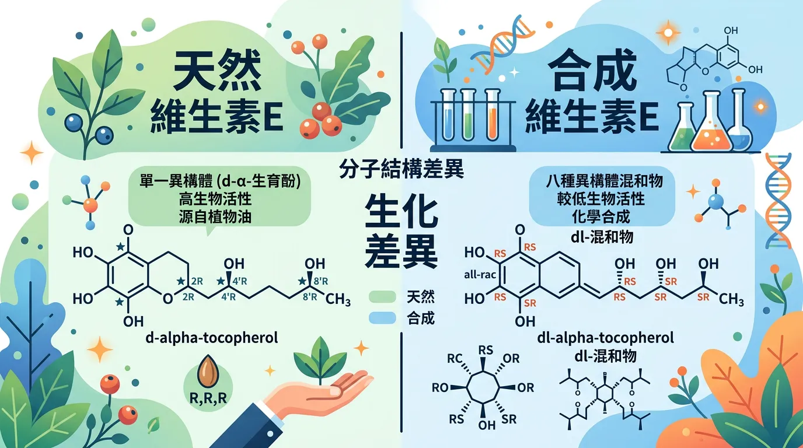
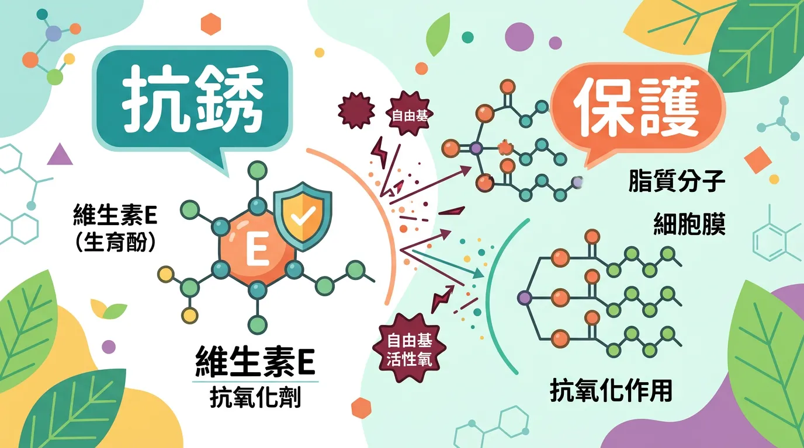
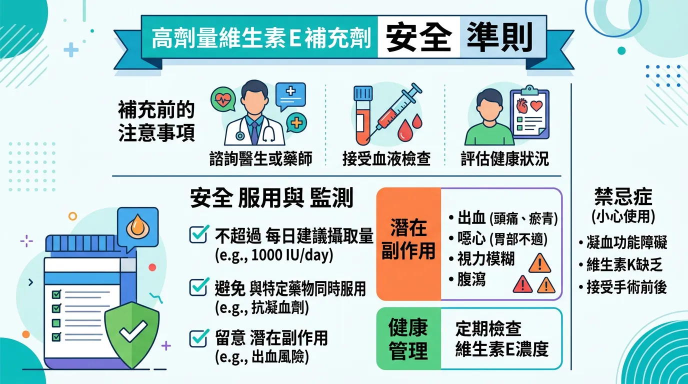
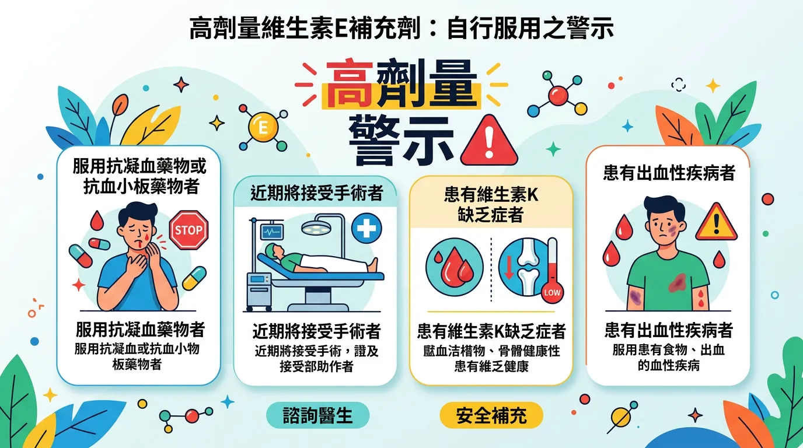
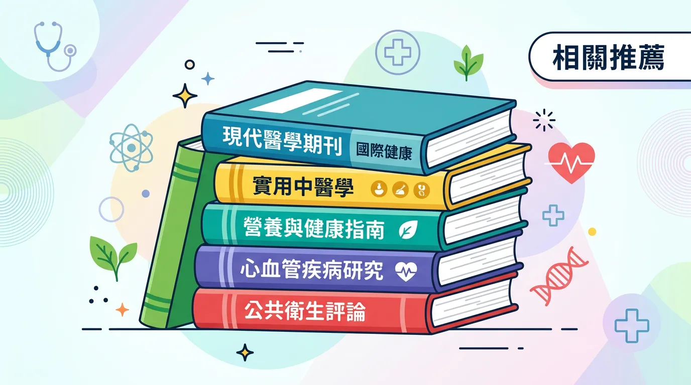

# 抗老神隊友維他命 E 怎麼吃？搞懂保護心血管跟抗凝血風險

本文你會學到：天然型與合成型差異、脂質過氧化保護與維生素 K 拮抗、劑量上限。大致來說，維他命 E 能保護細胞膜脂質，但高劑量會干擾維他命 K、增加出血風險，術前兩週要停用；優先從堅果與好油攝取。

維生素 E (Vitamin E) 是由八種脂溶性化合物（四種生育醇與四種生育三烯酚）組成的家族，其中 **α-生育醇 (α-tocopherol)** 是唯一能被肝臟轉運蛋白識別並輸送到全身器官的活性形式。作為人體最重要的**細胞膜守護者**，它能鎖定並中和攻擊多不飽和脂肪酸 (PUFAs) 的自由基。

---

## 快速摘要：天然型與合成型的生化差異

<DataTable theme="blue" caption="維生素 E 天然型 vs 合成型">
  <Fragment slot="header">
    <tr><th>特徵</th><th>天然型 (d-α)</th><th>合成型 (dl-α)</th><th>臨床意義</th></tr>
  </Fragment>
  <tr><td><strong>來源標示</strong></td><td>RRR-alpha-tocopherol</td><td>All-rac-alpha-tocopherol</td><td>天然型活性更高。</td></tr>
  <tr><td><strong>生化效力</strong></td><td><strong>100%</strong> (1.49 IU/mg)</td><td><strong>~50%</strong> (1.10 IU/mg)</td><td>合成型半數不活化。</td></tr>
  <tr><td><strong>關鍵作用</strong></td><td>防禦脂質過氧化。</td><td>相同容量效果減半。</td><td>優先選「d-」前綴。</td></tr>
  <tr><td><strong>安全性上限</strong></td><td>1,000 mg (1,500 IU)</td><td>1,000 mg (1,100 IU)</td><td><strong>每日 UL</strong>。</td></tr>
</DataTable>

<Callout icon="⚠️" title="實用提醒：維生素 K 與手術前停藥">
高劑量維生素 E 干擾維生素 K、增加抗凝血劑者**內出血風險**。術前 **14 天**停用高劑量維生素 E。除非明確缺乏，勿長期每日 &gt; 400 IU（極高劑量可能增加部分疾病死亡率）。與[維生素 C](/vitamin-c/) 併用可再循環氧化型維生素 E。
</Callout>

---

## 🔬 分子機制：為什麼它是脂肪的「抗銹劑」？

1. **鏈斷止鎖效應 (Chain-breaking)**：細胞膜含有大量不飽和脂肪。當自由基發起連鎖反應時，維生素 E 會犧牲自己提供一個電子，阻斷氧化鏈的延伸，防止細胞膜崩解。
2. **維生素 C 的再循環**：被氧化的維生素 E 並非廢棄物，它可以透過[維生素 C](/vitamin-c/) 的電子補充而重新活化。這就是為什麼兩者在[心血管保護](/heart-disease-prevention/)中常被併用的原因[^6]。
3. **維生素 K 拮抗**：高劑量的維生素 E 會干擾維生素 K 的代謝，導致凝血因子合成受阻。這會顯著增加服用抗凝血劑人群的**內出血風險**[^1]。

了解機制與風險後，可以這樣補充與注意：

---

## 🛠️ 維生素 E 安全檢查要點：高階補給準則

- **執行「d-α 前綴審查」**：
  - 購買時核對成分。天然來源 (d- 或 RRR-) 的生物保留率顯著優於合成來源 (dl-)。對於[長者健康](/senior-health-nutrition/)，建議選擇含「混合生育醇 (Mixed Tocopherols)」的產品以模擬自然飲食比例。
- **匹配「PUFA 攝取量」**：
  - 你的[魚油 (Omega-3)](/macronutrients-guide/) 或植物油攝取量越高，需要的維生素 E 越多。維生素 E 是防止這些雙鍵脂肪酸在體內「酸敗」的第一道防線。
- **手術前停藥窗口 (Pre-op Window)**：
  - 基於抗凝血風險，任何高劑量維生素 E 補充劑必須在手術前 **14 天** 停止使用，以降低術中大出血的可能。
- **警惕「促氧化 (Pro-oxidant)」陷阱**：
  - 臨床大型研究建議，除非有明確缺乏，否則不要長期每日服用超過 400 IU。極高劑量可能反而增加部分疾病的總死亡率[^7]。

---

## 必看指南！誰不適合自行高劑量補充維生素 E？

**正在服用抗凝血劑**者高劑量 E 會增加出血風險。**術前兩週**須停用高劑量維他命 E。**除非醫師指示**，勿長期每日超過 400 IU（極高劑量可能增加部分風險）。懷孕哺乳請依產檢醫師建議劑量。

---

## 給你的最後建議

維生素 E 應從[地中海式飲食](/mediterranean-diet/)（堅果、冷壓植物油、綠葉蔬菜）中獲取。對於需要透過補充劑優化[皮膚健康或生殖功能](/vitamin-a/)的人群，應採取低劑量、週期性服用的策略。透過與[維生素 C](/vitamin-c/) 的精準配比，我們能建構最穩固的細胞防禦網。

---

## 常見問題（FAQ）

### 天然型維生素 E（d-α）和合成型（dl-α）有什麼區別？

**天然型（d-α-生育醇）**的生化效力為 100%（1.49 IU/mg），肝臟轉運蛋白能完全識別並輸送；**合成型（dl-α-生育醇）**效力僅約 50%，因為混合異構體中大半失活。天然型更容易被人體吸收和保留，補充時應優先選擇「d-」或「RRR-」前綴的產品。

### 驚人真相：為什麼手術前要停用維生素 E？

高劑量維生素 E（>400 IU）會干擾維生素 K 的代謝，抑制凝血因子合成，導致血液凝固能力下降。術中大出血風險顯著增加，尤其是服用抗凝血劑的患者。建議術前 14 天停止高劑量維生素 E 補充，以降低出血併發症。

### 維生素 E 和維生素 C 如何協同作用？

被氧化的維生素 E 本身會失活，但維生素 C 能夠提供電子將其再循環，使其重新恢復抗氧化功能。這就是為什麼同時補充兩者在心血管保護中特別有效。兩者協同能建構更穩固的細胞防禦網。

### 長期服用高劑量維生素 E 有風險嗎？

臨床大型研究建議，除非有明確缺乏症狀，否則不應長期每日超過 400 IU。極高劑量反而可能因「促氧化」效應而增加某些疾病的總死亡率。對於大多數人，從飲食（堅果、植物油、綠葉蔬菜）獲取足夠量已足夠。

### 哪些人不適合補充高劑量維生素 E？

**正在服用抗凝血劑（如華法林）的患者、計畫手術者、有凝血功能異常史者**都應避免高劑量補充。懷孕和哺乳期應依產科醫師建議，兒童劑量須按體重調整。若有疑問，應先諮詢醫師再自行補充。

---

## 推薦閱讀：你可能也會喜歡

- [心臟病預防：維生素 E 在防止 LDL 氧化與斑塊形成中的爭議與實證](/heart-disease-prevention/)
- [維生素 C 完整指南：如何透過電子再循環機制喚醒枯竭的維生素 E](/vitamin-c/)
- [地中海飲食：堅果與橄欖油中的天然生育醇如何延緩細胞衰老](/mediterranean-diet/)
- [長者健康營養：預防認知衰退與神經退化的脂溶性維生素策略](/senior-health-nutrition/)

---

## 這裡有科學根據：參考文獻

以下文獻最後檢索：2026-02。

1. *National Institutes of Health (NIH)*. (2024). *Vitamin E: Fact Sheet for Health Professionals*.
6. *The FASEB Journal*. (2024). *Vitamin E and C synergy: Mechanisms of lipid protection and redox cycling*.
7. *Annals of Internal Medicine*. (2024). *Meta-analysis: High-dosage vitamin E and all-cause mortality*.
10. *European Food Safety Authority (EFSA)*. (2024). *Scientific Opinion on the Upper Limit for Vitamin E (Tocopherols)*.