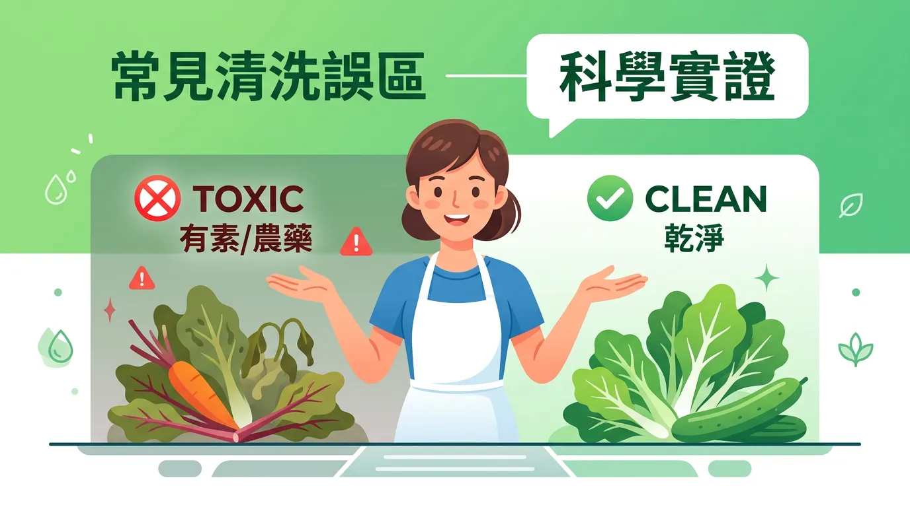
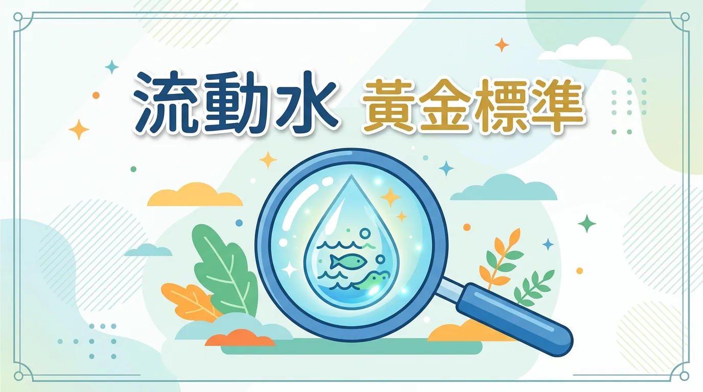
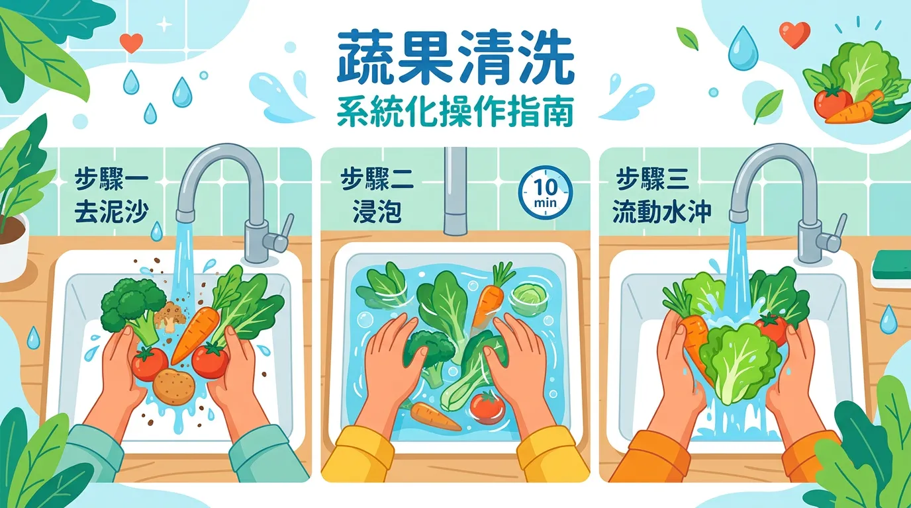

# 用鹽水洗菜反而更毒？破解農藥殘留，蔬菜正確清洗 3 步驟

本文你會學到：流動水與摩擦的實證效果、鹽水與醋的誤區及正確清洗步驟。說穿了，用流動水邊沖邊輕搓最有效，鹽水或醋泡反而可能讓農藥滲入，根莖類可削皮更安心。

在日常飲食中，清洗是移除「接觸性農藥」與表面污染物的關鍵物理程序。然而，傳統流傳的鹽水或醋浸泡法，在現代毒理學研究中已被證實效率低下，甚至可能導致農藥更易滲入蔬果組織。理解**流體動力學**與**表面摩擦**的原理，才是確保食安的核心。

---

## 快速摘要：常見清洗誤區與科學實證

<DataTable theme="blue" caption="清洗方式與實證">
  <Fragment slot="header">
    <tr><th>清洗媒體</th><th>宣稱效果</th><th>科學真相</th><th>醫療建議</th></tr>
  </Fragment>
  <tr><td><strong>流動自來水</strong></td><td>稀釋與物理沖刷。</td><td><strong>最有效</strong>，可移除 80%+ 表面殘留。</td><td><strong>首選</strong>。</td></tr>
  <tr><td><strong>鹽水</strong></td><td>微生物滲透壓。</td><td>效果極差，可能使農藥滲入內部。</td><td><strong>不建議</strong>。</td></tr>
  <tr><td><strong>食醋</strong></td><td>酸性去汙。</td><td>對農藥無顯著移除，影響風味。</td><td><strong>不建議</strong>。</td></tr>
  <tr><td><strong>小蘇打</strong></td><td>中和酸性農藥。</td><td>需浸泡 12 分鐘以上才有微量效果[^4]。</td><td>可選，不如流動水。</td></tr>
</DataTable>

<Callout icon="💧" title="實用提醒：三段式沖洗法">
**浸泡** 3–5 分鐘軟化泥土與蟲卵 → **流動翻洗** 10–15 分鐘 → **刷洗**根莖與凹凸表面。系統性農藥無法靠清洗移除，優先[TAP 或有機](/vegetable-label/)。蒂頭、凹槽、根部為高殘留區，清洗後切除。
</Callout>

---

## 🔬 科學機制：為什麼「流動水」是黃金標準？

1. **剪切力 (Shear Force)**：流動的水產生的物理剪切力能直接將吸附在蠟質表面的農藥顆粒撥離。
2. **濃度梯度**：持續的流動確保了蔬果周圍的農藥濃度始終為零，優化了溶解擴散的效率。
3. **避免交叉污染**：靜置浸泡 (Stagnant Soak) 超過 15 分鐘，溶解在水中的農藥與細菌可能透過微孔重新進入蔬果內部[^2]。

了解機制後，可以這樣操作：

---

## 🛠️ 蔬果清洗要點：系統化操作指南

- **執行「三段式沖洗法」**：
  1. **浸泡 (Steep)**：先在盆中浸泡 3-5 分鐘，軟化表皮泥土與蟲卵。
  2. **流動翻洗 (Agitate)**：開啟小水流，讓蔬果在流動水中翻動 10-15 分鐘。
  3. **刷洗 (Scrub)**：針對[根莖類如白蘿蔔](/vegetable-label/)或表面凸凹的苦瓜，使用專用軟刷進行局部物理摩擦[^7]。
- **針對「系統性農藥」的規避**：
  - 清洗無法移除植物組織內部的系統性農藥。此時應優先選擇具有 [TAP 產銷履歷或有機驗證](/vegetable-label/) 的農產品。
- **特定部位移除 (Targeted Removal)**：
  - 蒂頭、凹槽與根部是殘留農藥的高風險區。清洗後務必切除這些部位，防範二次污染。
- **臭氧與超音波工具 (Advanced Tools)**：
  - 臭氧能降解部分農藥但會產生臭氧異味；超音波則對脆弱葉菜有物理損害風險。一般家庭使用流動水加物理摩擦已足夠[^8]。

---

## 給你的最後建議

清洗的目標是「最小化殘留」而非「絕對零毒素」。與其追求高價的清洗劑，不如專注於**流動水質的穩定性**與**足夠的沖洗時間**。配合[地中海飲食](/mediterranean-diet/)的多樣化選購策略，能有效分散單一農藥累積的代謝壓力。

---

## 常見問題（FAQ）

### 進階討論：鹽水浸泡能去除農藥嗎？

**不能，反而可能加速農藥滲入**。鹽水的高滲透壓會改變蔬菜細胞膜的滲透性，使農藥更容易穿過細胞膜進入組織內部。科學研究證實鹽水的農藥移除效率極差，長時間浸泡（>15 分鐘）甚至會讓溶解在水中的細菌和農藥透過微孔重新進入蔬果。

### 揭秘！為什麼流動水比浸泡更有效？

流動水產生的**剪切力（Shear Force）**能直接將吸附在蠟質表面的農藥顆粒撥離。持續流動確保蔬果周圍的農藥濃度始終為零，優化溶解擴散效率。靜置浸泡卻是「死水」環境，無法有效移除農藥，反而易導致交叉污染。

### 重點解析：小蘇打和醋能去農藥嗎？

**小蘇打**需浸泡 12 分鐘以上才有微量效果，遠不如流動水；**食醋**對農藥無顯著移除作用，反而可能改變蔬菜風味。都不建議使用。相比之下，流動水邊沖邊輕搓可移除 80% 以上表面殘留，是最科學有效的方法。

### 關鍵看點：系統性農藥無法清洗是什麼意思？

**系統性農藥**是在種植期間被植物吸收進入組織內部的農藥，不存在於表面。再怎麼清洗也無法移除。應對的唯一方式是**優先選擇 TAP 產銷履歷或有機認證**的農產品，在購買時就降低風險，而非依賴清洗。

### 核心觀念：清洗後還需要削皮嗎？

蒂頭、凹槽和根部是農藥高殘留區，清洗後務必切除這些部位。對於**根莖類蔬菜**（如白蘿蔔、馬鈴薯）和表面凸凹的瓜類（苦瓜），**削皮或去皮**能進一步降低農藥攝入量，特別是對兒童和孕婦更為重要。

---

## 推薦閱讀：你可能也會喜歡

- [農產品標籤識別：如何透過 TAP 與有機驗證標章降低系統性農藥風險？](/vegetable-label/)
- [地中海飲食：如何在高攝取蔬菜量的同時建立完善的食安防線？](/mediterranean-diet/)
- [生活方式與免疫：環境毒素暴露如何透過微循環淤滯影響長期健康](/lifestyle-immunity-factors/)
- [硝酸鹽安全：除了農藥，你更該注意蔬菜儲存中的亞硝酸鹽變化](/nitrate/)

---

## 這裡有科學根據：參考文獻

以下文獻最後檢索：2026-02。

2. *Journal of Agricultural and Food Chemistry*. (2024). *Comparison of rinsing and soaking in pesticide residue reduction on leafy greens*.
4. *Journal of Food Science and Technology*. (2024). *The efficacy of sodium bicarbonate solutions in dissipating acetamiprid and phosmet residues*.
7. *Food Control*. (2025). *Mechanical scrub vs. chemical wash: Evaluating decontamination efficiency on rough-surfaced vegetables*.
8. *Trends in Food Science & Technology*. (2025). *Ozone and ultrasonication in household food safety: A critical review*.